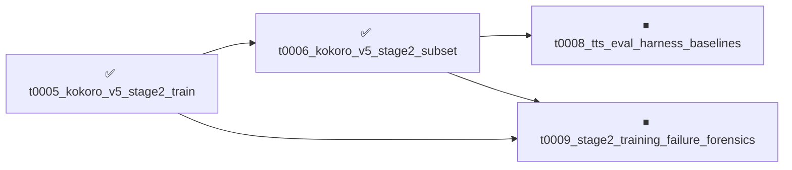

# Project Tasks

9 tasks. ⏹ **2 not_started**, ✅ **7 completed**.

**Browse by view**: By status: [⏹ `not_started`](by-status/not_started.md), [✅
`completed`](by-status/completed.md); [By date added](by-date-added/README.md)

---

## Dependency Graph

---

## ⏹ Not Started

⏹ 0009 — <strong>Stage 2 training failure forensics and safeguards</strong>

| Field | Value |
|---|---|
| **ID** | `t0009_stage2_training_failure_forensics` |
| **Status** | not_started |
| **Effective date** | — |
| **Dependencies** | [`t0005_kokoro_v5_stage2_train`](../../overview/tasks/task_pages/t0005_kokoro_v5_stage2_train.md), [`t0006_kokoro_v5_stage2_subset`](../../overview/tasks/task_pages/t0006_kokoro_v5_stage2_subset.md) |
| **Expected assets** | 1 answer, 1 library |
| **Source suggestion** | — |
| **Task types** | [`data-analysis`](../../meta/task_types/data-analysis/) |
| **Task page** | [Stage 2 training failure forensics and safeguards](../../overview/tasks/task_pages/t0009_stage2_training_failure_forensics.md) |
| **Task folder** | [`t0009_stage2_training_failure_forensics/`](../../tasks/t0009_stage2_training_failure_forensics/) |

# Stage 2 Training Failure Forensics and Safeguards

## Motivation

Four training tasks (t0001, t0004, t0005, t0006; 19+ launches, ~$440 of GPU) have not produced
a checkpoint with clean audio. Each task fixed the symptom in front of it and moved on:

* t0001 (v4) diverged at epoch 7. t0003 traced it to 21% grapheme-poisoned manifests.
* t0005 (v5, clean data) crashed five times, then diverged after the GAN switched on
  (`acoustic_norm` 10 → 671, val 0.848 → 2.07). Seven patches were stacked, including
  grad-skip guards and an `exp` clamp in `istftnet.py` that "stops the crash; does NOT stop
  the divergence".
* t0006 stopped divergence with `lambda_gen=0.05`, but changed six variables at once (data
  size, `multispeaker`, Stage 1 checkpoint, `joint_epoch`, `lambda_gen`, LR 3e-5 → 1e-4). The
  audio is still noisy, and the cause is still unknown.

The researcher asked for a systematic review before any more training: read every log, check
the data, check the pipeline, check that checkpoints are saved and loaded correctly, and build
protection so that the next failure is caught early, rolled back from a checkpoint, and
explainable from the logs.

This task runs **no new training** (see Compute for the one optional smoke test).

## Key Questions

1. At which step does each failed run first go wrong, and which logged signal moves first (Dur
   loss, `acoustic_norm`, generator/discriminator loss, grad norms, skip counts)?
2. What separates v3's successful Stage 2 from every failure, once confounds are listed
   explicitly? t0003 found v3's success depended on which `first_stage.pth` happened to be in
   the log directory.
3. Is the training data consistent: sample rate, duration distribution, clipping, silence,
   text length vs audio length, and how does the 1557-clip v5 set differ from v3's 266 clips?
4. Is the training pipeline correct: does `train_second_patched.py` match upstream StyleTTS2
   and v3's patch, do any of the seven t0005 patches mask a real problem, and are DataParallel
   and the loading path (`load_only_params`, `ignore_modules`, `multispeaker`) doing what the
   configs assume?
5. Are checkpoints saved, labeled and loaded correctly? Known inconsistencies to resolve:
   * t0004: `epoch_1st_00007.pth` labeled "epoch 10" (zero-indexed it looks like epoch 8, val
     0.757).
   * t0005: best checkpoint reported as epoch 3 in results but epoch 2 in `logs/README.md`.
   * t0006: `epochs_2nd: 10` instead of the intended 15; v6d metrics report `acoustic_norm`
     8.51 while the text says v3's Stage 1 dropped it to 0.36.
   * Only the top-2 checkpoints by `val_loss` are kept, although `val_loss` is not proven to
     track audio quality.
6. Is `val_loss` 0.506 (v3) even comparable to the v5 numbers — same val set, same loss
   definition?
7. Why did v3's audio go from exploded durations (`v3/audio/v3/`) to clean (`v3b/`) six
   minutes apart with no retraining (open question from t0003)?

## Scope

### 1. Log inventory and collection

Almost no training logs are in git: `.gitignore` excludes `*.log`, and the only committed
training log is `tasks/t0006_kokoro_v5_stage2_subset/logs/run03_v6c_v3_stage1.log`. t0005's
`logs/README.md` describes `crash_01`-`crash_06`, `run06_divergence_full.log` and
`stage2_v5.log`, none of which are in the repo. t0005 also notes the launch command `rm -f`s
the remote log and the config file was edited in place between launches.

Collect every log that still exists, per run: t0001 (`stage2_v4.log`), v3
(`stage2_v3_frozen_lm.log`, `stage2_clean.log`, `stage2_dirty.log`, Stage 1 logs), t0004 Stage
1, t0005 launches 1-6, t0006 runs 01-04, plus any TensorBoard event files and configs. Likely
locations: LLM-T1-NC80 (`/mnt/kikiri-tts/StyleTTS2/logs/`, `kokoro-finetune/`),
`rezolved/rail-benchmarks` (`kokoro-finetune/`), and the original author's machine. LESSONS
Lesson 10: `/mnt` on Azure ML is ephemeral, so some logs may be gone — record what is missing
rather than guessing.

Store logs in this task's `data/logs/<run_id>/` (text logs are small; force-add past `*.log`
or DVC-track if large). Produce an inventory table: run_id, task, log present (y/n), config
present, Stage 1 checkpoint used (with SHA-256 where recoverable), data list, outcome.

### 2. Per-run timelines

Parse every loss field per step into one tidy table (run_id, epoch, step, field, value). Plot
each run aligned on `joint_epoch`. Mark the first anomalous step per run and the leading
indicator.

### 3. Confound table

For every run, list the effective settings: data list and size, `multispeaker`,
`first_stage_path` (and hash), `joint_epoch`, `lambda_gen`, `lambda_slm`,
`lr`/`ft_lr`/`bert_lr`, `batch_size`, GPU count and parallelism mode, `train_LM`, which of the
seven patches were active. Reconstruct t0005's per-launch configs from log headers and git
history, since the file was edited in place.

### 4. Data audit

On the v5 train/val lists and v3's 266-clip list: sample rate, channels, duration histogram,
peak/clipping rate, leading/trailing silence, loudness (LUFS), frames per phoneme outliers,
OOV or vocab-invalid tokens, train/val overlap, and whether v3's val set equals val_96.

### 5. Pipeline audit

Diff `tasks/t0005_kokoro_v5_stage2_train/code/train_second_patched.py` against upstream
StyleTTS2 `train_second.py` and against v3's
`tasks/t0006_kokoro_v5_stage2_subset/data/reference/v3/train_second_patch.diff`. Review each
of the seven t0005 patches and state whether it fixes a cause or hides one. Compare against
the published StyleTTS2 fine-tuning recipe (`train_finetune.py`, which starts from a
pretrained multi-speaker model) and against public Kokoro fine-tuning recipes. Check that mel
extraction and the 24 kHz setup match what Kokoro's decoder expects.

### 6. Checkpoint audit

Map every checkpoint file to its epoch, step, `val_loss`, config and launch. Resolve the
inconsistencies in Key Question 5. Verify from code how "best" checkpoints are selected and
overwritten, and whether a healthy checkpoint from before each divergence still exists. Verify
with hashes which `first_stage.pth` each Stage 2 run actually loaded.

### 7. Safeguards (library asset)

Ship a small, tested patch plus a monitor that future training tasks reuse:

* Save a checkpoint every epoch (and every N steps near `joint_epoch`), with a retention
  policy that always keeps the last healthy one. Never select only by `val_loss`.
* Write a structured JSONL metrics log (one record per step: all losses, grad norms, skip
  count, LR, epoch) next to the text log. Never `rm -f` or overwrite logs between launches;
  one directory per launch, with the resolved config and checkpoint hashes saved alongside.
* Health gates checked live, with thresholds derived from Step 2 (for example Dur loss on the
  first Stage 2 step near v3's 0.81, `acoustic_norm` ceiling, val spike limit, consecutive
  skips). When a gate fires: stop, record why, and point to the last healthy checkpoint to
  resume from.
* **Offline replay test**: run the gates over the collected logs. They must fire on t0001,
  t0005 run06 and t0006 run01/run02 at or before divergence, and must not fire on v3's
  successful run.

### 8. Answer asset

Answer: "Why does Kokoro Stage 2 fine-tuning break in this project, and how should the next
run be configured and monitored?" Root causes ranked with evidence and confidence, what is
still unknown, and a single recommended configuration for the next training task, changing one
variable at a time relative to the closest known-good run.

## Compute and Budget

* Analysis runs locally or on CPU: $0.
* VM time only to retrieve logs and checkpoint hashes from LLM-T1-NC80: target ≤ 30 min (~$7),
  with teardown through `setup-remote-machine`.
* Optional: one short GPU smoke test (≤ 1 h, ~$14) to confirm the patched training script
  writes the JSONL log, saves per-epoch checkpoints and triggers a gate. Only if the offline
  replay cannot exercise the code path.
* Planned total: ≤ $25. Write `results/costs.json` with `total_cost_usd` (t0001-t0006 used the
  wrong key and are invisible to `aggregate_costs`).

## Expected Outputs

* **Answer asset** (see Scope 8).
* **Library asset**: safeguard patch, JSONL metrics logger, health-gate monitor, log parser,
  and a `test_*.py` offline replay test.
* `results_detailed.md` tables: log inventory, confound table, checkpoint map, data audit
  summary, patch review (patch, fixes cause or hides symptom, keep/remove).
* Charts in `results/images/`, embedded in `results_detailed.md`:
  * Loss timelines per run aligned on `joint_epoch` (x = step, y = loss, one panel per field)
    — Q1.
  * `acoustic_norm` and grad norm per run on log scale — Q1.
  * Duration and loudness histograms, v5 vs v3 — Q3.
* Suggestions for the next training task.

## Dependencies

* `t0005_kokoro_v5_stage2_train`, `t0006_kokoro_v5_stage2_subset` — the runs under audit.
* Independent of t0008; the two can run in parallel. Audio-quality verdicts for checkpoints
  come from t0008's harness when available, but this task does not wait for it.

⏹ 0008 — <strong>TTS evaluation harness and baselines</strong>

| Field | Value |
|---|---|
| **ID** | `t0008_tts_eval_harness_baselines` |
| **Status** | not_started |
| **Effective date** | — |
| **Dependencies** | [`t0006_kokoro_v5_stage2_subset`](../../overview/tasks/task_pages/t0006_kokoro_v5_stage2_subset.md) |
| **Expected assets** | 1 library |
| **Source suggestion** | — |
| **Task types** | [`tts-benchmark-run`](../../meta/task_types/tts-benchmark-run/), [`baseline-evaluation`](../../meta/task_types/baseline-evaluation/) |
| **Task page** | [TTS evaluation harness and baselines](../../overview/tasks/task_pages/t0008_tts_eval_harness_baselines.md) |
| **Task folder** | [`t0008_tts_eval_harness_baselines/`](../../tasks/t0008_tts_eval_harness_baselines/) |

# TTS Evaluation Harness and Baselines

## Motivation

After six tasks (t0001-t0006) the project has not measured a single one of its success
criteria. Every training attempt was judged by StyleTTS2 `val_loss` and by listening. The
success criteria in `project/description.md` are speaker similarity (GE2E cosine ≥ 0.85
against ElevenLabs David) and TTFB ≤ 300 ms. There is no ElevenLabs baseline, no base-Kokoro
baseline, and no speaker-similarity code anywhere in the repo.

t0003 also showed that Stage 1 `val_loss` does not predict success (0.770 preceded the working
v3 Stage 2, 0.545 did not), so `val_loss` alone cannot be trusted as a quality signal.

This task builds the measurement tool once, as a reusable library, and uses it to answer
research questions 1 and 2 and to place every existing checkpoint on the same scale. It runs
no training.

## Key Questions

1. What are speaker_sim, TTFB (p50/p95/p99) and RTF for ElevenLabs David on ≥ 50 filler
   prompts?
2. What do base Kokoro-82M British male voices score on the same prompts?
3. How close is the v3 shipped bundle (the only checkpoint with clean audio) to speaker_sim ≥
   0.85?
4. Do the t0005 and t0006 best checkpoints score measurably worse than v3, i.e. does the
   harness detect the "noisy audio" that listening detected?
5. Is speaker_sim alone enough to reject broken audio, or are the duration and intelligibility
   sanity metrics needed as well?

## Systems to Evaluate

Every system is scored on the same prompt sets with the same harness:

1. **ElevenLabs David** — API (voice ID David). TTFB and RTF measured live through the
   streaming API; speaker_sim computed on held-out reference clips (see Scoring below).
2. **Kokoro-82M base, `bm_george`** — stock voicepack.
3. **Kokoro-82M base, `bm_lewis`** — stock voicepack.
4. **Kokoro-82M base decoder + v3 David voicepack** — `david_v3_best_voicepack.pt` with stock
   decoder/predictor. Tells us how much of the voice a voicepack alone captures, with no
   fine-tuned weights.
5. **v3 shipped bundle** — `david_v3_best_decoder_kokoro.pth` + `david_v3_best_voicepack.pt`
   from `tasks/t0006_kokoro_v5_stage2_subset/data/reference/v3/best/` (DVC).
6. **t0006 v6d epoch 6** —
   `tasks/t0006_kokoro_v5_stage2_subset/results/checkpoints/v6d/epoch_2nd_00006.pth`, packaged
   with t0002's five-module extraction (`extract_decoder_generic.py`).
7. **t0005 run06 best** — `tasks/t0005_kokoro_v5_stage2_train/results/checkpoints/` best
   checkpoint, same packaging. Note: t0005's results say epoch 3 but `logs/README.md` says
   epoch 2; record which file was actually scored.

Floor control: one clearly different Kokoro voice (e.g. `af_heart`, female American) to show
what a "wrong speaker" score looks like, so 0.85 can be interpreted.

All Kokoro arms must synthesize through
`tasks/t0003_kokoro_v5_phoneme_data/code/build_pipeline.py` (British `lang_code="b"` plus
brand lexicon), not a bare `KPipeline` — t0003 showed accent and lexicon mismatches silently
change the token stream.

## Prompt Sets and Data

* **val_96**: the 96 held-out clips (`data/v4/val/`, text from
  `tasks/t0003_kokoro_v5_phoneme_data/results/v5/val_list.txt`). Real David audio is available
  for each prompt, so per-prompt paired comparison is possible. Never train on these.
* **Fillers**: ≥ 50 prompts sampled with a fixed seed (seed=42) from the 1358-clip ElevenLabs
  filler corpus. The corpus currently lives only on the VM
  (`kokoro-finetune/data/11labs_david/`, see `overview/datasets/fillers_1358.md`) and is not
  DVC-tracked. First step: copy it off the VM, `dvc add` it under this task's `data/`, and
  `dvc push`. Beware LESSONS Lesson 10 — `/mnt` on Azure ML is ephemeral; confirm the corpus
  still exists before planning around it.

## Scoring

* **speaker_sim** (registered metric): resemblyzer GE2E cosine between each synthesized clip
  and the mean embedding of the ElevenLabs David reference set. Split the reference clips into
  a centroid half and a held-out half with a fixed seed; the ElevenLabs arm is scored on the
  held-out half so it is not compared against itself. Report mean, std and per-clip
  distribution.
* **ttfb_ms** (registered metric): for ElevenLabs, wall time from request to first streamed
  audio byte. For Kokoro, wall time from pipeline call to the first audio chunk yielded.
  Follow LESSONS Lesson 1 (discarded warmup requests before measuring) and Lesson 4 (record
  torch/CUDA/kokoro versions and GPU at measurement time). Report p50/p95/p99.
* **rtf** (registered metric): synthesis wall time divided by output audio duration.
* **duration_ratio** (sanity): synthesized duration divided by reference clip duration.
  Catches the 10× duration explosion seen in t0002 before anyone listens.
* **WER** (sanity): transcribe synthesized audio with a local Whisper model and compare
  against the prompt text. Catches garbled or noisy audio that could still score a plausible
  speaker_sim.

## Compute and Budget

* Quality metrics (speaker_sim, duration_ratio, WER) can run on CPU or a single GPU.
* The success criterion defines TTFB "local inference, H100". Kokoro TTFB/RTF should be
  measured on LLM-T1-NC80 in one short window (target ≤ 1.5 h, ~$21), with setup and teardown
  through the `setup-remote-machine` skill. A CPU TTFB number may be reported in addition,
  clearly labeled.
* ElevenLabs API: ~150 streaming requests of short filler text, well under $5.
* **Budget note**: the project budget was raised to $5000 in t0007. `aggregate_costs` still
  reports $0 spent because t0001-t0006 write `total_usd` instead of `total_cost_usd`; real
  spend so far is ~~$370 recorded plus unrecorded t0006 GPU time (~~$70). This task must write
  `total_cost_usd`. Planned total for this task: ≤ $30.

## Expected Outputs

* **Library asset**: the evaluation harness (prompt-set loader, per-system synth adapters,
  scoring, report writer), reusable by every future training task.
* `results/metrics.json` with speaker_sim, ttfb_ms, rtf per system (as variants).
* Tables in `results_detailed.md`:
  * Main table: rows = systems 1-7 + floor control; columns = speaker_sim mean/std, ttfb_ms
    p50/p95/p99, rtf, duration_ratio median, WER; plus delta vs ElevenLabs.
  * Per-prompt-set breakdown (val_96 vs fillers).
* Charts in `results/images/`, embedded in `results_detailed.md`:
  * speaker_sim distribution per system (box plot; y = GE2E cosine, dashed line at 0.85) —
    answers Q1-Q4.
  * TTFB CDF per system (x = ms, dashed line at 300 ms) — answers Q1-Q2.
  * speaker_sim vs WER scatter per clip — answers Q5.
* A few synthesized examples per system (DVC-tracked, not git).
* A clear statement: which systems (if any) already pass each success criterion.

## Dependencies

* `t0006_kokoro_v5_stage2_subset` — provides the v3 reference bundle and the v6d checkpoint.
* Independent of t0009; the two can run in parallel.

## ✅ Completed

✅ 0007 — <strong>Brainstorm results session 1</strong>

| Field | Value |
|---|---|
| **ID** | `t0007_brainstorm_results_1` |
| **Status** | completed |
| **Effective date** | 2026-09-14 |
| **Dependencies** | [`t0001_kokoro_v4_stage2_finetune`](../../overview/tasks/task_pages/t0001_kokoro_v4_stage2_finetune.md), [`t0002_kokoro_v4_voicepack_decoder_package`](../../overview/tasks/task_pages/t0002_kokoro_v4_voicepack_decoder_package.md), [`t0003_kokoro_v5_phoneme_data`](../../overview/tasks/task_pages/t0003_kokoro_v5_phoneme_data.md), [`t0004_kokoro_v5_stage1_train`](../../overview/tasks/task_pages/t0004_kokoro_v5_stage1_train.md), [`t0005_kokoro_v5_stage2_train`](../../overview/tasks/task_pages/t0005_kokoro_v5_stage2_train.md), [`t0006_kokoro_v5_stage2_subset`](../../overview/tasks/task_pages/t0006_kokoro_v5_stage2_subset.md) |
| **Expected assets** | — |
| **Source suggestion** | — |
| **Task types** | [`brainstorming`](../../meta/task_types/brainstorming/) |
| **Start time** | 2026-09-14T13:00:00Z |
| **End time** | 2026-09-14T14:30:00Z |
| **Step progress** | 4/4 |
| **Task page** | [Brainstorm results session 1](../../overview/tasks/task_pages/t0007_brainstorm_results_1.md) |
| **Task folder** | [`t0007_brainstorm_results_1/`](../../tasks/t0007_brainstorm_results_1/) |
| **Detailed report** | [results_detailed.md](../../tasks/t0007_brainstorm_results_1/results/results_detailed.md) |

# Brainstorm Results Session 1

First human brainstorming session for rail-arf-tts. Reviews the six completed tasks
(t0001-t0006), all of which were Kokoro fine-tuning attempts, and decides what to do next. The
researcher agreed that the project cannot measure its own success criteria yet and that the
repeated Stage 2 training failures need a systematic forensic review before more GPU is spent.

**Results summary:**

> **Brainstorm Results Session 1**
>
> **Summary**
>
> First brainstorm after six Kokoro fine-tuning tasks (t0001-t0006) that produced no
> clean-audio
> checkpoint and measured none of the project's success criteria. The session created **2 new
> tasks**
> (t0008 evaluation harness and baselines, t0009 Stage 2 training failure forensics and
> safeguards)
> and raised the project budget from $500 to **$5000**. No suggestions existed, so none were
> rejected
> or reprioritized.
>
> **Session Overview**
>
> * Date: 2026-09-14.
> * Context: t0001-t0006 were all Kokoro StyleTTS2 fine-tuning attempts. t0003 found and fixed
>   a
> grapheme fallback that poisoned 21% of the v4 manifests. t0005 fixed seven crashes but every
> Stage
> 2 run diverged after the GAN switched on. t0006 stabilized the GAN with `lambda_gen=0.05`
> but the
> audio is still noisy (best val 0.846 vs v3's 0.506).
> * Prompt: researcher asked to analyze the repo and decide next steps.
> * Key findings presented:
> * No speaker_sim, TTFB or RTF measurement exists; no ElevenLabs or base-Kokoro baseline.

✅ 0006 — <strong>Kokoro v5 Stage 2: 250-clip subset, multispeaker:
false</strong>

| Field | Value |
|---|---|
| **ID** | `t0006_kokoro_v5_stage2_subset` |
| **Status** | completed |
| **Effective date** | 2026-09-13 |
| **Dependencies** | [`t0005_kokoro_v5_stage2_train`](../../overview/tasks/task_pages/t0005_kokoro_v5_stage2_train.md) |
| **Expected assets** | 1 model |
| **Source suggestion** | — |
| **Task types** | [`tts-finetuning-eval`](../../meta/task_types/tts-finetuning-eval/) |
| **Start time** | 2026-09-12T19:00:00Z |
| **End time** | 2026-09-13T00:00:00Z |
| **Step progress** | 4/4 |
| **Task page** | [Kokoro v5 Stage 2: 250-clip subset, multispeaker: false](../../overview/tasks/task_pages/t0006_kokoro_v5_stage2_subset.md) |
| **Task folder** | [`t0006_kokoro_v5_stage2_subset/`](../../tasks/t0006_kokoro_v5_stage2_subset/) |
| **Detailed report** | [results_detailed.md](../../tasks/t0006_kokoro_v5_stage2_subset/results/results_detailed.md) |

# t0006 — Kokoro v5 Stage 2: 250-clip subset, multispeaker: false

## Hypothesis

t0005 run 6 passed the joint_epoch boundary (first time!) thanks to the `istftnet.py exp()`
clamp, but val_loss diverged 0.848 → 2.07 across 8 post-GAN epochs. Analysis of v3 (val 0.506,
the working benchmark) revealed two key differences from t0005:

1. **Data scale**: v3 used 266 clips (31 steps/epoch). t0005 used 1557 clips (194
   steps/epoch). Larger dataset → more diverse discriminator batches → stronger GAN gradient
   at joint_epoch.
2. **multispeaker: false** in v3 vs **true** in t0005. Single-speaker makes the
   discriminator's task easier at the joint_epoch transition and reduces gradient magnitude.

This task tests both in combination: 250 clips (seed=42 random sample from v5's 1557, matching
v3's scale) plus `multispeaker: false`, with all t0005's proven fixes retained. One deliberate
change at a time — lr and lambda_gen are NOT changed (keeping 3e-5 and 1.0) so the
data+multispeaker effect is isolated.

## Changes from t0005 run 6

| Parameter | t0005 run 6 | t0006 | Reason |
|-----------|-------------|-------|--------|
| `train_data` | 1557 clips | 250 clips (train_list_250.txt) | Match v3's data scale |
| `multispeaker` | true | false | Match v3's recipe; single-speaker is safe for David-only |
| `log_dir` | kokoro-david-v5 | kokoro-david-v6 | Separate logs |
| All other params | — | unchanged | Isolate the variables |

## Retained from t0005

All seven fixes from t0005 run 6:
1. `lambda_slm == 0` guard around `slmadv()` (crash #1 fix)
2. LR reverted to v4-safe values: `lr/ft_lr: 3e-5`, `bert_lr: 1e-6` (crash #2 fix)
3. `train_LM: false` guard (crash #3 fix)
4. `clip_grad_norm_` on msd/mpd/decoder/style_encoder (crash #3 fix)
5. `set_detect_anomaly(False)` (crash #4 fix)
6. Finite-grad skip guard + 50-consecutive-skip abort (crash #5 fix)
7. `torch.exp(torch.clamp(..., max=15.0))` in `istftnet.py:523/541` (crash #6 root-cause fix)

## Expected outcome

If the hypothesis is correct: GAN activates at epoch 4 without divergence (matching v3's 0.549
at epoch 4), val_loss trends toward v3's 0.506 benchmark.

Health gate at epoch 4 (first GAN epoch): `acoustic_norm` must stay < 20 and val_loss must not
exceed epoch 3's value by more than 0.05. If it does → data scale is not the cause, and we
need to reduce `lambda_gen`.

## Results Summary (4 runs)

| Run | Config | lambda_gen | joint_epoch | Best val | acoustic_norm | Audio |
|-----|--------|-----------|-------------|----------|---------------|-------|
| run01 v6 | v6 | 1.0 | 3 | ~0.89 | 10→27 | diverged ep7 |
| run02 v6b | v6b | 0.2 | 3 | 0.895 (ep4) | 10→61 | diverged ep7 |
| run03 v6c | v6c | 0.2 | 3 | 0.849 (ep5) | 0.37→6.07 | noisy |
| run04 v6d | v6d | 0.05 | 6 | **0.846 (ep6)** | 8.51 | **noisy** |

v6b used wrong first_stage.pth (multispeaker:true mismatch). v6c/v6d used v3's first_stage.pth
(multispeaker:false), which correctly drops the baseline acoustic_norm from 10 to 0.36.

**Target not reached**: best val=0.846 vs v3 gold standard 0.506. Audio remains noisy across
all runs. The GAN activates stably (lambda_gen=0.05 prevented divergence) but 10 epochs is
insufficient for the model to converge to clean synthesis quality.

## Recommendation for Next Task

Three options, in priority order:

1. **Check v3 original config** (5 min, free) — v3 reached val=0.569 at epoch 1, far better
   than our pre-GAN baseline of 1.51. If v3 used `joint_epoch: 0` (GAN active from ep1), this
   explains the gap. Understanding v3's exact settings before launching more compute is the
   cheapest step.

2. **Continue from v6d ep6** — resume training from `epoch_2nd_00006.pth` (val=0.846, stable)
   with corrected `epochs_2nd: 20`. The model is stable; it may simply need more GAN epochs to
   converge. Fix required: set `epochs_2nd: 20` (was accidentally left at 10 in v6d config, so
   training stopped at epoch 10 instead of 15 as intended).

3. **v6e: weaker GAN + longer warmup** — `lambda_gen: 0.01`, `joint_epoch: 8`, `epochs: 25`.
   Fresh start with 7 pre-GAN warmup epochs and near-zero GAN weight.

**Recommended sequence**: do option 1 first, then decide between 2 and 3 based on v3's config.

## Files

- `code/config_david_v6_stage2.yml` — run01 config
- `code/config_david_v6b_stage2.yml` — run02 config
- `code/config_david_v6c_stage2.yml` — run03 config (v3 first_stage.pth, lambda_gen=0.2)
- `code/config_david_v6d_stage2.yml` — run04 config (lambda_gen=0.05, joint_epoch=6)
- `code/infer_v6c.py` — inference script for v6c (en-gb G2P, strips DataParallel prefix)
- `code/infer_v6d.py` — inference script for v6d (same, points to v6d ep6 checkpoint)
- `code/train_list_250.txt` — 250-clip subset list (local copy; VM:
  `/mnt/kikiri-tts/data/v5/train_list_250.txt`)
- `logs/` — training logs, synced from VM
- `results/audio_v6c_ep5/` — v6c synthesis audio (noisy)
- `results/audio_v6d_ep6/` — v6d synthesis audio (noisy)
- `results/checkpoints/` — top-2 checkpoints by val_loss (synced)
- `reference/v3/` — DVC-tracked v3 gold standard assets (Stage 1 checkpoint, best voicepack,
  decoder, reference audio)

**Results summary:**

> **t0006 Results Summary**
>
> **Objective**
>
> Test 250-clip data scale + `multispeaker: false` in combination to isolate Stage 2
> divergence cause
> from t0005.
>
> **Key Results**
>
> | Run | Config | lambda_gen | joint_epoch | Best val | Audio |
> |-----|--------|-----------|-------------|----------|-------|
> | run01 | v6 | 1.0 | 3 | ~0.89 | diverged ep7 |
> | run02 | v6b | 0.2 | 3 | 0.895 (ep4) | diverged ep7 |
> | run03 | v6c | 0.2 | 3 | 0.849 (ep5) | noisy |
> | run04 | v6d | 0.05 | 6 | **0.846 (ep6)** | noisy |
>
> **Best checkpoint**: v6d epoch 6, val_loss = 0.846. Target not reached (v3 gold: 0.506).
>
> **Conclusion**
>

✅ 0005 — <strong>Kokoro v5 Stage 2 fine-tune</strong>

| Field | Value |
|---|---|
| **ID** | `t0005_kokoro_v5_stage2_train` |
| **Status** | completed |
| **Effective date** | 2026-09-13 |
| **Dependencies** | [`t0004_kokoro_v5_stage1_train`](../../overview/tasks/task_pages/t0004_kokoro_v5_stage1_train.md) |
| **Expected assets** | 1 model |
| **Source suggestion** | — |
| **Task types** | [`tts-finetuning-eval`](../../meta/task_types/tts-finetuning-eval/) |
| **Start time** | 2026-09-12T23:00:00Z |
| **End time** | 2026-09-13T06:00:00Z |
| **Step progress** | 5/5 |
| **Task page** | [Kokoro v5 Stage 2 fine-tune](../../overview/tasks/task_pages/t0005_kokoro_v5_stage2_train.md) |
| **Task folder** | [`t0005_kokoro_v5_stage2_train/`](../../tasks/t0005_kokoro_v5_stage2_train/) |
| **Detailed report** | [results_detailed.md](../../tasks/t0005_kokoro_v5_stage2_train/results/results_detailed.md) |

# t0005 — Kokoro v5 Stage 2 fine-tune

## Objective

Run StyleTTS2 Stage 2 from t0004's `first_stage.pth` (epoch 10, val_loss 0.740) on the v5
phoneme-corrected corpus, with the stop-early criterion from t0003 checked at the earliest
possible moment, and sync tooling that shows live progress.

## Background

t0003 traced t0001's Stage 2 divergence to a corrupted training manifest and rebuilt clean
manifests. t0004 ran Stage 1 on the clean data. This task is Stage 2 — the step where t0001
actually failed (Dur loss opened at 16.84 and never recovered), so it carries the stop
criterion t0003 defined: v3's successful Stage 2 opened at Dur loss 0.81; every failed run
(including t0001's) opened at 8-17. That's readable from the first logged step, long before a
checkpoint exists to evaluate.

## Multi-GPU: two different mechanisms, only one applies here

`train_first.py` and `train_second.py` use different multi-GPU code paths — this matters for
how each is launched:

- **`train_first.py`** uses `accelerate` (`Accelerator`, `DistributedDataParallelKwargs`) —
  proper DDP, requires `accelerate launch --num_processes 2` to actually use both GPUs. t0004
  launched it as plain `python3 train_first.py`, so it silently ran on **1 of 2 GPUs**
  (confirmed via `nvidia-smi` during the run — GPU0 63%/34GB, GPU1 0%/3MB). It still trained
  correctly; just half-speed.
- **`train_second.py`** uses `torch.nn.DataParallel` (`MyDataParallel`, applied
  unconditionally at lines 195-197) — a different, single-process mechanism. It auto-detects
  all visible CUDA devices and splits the batch across them **within one process**. Launching
  this script via `accelerate launch --num_processes 2` would be wrong: it would spawn two
  independent processes, each seeing only one GPU (accelerate restricts visible devices per
  rank), each running its own un-synchronized `MyDataParallel`-wrapped copy of the whole
  training loop, both writing checkpoints to the same `log_dir` — a race, not real 2-GPU
  training.

Confirmed on the VM: `CUDA_VISIBLE_DEVICES` unset, `torch.cuda.device_count() == 2`. So the
correct launch for this task is plain `python3 train_second.py` — no accelerate wrapper — and
`DataParallel` uses both GPUs automatically.

## batch_size: kept at v3's value, not doubled

`DataParallel` splits the configured `batch_size` across GPUs rather than multiplying it, so
`batch_size: 8` here means 4+4 per GPU per step — smaller than v3's per-GPU batch, if v3's run
was in fact single-GPU (v3's own log shows the `accelerate launch` multi-GPU banner even for
Stage 2, whose script has no `accelerate`/DDP code at all — so it's unclear whether v3's "8"
was ever a true single-process batch or an artifact of a similarly ambiguous launch).

Doubling `batch_size` to 16 (to get 8/GPU, matching v3's number) was considered and rejected:
this run's entire purpose is isolating the data fix as the one changed variable against t0001.
Batch size affects gradient noise and its interaction with the `joint_epoch` GAN warmup —
changing it on top of the data fix would confound the result. `batch_size: 8` is kept exactly
as v3's config states it, literally. `num_workers: 16` is unchanged (VM has 80 cores; no
bottleneck at this batch size).

## Approach

1. Launch `python3 train_second.py --config_path Configs/config_david_v5_stage2.yml` on the VM
   (`first_stage_path: first_stage.pth` resolves to `logs/kokoro-david-v5/first_stage.pth` —
   t0004's output, confirmed by matching `log_dir`).
2. Run `code/sync_and_monitor.sh` locally: rsyncs the log every 30s (cheap, checked first),
   prints the stop-criterion verdict the moment the first `Dur Loss:` line appears, then syncs
   any new `epoch_2nd_*.pth` and prunes to the top-2 by `val_loss` — locally and on the VM.
3. If the stop criterion fires bad (Dur loss > 2.0 on the first step), kill the run
   immediately and report — the data hypothesis would be falsified, and 10 epochs would be
   wasted confirming it slowly instead of quickly.
4. Otherwise let the 10-epoch schedule finish.

## Verification criteria

- Stop-criterion verdict printed within the first sync cycle after Stage 2 starts.
- If healthy: `train_second.py` completes 10 epochs without a traceback, and the final
  val_loss is compared against v3's 0.506.
- Exactly 2 checkpoints survive locally and on the VM at any point after epoch 3.

## Crash at epoch 3 (joint_epoch) and the fix

First launch crashed at epoch 3 (`epoch >= joint_epoch`) with `UnboundLocalError: local
variable 'ref' referenced before assignment` at the `slmadv(...)` call. `ref` is only assigned
when `multispeaker and epoch >= diff_epoch` (never true here — `diff_epoch: 999`), but vanilla
`train_second.py` calls `slmadv(..., ref if multispeaker else None)` unconditionally once
`epoch >= joint_epoch`, regardless of `lambda_slm`.

t0001 (v4) never hit this because its `code/train_second_patched.py` wraps the call in `if
loss_params.lambda_slm == 0: slm_out = None else: slm_out = slmadv(...)` — skipping it
entirely when the SLM discriminator is disabled (which it is: `lambda_slm: 0.0`, WavLM
discriminator crashes). Re-provisioning the VM from the wiped ephemeral disk re-cloned vanilla
`train_second.py` from `semidark/StyleTTS2` and lost this local patch.

Fix: re-applied the same guard to `/mnt/kikiri-tts/StyleTTS2/train_second.py` on the VM (copy
saved at `code/train_second_patched.py`), deleted the 3 stale `epoch_2nd_*.pth` checkpoints
and the old log, and relaunched from scratch (only ~24 min lost).

## Second crash at epoch 3→4 (joint_epoch) and the LR revert

The relaunch hit `epoch >= joint_epoch` cleanly (no `ref` error this time) but then NaN'd in
`d_loss.backward()` — `RuntimeError: Function 'PowBackward0' returned nan values in its 0th
output.` — at the exact same epoch boundary where t0001 (v4) previously NaN'd.

This directly falsifies the config's prior comment: `ft_lr`/`lr: 0.0001` and `bert_lr:
1.0e-05` were set back to v3's literal values on the assumption that t0001's epoch-4 NaN was
caused by the 21% raw-text (unphonemized) rows in v4's corpus, not the LR — and that v5's
phoneme-corrected data would make the high LR safe again. It didn't: the NaN reproduced on the
cleaned v5 data at the same LR and the same joint_epoch boundary, meaning the LR itself is a
real culprit here, at least in combination with GAN activation, independent of the
raw-text-row issue.

Fix: reverted `bert_lr: 1.0e-06`, `ft_lr`/`lr: 3.0e-05` — v4's proven-stable values (see
t0001/research.md's NaN-collapse fix) — and relaunched from scratch again. This does add a
second changed variable on top of the data fix (no longer a perfectly isolated single-variable
comparison against t0001), but continuing to crash at the higher LR isn't a usable
alternative.

## Third lost patch: `train_LM` guard on the unconditional BERT optimizer step

`rail-benchmarks/kokoro-finetune/DAVID_V3_RESULTS.md` documents `train_LM: false` as the
actual fix (not a dead config key) that unblocked v3: without it,
`optimizer.step("bert_encoder")` + `optimizer.step("bert")` run unconditionally every step,
BERT gradients from the discriminator signal destroy the language model once the GAN phase
starts, and LM Loss explodes (23 → 1757, all-noise audio in v1/v2).

Checked the current (freshly re-cloned, vanilla) `train_second.py` on the VM: the guard was
missing — same pattern as the `slmadv`/`ref` and `lambda_slm` guards lost when the VM's
ephemeral disk was wiped and the repo re-cloned.
`t0001/code/train_second_patched.py:107,623-625` has `train_LM = config.get("train_LM", True)`
gating exactly this call; the VM's script had no such variable or gate at all, so `train_LM:
false` in the yaml was silently a no-op and BERT was being fully updated every step of every
run this session (including the two crashed attempts above).

The second, GAN-phase `optimizer.step("bert_encoder")`/`("bert")` call (inside the
`joint_epoch`/`slmadv` block) is NOT guarded by `train_LM` in either the vanilla or the
patched script — but it's dead code here regardless, since `lambda_slm: 0.0` makes `slm_out`
always `None`, which hits `continue` before reaching it.

Applied the same guard to the VM's `train_second.py` (copy saved to
`code/train_second_patched.py`), killed the in-progress run (epoch 2, ~20 min in, no data lost
that mattered), deleted stale checkpoints/log, and relaunched a third time with the full set
of three restored patches: `slmadv`/`lambda_slm==0` guard, LR revert to v4-safe values, and
this `train_LM` guard.

## Fourth crash: NaN in loss_mel, same epoch boundary — missing gradient clipping

The third relaunch reached epoch 3/4 cleanly (no `ref` error, no `PowBackward0` NaN) but then
hit `NaN detected in loss_mel after loss_mel = stft_loss(y_rec, wav)` — a different NaN
symptom, same exact epoch boundary (`joint_epoch`). The script's own NaN guard called
`sys.exit(1)` (no traceback, process just disappears — confirmed via `nvidia-smi` showing both
GPUs at 0%/0 MiB).

Investigated `train_second.py` end to end: `start_ds` (activates MSD/MPD discriminators) and
the first-ever `optimizer.step("style_encoder")`/`optimizer.step("decoder")` calls both flip
on at the exact same instant (`epoch >= joint_epoch`), and there is **no gradient clipping
anywhere in the file** — not on the discriminator step, not on the decoder/style_encoder step.
Ruled out a data cause first: `ref_mels` (the multispeaker style reference) are sourced
per-item from the training dataset itself (`meldataset.py`), not from the unrelated scipy
test-WAV files that show up in the separate per-epoch `extract_voicepack` TensorBoard
diagnostic (a cosmetic, unrelated warning).

The most likely mechanism: the very first backward through freshly-activated,
never-yet-trained MSD/MPD discriminators produces an unbounded gradient into the
decoder/style_encoder's first-ever update, pushing weights into a regime that yields NaN mel
output on the next forward pass. v3 (266 clips, single-speaker) apparently crossed this same
boundary without incident at the same `ft_lr`/`lr: 0.0001` — plausibly luck of the batch/seed
on a much smaller, more homogeneous dataset, not proof the transition is inherently safe.

Fix: added `torch.nn.utils.clip_grad_norm_(..., 10.0)` on `model.msd`, `model.mpd` (right
after `d_loss.backward()`) and on `model.style_encoder`, `model.decoder` (right after
`g_loss.backward()`, inside the `epoch >= joint_epoch` block) in the VM's `train_second.py`
(copy saved to `code/train_second_patched.py`). This is a new stabilization measure, not a
restored v3/v4 patch — standard practice for GAN fine-tuning that this StyleTTS2 fork never
had. Relaunched a fourth time with all four fixes: `slmadv`/`lambda_slm==0` guard, LR revert,
`train_LM` guard, and this gradient clipping.

**Results summary:**

> **Results Summary: Kokoro v5 Stage 2 Fine-tune**
>
> **Summary**
>
> 6 Stage 2 training runs on LLM-T1-NC80 (DataParallel, both GPUs). All converged through GAN
> activation but all diverged within 4 post-GAN epochs. Best checkpoint: **run06 epoch 3,
> val_loss=0.848**. Root cause: 1557-clip dataset is too large for the discriminator at
> joint_epoch
> transition — GAN gradient overwhelms the generator. 7 crash fixes accumulated across runs.
> All fixes
> carried forward to t0006 (250-clip subset).
>
> **Key Metrics**
>
> | Metric | Value |
> | --- | --- |
> | Best val loss | 0.848 |
> | Best run | run06 |
> | Best epoch | 3 |
> | Runs attempted | 6 |
> | Machine | LLM-T1-NC80 (2× H100 NVL, DataParallel) |
> | Training clips | 1557 (v5 phoneme-corrected) |

✅ 0004 — <strong>Kokoro v5 Stage 1 fine-tune</strong>

| Field | Value |
|---|---|
| **ID** | `t0004_kokoro_v5_stage1_train` |
| **Status** | completed |
| **Effective date** | 2026-09-12 |
| **Dependencies** | [`t0003_kokoro_v5_phoneme_data`](../../overview/tasks/task_pages/t0003_kokoro_v5_phoneme_data.md) |
| **Expected assets** | 1 model |
| **Source suggestion** | — |
| **Task types** | [`tts-finetuning-eval`](../../meta/task_types/tts-finetuning-eval/) |
| **Start time** | 2026-09-12T14:00:00Z |
| **End time** | 2026-09-12T23:00:00Z |
| **Step progress** | 5/5 |
| **Task page** | [Kokoro v5 Stage 1 fine-tune](../../overview/tasks/task_pages/t0004_kokoro_v5_stage1_train.md) |
| **Task folder** | [`t0004_kokoro_v5_stage1_train/`](../../tasks/t0004_kokoro_v5_stage1_train/) |
| **Detailed report** | [results_detailed.md](../../tasks/t0004_kokoro_v5_stage1_train/results/results_detailed.md) |

# t0004 — Kokoro v5 Stage 1 fine-tune

## Objective

Run StyleTTS2 Stage 1 on t0003's phoneme-corrected corpus (`data/v5/`), producing a
`first_stage.pth` to hand off to Stage 2. Stage 1 must be redone from scratch — t0001's Stage
1 was trained on the same corrupted grapheme/phoneme mixture as its Stage 2, so its checkpoint
cannot be reused (see t0003's Stage 1 duration probe: it explodes exactly like v4's).

## Background

t0001's Stage 2 run diverged; t0003 traced the likely cause to 21% of the training manifest
holding raw text instead of phonemes. t0003 rebuilt clean manifests but did not train
anything. This task is the actual run, plus the operational tooling t0001 lacked from the
start: a sync script that also prunes old checkpoints (both locally and on the ephemeral VM
disk) and shows epoch progress, so a long run doesn't need constant manual log-tailing.

## Approach

1. Provision `/mnt/kikiri-tts` on LLM-T1-NC80: clone the `semidark/StyleTTS2` and
   `semidark/kokoro` submodules, build a venv, upload the v4 wavs and v5 manifests.
2. Launch `train_first.py` against `config_david_v5.yml` (10 epochs, matching v3's schedule).
3. Run `code/sync_and_monitor.sh` locally: polls the VM every 30s, rsyncs the log and any new
   `epoch_1st_*.pth`, prints an epoch progress bar, and prunes to the top-2 checkpoints by
   `val_loss` — on both the local copy and the VM (the VM disk is ephemeral, but there's no
   reason to let 10 epochs of checkpoints pile up mid-run either).
4. Stop and report if the log shows a crash; otherwise stop when the configured final epoch is
   reached.

## Environment setup notes (for whoever runs this next)

Getting `train_first.py` to launch on a fresh VM took five sequential fixes, none related to
the data or config — pure environment gaps in the from-scratch `/mnt/kikiri-tts` setup:

1. `pandas` was missing from the initial pip install list (`meldataset.py` imports it
   directly).
2. `tensorboard` was missing (`torch.utils.tensorboard.SummaryWriter`).
3. The pip package `monotonic_align` only ships `maximum_path` — `utils.py` also imports
   `mask_from_lens`, which the real StyleTTS2 repo defines itself but this pip package
   doesn't. Patched it directly into the installed package
   (`venv/lib/python3.10/site-packages/monotonic_align/__init__.py`).
4. A stray `/mnt/hf_home_cache` default (not from any visible env var or dotfile — never fully
   traced) is not writable; launch with `HF_HOME`/`HF_HUB_CACHE` pointed at
   `/mnt/kikiri-tts/hf_cache` explicitly.
5. `transformers==5.17.0` refuses `torch.load` on torch < 2.6 for non-safetensors checkpoints
   (`microsoft/wavlm-base-plus`, loaded unconditionally by `WavLMLoss.__init__` even though
   `lambda_slm: 0.0` means the loss is never used). Downgraded to `transformers==4.46.3`,
   which predates the check.

## Verification criteria

- `train_first.py` completes 10 epochs without a traceback.
- **Stop-early signal, carried over from t0003**: this is Stage 1, so Dur/CE loss aren't
  logged yet — the real check is at Stage 2's first step (Dur ~0.8 = healthy, 8-17 = the data
  hypothesis is wrong). Recorded here for continuity into the next task.
- Exactly 2 checkpoints survive locally and on the VM at any point after epoch 3.

**Results summary:**

> **Results Summary: Kokoro v5 Stage 1 Fine-tune**
>
> **Summary**
>
> Ran StyleTTS2 Stage 1 on v5 phoneme-corrected corpus (1557 clips) for 10 epochs on
> LLM-T1-NC80
> (single GPU — train_first.py does not support DDP). Best checkpoint: **epoch 10,
> val_loss=0.740**.
> Checkpoint handed off to t0005 for Stage 2. Note: ran on GPU0 only due to plain python3
> invocation
> (not accelerate launch) — silently half-speed but trained correctly.
>
> **Key Metrics**
>
> | Metric | Value |
> | --- | --- |
> | Best val loss | 0.740 |
> | Best epoch | 10 |
> | Epochs completed | 10 |
> | Machine | LLM-T1-NC80 (1× H100 NVL, GPU0 only) |
> | Training clips | 1557 (v5 phoneme-corrected) |
>
> **Training Curve**

✅ 0003 — <strong>Regenerate v5 phoneme manifests</strong>

| Field | Value |
|---|---|
| **ID** | `t0003_kokoro_v5_phoneme_data` |
| **Status** | completed |
| **Effective date** | 2026-09-12 |
| **Dependencies** | [`t0001_kokoro_v4_stage2_finetune`](../../overview/tasks/task_pages/t0001_kokoro_v4_stage2_finetune.md), [`t0002_kokoro_v4_voicepack_decoder_package`](../../overview/tasks/task_pages/t0002_kokoro_v4_voicepack_decoder_package.md) |
| **Expected assets** | 2 dataset |
| **Source suggestion** | — |
| **Task types** | [`tts-finetuning-eval`](../../meta/task_types/tts-finetuning-eval/) |
| **Start time** | 2026-09-12T08:00:00Z |
| **End time** | 2026-09-12T14:00:00Z |
| **Step progress** | 3/3 |
| **Task page** | [Regenerate v5 phoneme manifests](../../overview/tasks/task_pages/t0003_kokoro_v5_phoneme_data.md) |
| **Task folder** | [`t0003_kokoro_v5_phoneme_data/`](../../tasks/t0003_kokoro_v5_phoneme_data/) |
| **Detailed report** | [results_detailed.md](../../tasks/t0003_kokoro_v5_phoneme_data/results/results_detailed.md) |

# t0003 — Regenerate v5 phoneme manifests

## Objective

Produce train/val manifests whose text column is in the same token space Kokoro uses at
inference, so the next Stage 1 + Stage 2 fine-tune can beat v3's val_loss of 0.506.

## Background

t0001's Stage 2 run diverged (val_loss 0.594 → 0.751 → 1.147) and t0002's packaging of its
checkpoints produced a 10x duration explosion — 89 s of audio for a sentence that should take
9.6 s. t0002 ruled out the packaging code by running v3's proven artifacts through the
identical extraction and inference path, which came out clean. The defect was therefore in
t0001's training, and t0001's hyperparameters were already close to v3's.

The training data was never checked. `kokoro-finetune/scripts/prepare_v4_data.py` phonemizes
with misaki inside a bare `except Exception: return text.strip()`. misaki raises on words it
does not know — and the corpus is full of them: *Rezolve* (273 occurrences), *Ai*,
*brainpowa*, *agentic*, and a long tail of person and company names. Every one of those clips
fell back to raw English orthography. StyleTTS2's `TextCleaner` accepts ASCII letters, so
nothing crashed and nothing warned; the run simply trained on a 21% mixture of graphemes
inside a phoneme corpus.

A second, independent mismatch sat on top: the corpus was phonemized as British English
(correct — David's reference voice is British) while t0002 synthesized with
`KPipeline(lang_code="a")`, American. The two accents emit different vowel symbols for the
same word.

## Approach

Rebuild the text column only. Wav files and the train/val split are taken verbatim from the
existing v4 directories, so the sole difference against the failed run is the token space.

1. Recover each clip's original text from the *originals* — the v3 `manifest.csv` files and
   `fillers_from_logs.txt` — never from a v4 manifest, since all three v4 variants are
   corrupted in different ways.
2. Phonemize with `misaki.en.G2P(trf=False, british=True)`, with no exception fallback.
3. Install a lexicon (`code/lexicon.py`) for the 62 words misaki does not know, so none of
   them degrade to misaki's `❓` marker.
4. Gate every line against Kokoro's own 114-symbol vocab from `config.json` — the exact
   character set the model accepts — plus explicit checks for raw-text leakage, double
   phonemization and `❓`.

## Deliverables

- `results/v5/train_list.txt`, `results/v5/val_list.txt` — manifests in
  `wav_path|phonemes|speaker_id` form, every line gate-clean.
- `results/config_david_v5.yml` — training config pointing at the new manifests, with v3's
  optimizer settings restored.
- `code/build_pipeline.py` — inference-side pipeline that applies the same accent and lexicon,
  so synthesis is fed the token space the model was trained on.

## Verification criteria

- 0 lines rejected by any gate in either output manifest.
- The gates flag all three broken v4 manifests when replayed against them.
- `Rezolve`, `brainpowa` and `agentic` phonemize without `❓` on both the training and the
  inference path.
- Deferred to the training run: Dur loss reaches ~0.72 in the first Stage 1 epoch (v3's
  value). If it sits at ~1.03 again, the data hypothesis is wrong and the run should be
  stopped rather than continued for 20 epochs.

**Results summary:**

> **Results Summary: v5 Phoneme Manifest Regeneration**
>
> **Summary**
>
> Rebuilt the Kokoro fine-tune manifests: **1557/1557 train and 96/96 val lines pass every
> validation
> gate, 0 rejected**, against 329 raw-text and 9 unknown-word lines in the manifest t0001
> actually
> trained on. Root cause of t0001's divergence and t0002's 10× duration explosion is a silent
> grapheme
> fallback in `prepare_v4_data.py` that fired on every clip containing a word misaki does not
> know —
> 21% of the training set. No training has been run yet.
>
> **Key Metrics**
>
> | Metric | Value |
> | --- | --- |
> | v5 clean train lines | 1557 / 1557 |
> | v5 clean val lines | 96 / 96 |
> | v4 raw_text_leaked (train) | 329 / 1557 (21%) |
> | OOV words repaired | 64 distinct, 480 occurrences |
> | Rezolve occurrences fixed | 273 |
> | Machine | local (darwin, no GPU) |

✅ 0002 — <strong>Package Kokoro v4 voicepack + decoder</strong>

| Field | Value |
|---|---|
| **ID** | `t0002_kokoro_v4_voicepack_decoder_package` |
| **Status** | completed |
| **Effective date** | 2026-09-12 |
| **Dependencies** | — |
| **Expected assets** | 1 model |
| **Source suggestion** | — |
| **Task types** | [`tts-finetuning-eval`](../../meta/task_types/tts-finetuning-eval/) |
| **Start time** | 2026-09-11T20:00:00Z |
| **End time** | 2026-09-12T10:00:00Z |
| **Step progress** | 3/3 |
| **Task page** | [Package Kokoro v4 voicepack + decoder](../../overview/tasks/task_pages/t0002_kokoro_v4_voicepack_decoder_package.md) |
| **Task folder** | [`t0002_kokoro_v4_voicepack_decoder_package/`](../../tasks/t0002_kokoro_v4_voicepack_decoder_package/) |
| **Detailed report** | [results_detailed.md](../../tasks/t0002_kokoro_v4_voicepack_decoder_package/results/results_detailed.md) |

# Package Kokoro v4 voicepack + decoder

## Motivation

t0001 trained a StyleTTS2 Stage 1 + Stage 2 (GAN) fine-tune of Kokoro-82M on the David voice
using the v4 dataset (1557 train / 96 val clips) — 4-6× more data than the v3 fine-tune (266
train clips). Stage 2 training diverged after epoch 6 (val_loss 0.751 → 1.147 → 1.129 once the
GAN discriminators destabilized), so the raw StyleTTS2 checkpoints from t0001 are not directly
production-ready.

The v3 fine-tune (`rail-benchmarks/kokoro-finetune/DAVID_V3_RESULTS.md`) solved the equivalent
problem by not shipping the raw StyleTTS2 checkpoint at all. Instead it packaged two artifacts
in Kokoro-API format:

- `david_v3_best_voicepack.pt` — a `[510, 1, 256]` ref_s style tensor, built by averaging
  `style_encoder` + `predictor_encoder` outputs (from the **Stage 1** checkpoint, i.e. before
  GAN destabilization) over ~200 David reference clips (`scripts/make_voicepack_from_ft.py`).
- `david_v3_best_decoder.pth` — the `decoder` sub-state-dict extracted from the **Stage 2**
  best checkpoint (by val_loss), with DDP/parametrization key remapping applied
  (`scripts/convert_checkpoint.py`), loadable directly by `kokoro.KModel`.

This task reproduces that packaging pipeline for v4 using t0001's checkpoints:

- Style source: `/mnt/kikiri-tts/StyleTTS2/logs/kokoro-david-v4/first_stage.pth` (Stage 1,
  frozen, pre-GAN — never touched by the divergence).
- Decoder source: `epoch_2nd_00005.pth` (t0001's best Stage 2 checkpoint by val_loss, epoch 6,
  val=0.751 — the last checkpoint before GAN divergence began).

A local ad-hoc StyleTTS2-native inference test in t0001 (bypassing the Kokoro packaging,
loading `epoch_2nd_00005.pth`'s own `style_encoder` directly) produced noisy/artifacted audio.
That test used the Stage 2 (post-partial-GAN) style encoder, not the Stage 1 style encoder
v3's pipeline specifies. This task's first concrete question is whether using the
Stage-1-sourced style (untouched by GAN instability) removes or reduces that noise, isolating
whether the artifact was a style-encoder problem or a decoder problem.

## Scope

- Reuse `rail-benchmarks/kokoro-finetune/scripts/make_voicepack_from_ft.py` and
  `convert_checkpoint.py` as reference implementations; adapt paths to v4's checkpoint
  locations and `data/v4/train/wavs/` instead of v3's `data/train/wavs/`.
- Produce exactly one voicepack + one decoder pair from the epoch 6 checkpoint (v4's current
  best by val_loss). Do not re-extract from other epochs unless the epoch 6 pair fails quality
  inspection.
- Run inference via `kokoro.KModel` + `KPipeline` (the actual production API path), not the
  raw StyleTTS2 `models.py` path used for the earlier ad-hoc listening test in t0001.
- Out of scope: retraining, hyperparameter changes, or diagnosing why Stage 2 v4 diverged
  (that is t0001's concern, already logged there).

## Approach

1. On LLM-T1-NC80, adapt `make_voicepack_from_ft.py`:
   - `CKPT` → `/mnt/kikiri-tts/StyleTTS2/logs/kokoro-david-v4/first_stage.pth`
   - `WAV_DIR` → `/mnt/kikiri-tts/data/v4/train/wavs`
   - `OUT` → `results/david_v4_voicepack.pt`
2. Extract the decoder sub-state-dict from `epoch_2nd_00005.pth`'s `net["decoder"]` key, run
   through `convert_checkpoint.py`'s key-remapping logic → `results/david_v4_decoder.pth`.
3. Load both via `kokoro.KModel(model="results/david_v4_decoder.pth")` +
   `KPipeline(voice="results/david_v4_voicepack.pt")` and synthesize the same 2 test sentences
   used in t0001's ad-hoc listening test, for direct comparison.
4. Listening/quality comparison: t0001's raw-StyleTTS2-style-from-Stage2 audio vs. this task's
   Kokoro-packaged style-from-Stage1 audio. Record a qualitative verdict (noise
   present/absent) — full GE2E speaker-similarity benchmarking against `data/11labs_david/` is
   a stretch goal, not required to close this task.

## Expected Assets

- `results/david_v4_voicepack.pt` — `[510, 1, 256]` ref_s tensor (model asset).
- `results/david_v4_decoder.pth` — Kokoro-API-loadable decoder state dict.
- `results/audio_samples/` — synthesized wavs for the 2 comparison sentences.
- `results/results_summary.md` — qualitative comparison (Stage1-style vs Stage2-style source),
  decision on whether this packaging is usable or whether t0001 needs a re-run with earlier
  stopping / different GAN schedule.

## References

- `tasks/t0001_kokoro_v4_stage2_finetune/` — source checkpoints and training log.
- `rail-benchmarks/kokoro-finetune/DAVID_V3_RESULTS.md` — v3 packaging recipe and results.
- `rail-benchmarks/kokoro-finetune/scripts/make_voicepack_from_ft.py`,
  `scripts/convert_checkpoint.py` — reference implementations.

**Results summary:**

> **Results: Kokoro v4 Voicepack + Decoder Packaging**
>
> **Summary**
>
> Reproduced v3's Kokoro-API packaging recipe (voicepack from Stage 1 style encoder, decoder+
> predictor+text_encoder+bert from Stage 2) for v4's checkpoints. Audio remained noisy across
> every
> variant tested (Stage 1 decoder, Stage 2 epoch 3 pre-GAN, Stage 2 epoch 6 best-by-val_loss).
> Root
> cause isolated to two independent bugs — one in this task's extraction script (fixed), one
> in
> t0001's underlying checkpoint (not fixable by repackaging). **v4 Stage 2 has no usable
> checkpoint
> for production packaging as-is; a re-run with a revised training schedule is required.**
>
> **Methodology**
>
> - Extracted `voicepack` (ref_s, `[510,1,256]`) from `first_stage.pth`'s `style_encoder` +
> `predictor_encoder`, averaged over 200 David train clips — matches v3's
> `make_voicepack_from_ft.py`.
> - Extracted `decoder` module state dict from three Stage 2 checkpoints
> (`epoch_2nd_00005.pth`/epoch 6/val=0.751, `epoch_2nd_00002.pth`/epoch 3/val=0.770 pre-GAN,
> `first_stage.pth`/Stage 1 pure-reconstruction) via key remapping
> (`parametrizations.weight.originalN` → `weight_g`/`weight_v`), matching

✅ 0001 — <strong>Kokoro v4 Stage 2 fine-tune</strong>

| Field | Value |
|---|---|
| **ID** | `t0001_kokoro_v4_stage2_finetune` |
| **Status** | completed |
| **Effective date** | 2026-09-11 |
| **Dependencies** | — |
| **Expected assets** | 1 model |
| **Source suggestion** | — |
| **Task types** | [`tts-finetuning-eval`](../../meta/task_types/tts-finetuning-eval/) |
| **Start time** | 2026-09-10T08:00:00Z |
| **End time** | 2026-09-11T19:00:00Z |
| **Step progress** | 5/5 |
| **Task page** | [Kokoro v4 Stage 2 fine-tune](../../overview/tasks/task_pages/t0001_kokoro_v4_stage2_finetune.md) |
| **Task folder** | [`t0001_kokoro_v4_stage2_finetune/`](../../tasks/t0001_kokoro_v4_stage2_finetune/) |
| **Detailed report** | [results_detailed.md](../../tasks/t0001_kokoro_v4_stage2_finetune/results/results_detailed.md) |

# t0001 — Kokoro v4 Stage 2 Fine-tune

## Objective

Train StyleTTS2 Stage 2 on LLM-T1-NC80 (2× H100 NVL) using the ElevenLabs David v4 dataset,
producing a Kokoro-82M checkpoint for voicepack extraction in t0002.

## Approach

1. Set up VM environment, upload 1557 v4 training clips and Stage 1 checkpoint.
2. Launch `train_second.py` via `accelerate launch --num_processes 2` (DDP).
3. Monitor val loss per epoch; download top checkpoints via `sync_and_monitor.sh`.
4. Best checkpoint → DVC-tracked artifact.

## Results

| Epoch | Val loss |
|-------|----------|
| 1 | 0.820 |
| 2 | 0.801 |
| 3 | 0.770 |
| 4 | 0.815 |
| 5 | 0.763 |
| **6** | **0.751** ← best |
| 7 | 1.147 |
| 8 | 1.129 |

Best: **epoch 6, val=0.751**. GAN diverged at epoch 7. Root cause (discovered in t0003): 21%
of the training manifest contained raw grapheme text instead of phonemes — corrupted data
caused the divergence. This checkpoint was still used as the source for voicepack extraction
in t0002.

## Files

- `plan.md` — original planning document
- `research.md` — research and background
- `code/` — setup, upload, and monitoring scripts
- `logs/` — training logs
- `results/checkpoints/epoch_2nd_00002.pth.dvc` — epoch 2 checkpoint
- `results/checkpoints/epoch_2nd_00004.pth.dvc` — epoch 4 checkpoint
- `results/checkpoints/epoch_2nd_00005.pth.dvc` — epoch 5 checkpoint (best pre-divergence)
- `results/checkpoints/first_stage.pth.dvc` — Stage 1 checkpoint used
- `results/audio_check/` — sample audio from epoch 2
- `results/audio_check_epoch3/` — sample audio from epoch 3

**Results summary:**

> **Results Summary: Kokoro v4 Stage 2 Fine-tune**
>
> **Summary**
>
> Trained StyleTTS2 Stage 2 on LLM-T1-NC80 (2× H100 NVL) for 8 epochs on 1557 ElevenLabs David
> v4
> clips. Best checkpoint: **epoch 6, val_loss=0.751**. GAN diverged at epoch 7 (val 0.751 →
> 1.147),
> cutting the run short. Root cause (discovered in t0003): 21% of the training manifest
> contained raw
> grapheme text instead of phonemes. The epoch 6 checkpoint was used as source for voicepack
> extraction
> in t0002 but produced a broken duration predictor (10× duration explosion).
>
> **Key Metrics**
>
> | Metric | Value |
> | --- | --- |
> | Best val loss | 0.751 |
> | Best epoch | 6 |
> | Epochs completed | 8 (diverged at 7) |
> | Machine | LLM-T1-NC80 (2× H100 NVL) |
> | Training clips | 1557 |
> | Val clips | 96 |

