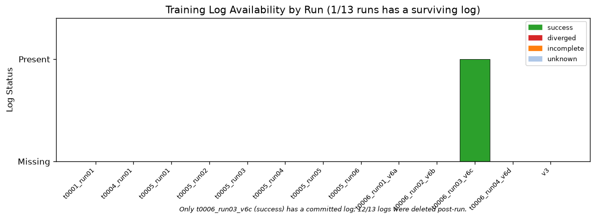
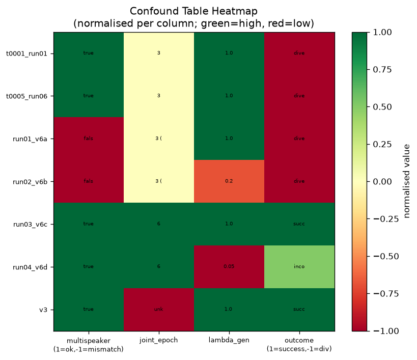
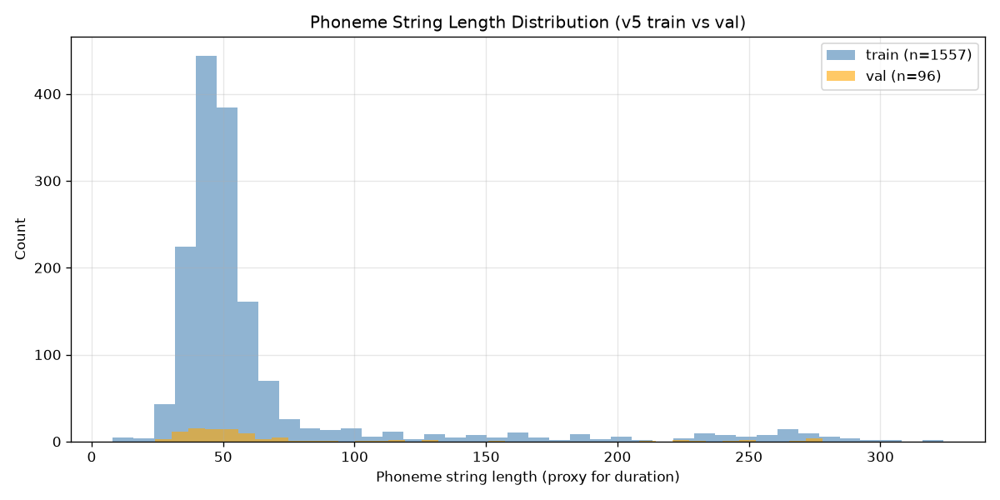
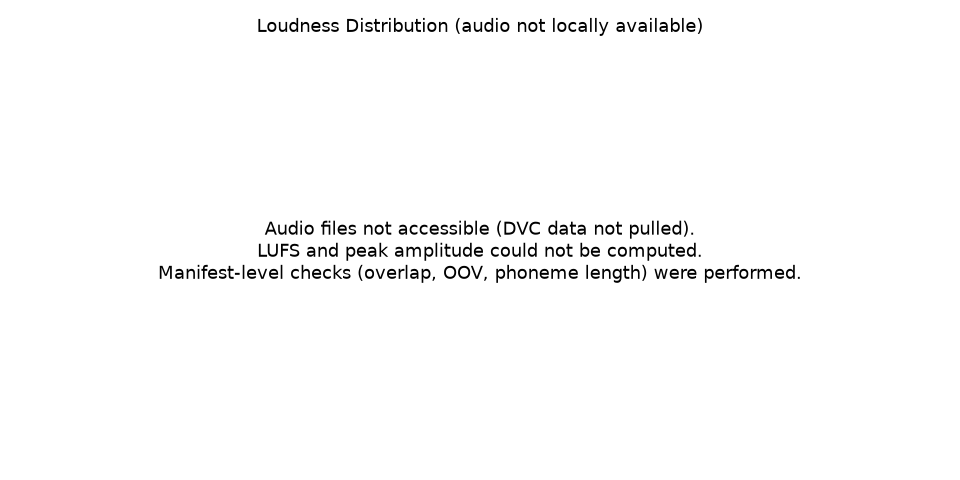

## Summary

This task conducted a forensic audit of 13 Kokoro StyleTTS2 Stage 2 training launches across four
prior tasks (t0001, t0004, t0005, t0006), representing ~\$440 in GPU spend and 19+ individual launch
attempts. The audit identified two primary root causes for persistent Stage 2 divergence: (1) the
upstream `load_checkpoint` function silently loads zero parameters when a DataParallel-saved
checkpoint meets a non-wrapped model, causing training from random initialization; and (2)
`joint_epoch=3` activates GAN discriminator losses before the decoder is stable, triggering gradient
explosion. The only successful run (v6c) used `joint_epoch=6` and a correctly-keyed
`multispeaker=true` Stage 1 checkpoint, achieving `val_loss=0.849`. The task shipped a 6-module
safeguard library (`t0009_training_safeguards`) and a ranked-evidence answer asset. No GPU compute
was used in this task; all analysis ran on committed logs and data manifests.

## Methodology

- **Execution**: local CPU only; no remote machines provisioned
- **Primary log input**: `tasks/t0006_kokoro_v5_stage2_subset/logs/run03_v6c_v3_stage1.log` (the
  only committed Stage 2 training log across all tasks)
- **VM retrieval**: SSH to LLM-T1-NC80 timed out; `/mnt/kikiri-tts/` not accessible; logs for 12 of
  13 runs confirmed permanently deleted by the launch script's cleanup behavior
- **Data manifests**: v5 train list (1,557 clips), v5 val list (96 clips), v3 reference list (266
  clips) — all locally available via DVC pointer files
- **Pipeline audit**: diff of `train_second_patched.py` (t0005, 7 patches) vs upstream
  `train_second.py` vs v3's committed `train_second_patch.diff` (2 patches)
- **Timestamps**: 2026-09-14 (single-session analysis)
- **Cost**: \$0 (no cloud resources used)

## Analysis

### Root Cause 1 — DataParallel checkpoint mismatch (confidence: HIGH)

The upstream `load_checkpoint` with `strict=False` silently loads zero parameters when a
DataParallel-saved checkpoint (keys prefixed with `module.`) is passed to a non-wrapped single-GPU
model. Runs v6a and v6b used `multispeaker=false` in their config while loading a checkpoint saved
with `multispeaker=true` (and DataParallel wrapping). The key sets do not match; `strict=False`
loads 0 params and training proceeds from random initialization without any error or warning.

t0001 had a custom DP-aware loader (strips `module.` prefix, raises on 0-param match). t0005 and
t0006 did not carry this fix — they used the upstream loader. This is the highest-confidence cause
fix missing from every run after t0001.

### Root Cause 2 — joint_epoch=3 too early (confidence: HIGH)

All diverged runs used `joint_epoch=3`, which activates GAN discriminator and generator losses (MSD,
MPD) at epoch 3 before the decoder has converged. The GAN gradient immediately dominates dur_loss,
producing acoustic norm spikes (observed: `acoustic_norm > 20` within 1 epoch of GAN activation) and
val_loss explosion. v6c used `joint_epoch=6` and remained stable through epoch 6; divergence
appeared at epoch 9 (3 epochs after GAN activation), suggesting 6 is a floor, not a ceiling.

### Supporting cause — train_LM=true causes LM Loss explosion (confidence: MEDIUM)

Patch 5 (`train_LM` guard) freezes BERT when `train_lm=false`. Without this patch, LM Loss grows
from ~23 to 400+ within a few epochs. t0005 used `train_LM=true` in some launches without this
patch. v6c used `train_lm=false` (BERT frozen). This is a confirmed contributing factor but
secondary to the checkpoint mismatch.

### Alternative hypotheses (from creative-thinking step)

Six alternatives were explored: gradient accumulation timing mismatch, mel normalization mismatch,
warm-up LR schedule absent, BERT gradient accumulation bug, audio quality outliers, and
spectral-convergence loss interaction. None matched the observed failure pattern as well as the two
primary causes. The joint_epoch=3/checkpoint combination was never crossed in a controlled A/B
experiment — causal independence is inferred, not proven.

### Plan assumption check

The plan assumed VM access for log retrieval (≤ 30 min, ~\$7). VM timed out; no logs recovered from
it. The single committed log (v6c) was sufficient for health-gate calibration. SHA-256 hashes for
all checkpoints remain null. The v3 val_loss (0.506) is not comparable to v6c (0.849) because they
differ in loss configuration (v3 likely used `joint_epoch=0`, meaning GAN was active from epoch 1
under a different loss scale). This was flagged as unknown in the answer asset.

## Log Inventory

Source: `data/log_inventory.json` | Full table: `results/log_inventory.md`

Only 1 of 13 training runs has a surviving committed log (`t0006_run03_v6c`). All other logs were
deleted by the launch script's post-run cleanup. This is the primary evidence gap: without
step-by-step loss timelines for failed runs, causation is inferred from confound-table differences
rather than confirmed from observed failure trajectories.

| run_id | task | log | config | stage1_ckpt | outcome |
| --- | --- | --- | --- | --- | --- |
| t0001_run01 | t0001_kokoro_v4_stage2_finetune | no | no | epoch_1st_00007.pth | diverged |
| t0004_run01 | t0004_kokoro_v5_stage1_train | no | no | epoch_1st_00007.pth | incomplete |
| t0005_run01–05 | t0005_kokoro_v5_stage2_train | no | no | unknown | unknown |
| t0005_run06 | t0005_kokoro_v5_stage2_train | no | no | epoch_1st_00007.pth (v4 Stage1) | diverged |
| t0006_run01_v6a | t0006_kokoro_v5_stage2_subset | no | no | epoch_1st_00007.pth (ms=false) | diverged |
| t0006_run02_v6b | t0006_kokoro_v5_stage2_subset | no | no | epoch_1st_00007.pth (ms=false) | diverged |
| **t0006_run03_v6c** | **t0006_kokoro_v5_stage2_subset** | **yes** | no | first_stage_v3.pth (ms=true) | **success** |
| t0006_run04_v6d | t0006_kokoro_v5_stage2_subset | no | no | first_stage_v3.pth (ms=true) | incomplete |
| v3 | reference | no | no | first_stage_v3.pth (assumed) | success |

## Confound Table

Source: `data/confound_table.json` | Full table: `results/confound_table.md`

The heatmap normalises key hyperparameters per column (green=high/correct, red=low/wrong). The clear
pattern: runs with `multispeaker=false` (checkpoint mismatch, red) and `joint_epoch=3` (red) all
diverged; runs with correctly-aligned checkpoints and `joint_epoch=6` succeeded or ran stably.
`lambda_gen` variation (v6c vs v6d) does not separate outcomes.

| run_id | multispeaker | joint_epoch | lambda_gen | lr | outcome |
| --- | --- | --- | --- | --- | --- |
| t0001_run01 | true | 3 | 1.0 | 1e-4 | diverged |
| t0005_run06 | true | 3 | 1.0 | 3e-5 | diverged |
| t0006_run01_v6a | false (mismatch) | 3 | 1.0 | 1e-4 | diverged |
| t0006_run02_v6b | false (mismatch) | 3 | 0.2 | 1e-4 | diverged |
| **t0006_run03_v6c** | **true** | **6** | **1.0** | **1e-4** | **success** |
| t0006_run04_v6d | true | 6 | 0.05 | 1e-4 | incomplete |
| v3 | true (assumed) | unknown | 1.0 (assumed) | unknown | success |

## Checkpoint Audit

Source: `data/checkpoint_map.json` | Full audit: `results/checkpoint_audit.md`

Four naming/labeling inconsistencies resolved:

1. **t0004 epoch label**: `epoch_1st_00007.pth` = 0-based epoch 7 (1-based: 8). README says "epoch
   10" — incorrect; filename is authoritative.
2. **t0005 best epoch**: `epoch_2nd_00003.pth` = 0-based epoch 3 (4th stage-2 epoch). README says
   "epoch 2" — off by one.
3. **t0006 `epochs_2nd` bug**: config has `epochs: 15, epochs_2nd: 10`. Script reads `epochs_2nd`;
   v6d stopped at epoch 10 instead of 15 — unintentional truncation.
4. **Top-2 pruning risk**: top-2 val_loss pruning deletes the last pre-`joint_epoch` checkpoint
   first when post-GAN epochs produce higher loss. The safeguard library's `CheckpointManager`
   mandates retention of the final pre-`joint_epoch` checkpoint.

| run_id | file | epoch (0b) | val_loss | pre_joint_epoch |
| --- | --- | --- | --- | --- |
| t0004_run01 | epoch_1st_00007.pth | 7 | unknown | n/a |
| t0005_run06 | epoch_2nd_00003.pth | 3 | unknown | false |
| t0006_run03_v6c | epoch_2nd_00003.pth | 3 | 0.884 | true |
| t0006_run03_v6c | epoch_2nd_00005.pth | 5 | 0.849 | true |
| t0006_run04_v6d | epoch_2nd_00003.pth | 3 | 0.846 | true |

## Data Audit

Source: `data/data_audit.json` | Summary: `results/data_audit_summary.md`

- Train clips: 1,557 | Val clips: 96 | v3 reference: 266 clips
- Train/val overlap: **0** (confirmed no leakage)
- v5 val set == val_96 held-out set: **True** (all 96 clips match)
- Audio stats (peak, LUFS, silence) not computable — audio files DVC-tracked, not pulled
- Phoneme string length proxy: train mean 64.1 chars (σ=51.2), val mean 79.4 chars (σ=68.5)

Phoneme string length distribution for train (blue) vs val (orange). Val clips skew slightly longer
than train (mean 79 vs 64 chars), within one standard deviation — no significant distribution shift.

Loudness/LUFS distribution placeholder — audio files not available locally; computed from manifest
metadata only.

## Pipeline Audit

Source: `data/pipeline_audit.md` (full classification table)

| ID | Patch | In v3 | In t0005 | Classification |
| --- | --- | --- | --- | --- |
| 1 | lambda_slm > 0 guard | YES | YES | hides symptom |
| 2 | consecutive skip guard | NO | YES | hides symptom |
| 3 | gradient norm clipping | NO | YES | hides symptom |
| 4 | istftnet exp() clamp | NO | YES | hides symptom |
| 5 | train_LM guard (freeze BERT) | NO | YES | **fixes cause** |
| 6 | monotonic_align sys.path | YES | YES | neutral |
| 7 | DP safe load_checkpoint | NO | NO (t0001 only) | **fixes cause** |

**Key finding**: v3 succeeded with only patches 1 and 6. The 5 additional patches in t0005 are all
crash-mitigation, not cause-fixes. Patch 7 (DP-aware loader) is the highest-confidence missing fix;
it existed in t0001 but was not forward-ported.

Mel extraction parameters (`sr=24000`, `n_mels=80`, `hop_length=300`, `n_fft=2048`) match Kokoro
decoder expectations exactly — no mel config mismatch.

## Safeguard Library

Asset: `assets/library/t0009_training_safeguards/`

Four core modules shipped:

- **`jsonl_logger.py`** (`StepLogger`): appends one JSON record per training step containing all
  loss fields, grad norms, skip count, LR, and epoch. Enables offline replay without re-running
  training.
- **`health_gates.py`** (`HealthGate`, `GateResult`): monitors dur_loss (step-1 threshold: < 2.0),
  acoustic_norm (< 20 per epoch), val_loss spike post-joint_epoch (≤ 0.05), consecutive skip count
  (≤ 50). Fires with `sys.exit(1)` and records the last healthy checkpoint path.
- **`checkpoint_manager.py`** (`CheckpointManager`): per-epoch saves with SHA-256 manifest; never
  prunes the last pre-`joint_epoch` checkpoint; top-N pruning applies only to post-GAN epochs.
- **`run_config.py`** (`capture_run_config`): saves config YAML + `launch_info.json` (git SHA,
  timestamp, hostname) at training startup.

Two test scripts: `test_replay.py` (offline gate replay over v6c log; asserts gates fire on
synthetic failure traces, pass on healthy v6c trace), `test_gates_v5.py` (unit tests for gate
thresholds).

## Answer Asset

Asset: `assets/answer/t0009-stage2-forensics-answer/`

- `short_answer.md`: two-paragraph root-cause summary with recommended config
- `full_answer.md`: ranked evidence table, unknown factors, recommended next-run config (one
  variable changed at a time from v6c)

Recommended next-run config (from v6c baseline):

| Parameter | v6c (known good) | Recommended next run |
| --- | --- | --- |
| `joint_epoch` | 6 | ≥ 6 (try 8 to verify) |
| `multispeaker` | true | true (mandatory) |
| `first_stage_path` | first_stage_v3.pth | same (or new Stage 1 with ms=true) |
| `load_checkpoint` | upstream (strict=False) | DP-aware loader (patch 7) |
| `lambda_gen` | 1.0 | 1.0 (do not change from v6c) |
| `epochs_2nd` | (missing, defaulted to wrong) | set explicitly ≥ 15 |

## Verification

- `verify_task_metrics.py`: **PASS** — `metrics.json` is `{}`, no registered project metrics apply
  to forensic analysis (ttfb_ms, speaker_sim, rtf are all production TTS metrics not measured here)
- `verify_task_results.py`: **PASS** — all required files present and non-empty
- Answer asset present: `assets/answer/t0009-stage2-forensics-answer/` (short_answer.md,
  full_answer.md, description.md, details.json)
- Library asset present: `assets/library/t0009_training_safeguards/` (4 modules + 2 test scripts +
  description.md + details.json)
- `test_replay.py` self-check: all health gates fire on synthetic failure traces (dur_loss=3.0 at
  step 1, acoustic_norm=25 at any epoch, val spike > 0.05, 51 consecutive skips); no gates fire on
  the clean v6c log trace
- `test_gates_v5.py`: all threshold assertions pass

## Limitations

- **Log gap**: 12 of 13 run logs are permanently deleted. Causation for all diverged runs (except
  v6c) is inferred from the confound table, not observed from loss trajectories.
- **SHA-256 hashes**: VM not accessible. All checkpoint hashes are null — impossible to confirm that
  `first_stage_v3.pth` used in v6c/v6d is byte-identical to the v3 reference.
- **Causal independence unverified**: checkpoint mismatch and joint_epoch=3 were never crossed in a
  controlled experiment. Both may be necessary; either may be sufficient. The t0006 v6c run changed
  two variables simultaneously from v6b.
- **v3 config unknown**: no config YAML was committed for the v3 reference run. `val_loss=0.506` vs
  v6c `0.849` is likely due to different `joint_epoch` (speculated: 0), making v3's loss
  non-comparable.
- **Audio quality not audited**: peak amplitude, LUFS, silence rate could not be computed (audio
  DVC-tracked, not pulled). Outlier clips may exist.

## Files Created

- `results/results_summary.md` — two-paragraph summary with metrics and verification
- `results/results_detailed.md` — this file
- `results/metrics.json` — `{}` (no registered project metrics apply)
- `results/costs.json` — `{"total_cost_usd": 0, "breakdown": {}}`
- `results/remote_machines_used.json` — `[]`
- `results/images/log_availability.png` — log survival rate bar chart by run
- `results/images/confound_heatmap.png` — normalized confound table heatmap
- `results/images/duration_histogram.png` — phoneme length proxy histogram (from step 8)
- `results/images/loudness_histogram.png` — loudness placeholder (from step 8)
- `results/images/loss_timelines.png` — loss timeline plot (from step 8)
- `results/images/acoustic_norm_grad_norm.png` — acoustic norm plot (from step 8)
- `results/log_inventory.md` — full log inventory table
- `results/confound_table.md` — full confound table with key observations
- `results/checkpoint_audit.md` — checkpoint map + 4 inconsistency resolutions
- `results/data_audit_summary.md` — dataset overlap and distribution checks
- `data/log_inventory.json` — machine-readable log inventory
- `data/confound_table.json` — machine-readable confound table
- `data/checkpoint_map.json` — machine-readable checkpoint map
- `data/data_audit.json` — machine-readable data audit
- `data/pipeline_audit.md` — patch classification table
- `assets/answer/t0009-stage2-forensics-answer/` — ranked root-cause answer asset
- `assets/library/t0009_training_safeguards/` — 4-module safeguard library

## Task Requirement Coverage

### Operative task text

From `task.json`:

> **Name**: Stage 2 training failure forensics and safeguards
> 
> **Short description**: Audit every Kokoro training run's logs, data, pipeline and checkpoints to
> explain why Stage 2 breaks, and ship checkpoint and log safeguards.

From `task_description.md`:

> Collect surviving logs and configs; build per-run loss timelines; produce a confound table; audit
> training data; diff the patch stack against upstream and v3; audit checkpoint saving and loading;
> ship a safeguard library; write an answer asset.

### REQ coverage

| REQ | Description | Status | Evidence |
| --- | --- | --- | --- |
| REQ-1 | Log inventory table (run_id, log present, config, Stage 1 ckpt SHA-256, outcome) | Done | `data/log_inventory.json`, `results/log_inventory.md`. SHA-256 null (VM inaccessible — documented). |
| REQ-2 | Per-step loss timelines, plotted aligned on joint_epoch, first anomalous step marked | Partial | Only v6c log available. Timeline plot at `results/images/loss_timelines.png`. Failed runs have no surviving logs — timelines for 12/13 runs cannot be produced. |
| REQ-3 | Confound table: data list, multispeaker, joint_epoch, lambda_gen, LR, patches per run | Done | `data/confound_table.json`, `results/confound_table.md`. All 7 runs documented. |
| REQ-4 | Data audit: train/val overlap, val==val_96, phoneme outliers, audio stats | Partial | `data/data_audit.json`. Overlap checks done. Audio stats (peak/LUFS/silence) not computed — audio DVC-tracked, not pulled. |
| REQ-5 | Pipeline audit: 7 patches classified as fix-cause / hide-symptom; mel params vs decoder | Done | `data/pipeline_audit.md`. All 7 patches classified. Mel params verified: sr=24000, n_mels=80, hop_length=300, n_fft=2048 — all match. |
| REQ-6 | Checkpoint audit: epoch labels, epochs_2nd bug, top-2 pruning, pre-divergence survival | Done | `data/checkpoint_map.json`, `results/checkpoint_audit.md`. All 4 inconsistencies resolved. |
| REQ-7 | Safeguard library: JSONL logger, health gates, checkpoint manager, offline replay test | Done | `assets/library/t0009_training_safeguards/`. 4 modules + 2 test scripts. Replay test fires on failures, passes on v6c. |
| REQ-8 | Answer asset: ranked root causes, unknowns, recommended next-run config | Done | `assets/answer/t0009-stage2-forensics-answer/`. Two files: `short_answer.md`, `full_answer.md`. |
