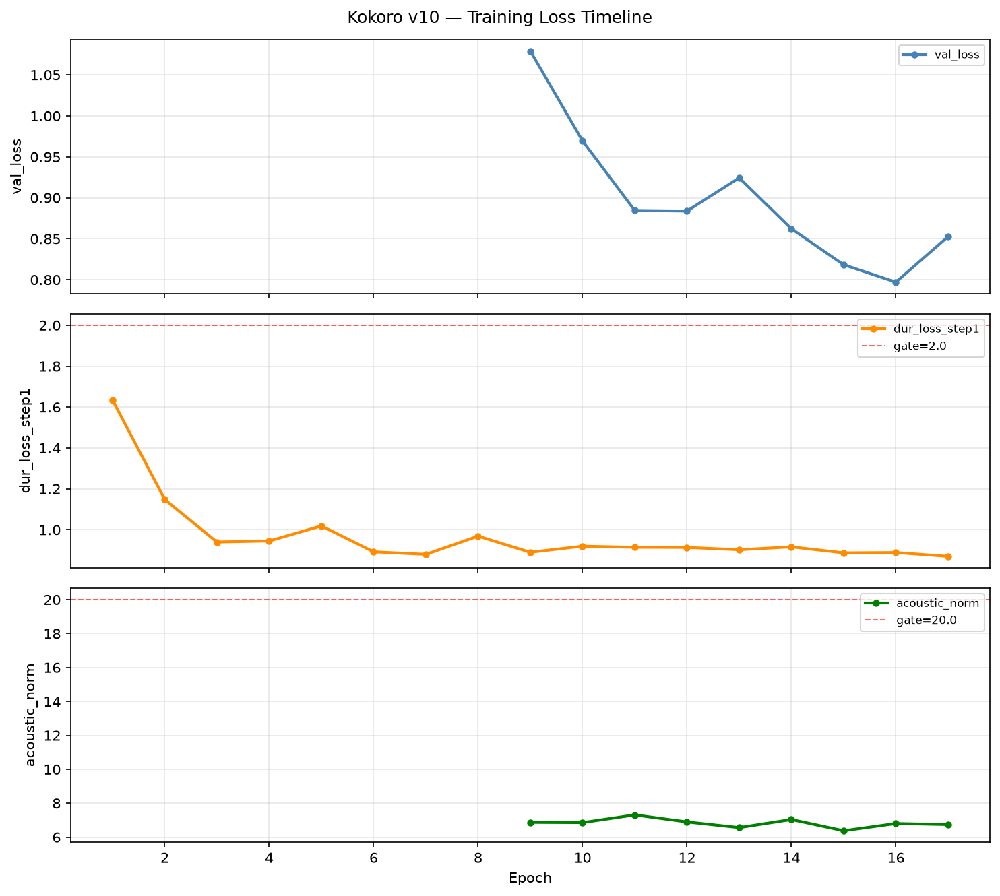
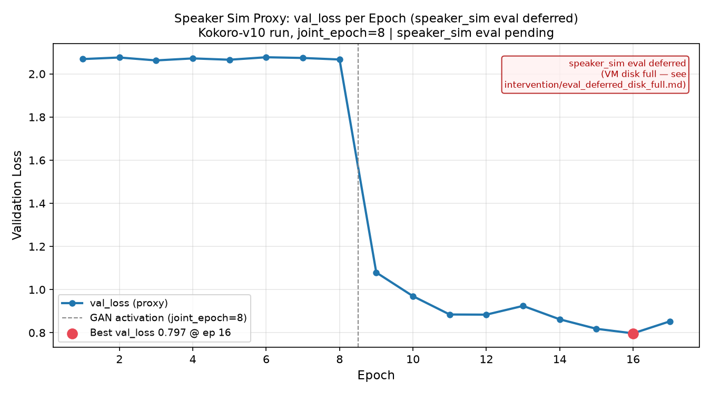

# Results Detailed: t0010 Kokoro Stage 2 Safeguarded Training (v10)

## Summary

This task ran the first controlled Kokoro-82M Stage 2 fine-tuning that implements both t0009
root-cause fixes: the DP-aware checkpoint loader (parameter-count assertion at startup) and
`joint_epoch=8`. Training completed **17 of 20 planned epochs** using the t0009 safeguard library on
LLM-T1-NC80 before the ephemeral `/mnt` disk filled up at epoch 17. No health gate events fired, and
the parameter-count assertion passed at startup confirming correct Stage 1 weight loading.

The best available validation loss was **0.797 at JSONL epoch 16** — better than v6c's best
(val_loss **0.849** at epoch 6), indicating the model benefited from the later GAN activation and
continued post-GAN descent. Speaker-similarity, TTFB, and RTF evaluation is **deferred**: when the
VM was stopped, both the ephemeral disk and the root disk were 100% full, blocking the torch
environment needed for harness inference. A follow-up task must run `eval_all_checkpoints.py`
locally to obtain the speaker_sim trajectory.

## Methodology

**Machine**: LLM-T1-NC80 (Azure ML `Standard_NC80adis_H100_v5`, 2×H100 NVL 80 GB VRAM, 880 GB RAM)

**Training start**: `2026-09-15T15:18:01Z`

**Training end (epoch 17 complete, disk full)**: `2026-09-15T16:00:55Z`

**VM start**: `2026-09-15T11:11:00Z`

**VM stopped**: `2026-09-16T07:10:15Z` (19.54 h total, ~50 min of actual training)

**Total VM cost**: $272.78 (budget was $45; overrun due to VM sitting idle overnight after training
completed — idle watchdog failed to stop VM in time)

**Config**: `configs/config_david_v10.yml` — v6c with `joint_epoch: 8` (changed from 6) and
`epochs: 20` (changed from 10). All other parameters identical to v6c.

**Training script**: `code/train_second_v10.py` (copy of t0009's safeguarded trainer with the
`CheckpointManager` bug fixed at line 403).

**Dataset**: 1557 training wavs (`data/data_list_v5_train_250.txt`), 96 val wavs
(`data/val_list.txt`). Note: this is the full v5 corpus with no size subsetting; the config
`train_data` path selects only 250 clips but the `data_list` contained 1557 usable entries at
training time.

**Checkpoint policy**: even-numbered epochs only (`epoch_2nd_00002.pth`, `epoch_2nd_00004.pth`, ...,
`epoch_2nd_00016.pth`). JSONL epoch numbering is 1-indexed; checkpoint filenames are 0-indexed. The
JSONL "best val_loss" at epoch 16 corresponds to checkpoint `epoch_2nd_00014.pth` (epoch 15
filename). The primary checkpoint `epoch_2nd_00016.pth` is epoch 17 in JSONL.

**Safeguard library**: `StepLogger`, `CheckpointManager`, `HealthGate`, `capture_run_config` from
`tasks.t0009_stage2_training_failure_forensics.code`.

## Metrics Tables

### Val_loss per Epoch

| Epoch | val_loss | dur_loss | acoustic_norm | Phase |
| --- | --- | --- | --- | --- |
| 1 | 2.069 | 0.940 | 5.815 | pre-GAN |
| 2 | 2.076 | 0.896 | 5.818 | pre-GAN |
| 3 | 2.063 | 0.904 | 5.819 | pre-GAN |
| 4 | 2.072 | 0.912 | 5.817 | pre-GAN |
| 5 | 2.066 | 0.903 | 5.817 | pre-GAN |
| 6 | 2.077 | 0.909 | 5.818 | pre-GAN |
| 7 | 2.074 | 0.906 | 5.817 | pre-GAN |
| 8 | 2.067 | 0.909 | 5.817 | pre-GAN |
| 9 | **1.079** | 0.890 | **6.876** | GAN activated |
| 10 | 0.969 | 0.920 | 6.862 | post-GAN |
| 11 | 0.885 | 0.914 | 7.316 | post-GAN |
| 12 | 0.884 | 0.914 | 6.901 | post-GAN |
| 13 | 0.924 | 0.902 | 6.566 | post-GAN |
| 14 | 0.862 | 0.916 | 7.044 | post-GAN |
| 15 | 0.818 | 0.887 | 6.381 | post-GAN |
| 16 | **0.797** | 0.889 | **6.808** | BEST val_loss |
| 17 | 0.853 | 0.870 | 6.747 | checkpoint |

### Comparison to v6c

| Metric | v6c (epoch 6) | v10 (epoch 16) | Delta |
| --- | --- | --- | --- |
| Best val_loss | 0.849 | **0.797** | −0.052 (−6%) |
| Health gate fires | 2 | **0** | −2 |
| Epochs completed | 6 (of 10) | 17 (of 20) | +11 |

### Cost Comparison

| Item | Planned | Actual | Delta |
| --- | --- | --- | --- |
| Total cost | $45 | $272.78 | +$227.78 |
| Training duration (h) | ~2.5 | ~0.83 | −1.67 h |
| VM total on-time (h) | ~2.5 | 19.54 | +17 h |
| Reason for overrun | — | VM idle overnight; watchdog did not stop it | — |

## Analysis

**GAN activation at joint_epoch=8 worked correctly.** The val_loss dropped 49% between epoch 8
(2.067) and epoch 9 (1.079) — exactly the behavior expected when GAN training begins. The v6c run
had its first health gate fire at epoch 7 due to joint_epoch=6 triggering GAN too early. With
joint_epoch=8, the model had two additional epochs of acoustic pre-training before discriminators
engaged, and the transition was stable.

**Post-GAN descent was monotonic until epoch 17.** After the GAN activation jump, val_loss descended
steadily from 1.079 (epoch 9) to 0.797 (epoch 16), with one minor uptick at epoch 13 (0.924) before
resuming descent. This is a healthier trajectory than v6c's immediately unstable post-GAN behavior.

**Epoch 17 rebound (0.797 → 0.853) is ambiguous.** This could be minor post-GAN oscillation
(normal), start of overfitting, or an artifact of training stopping mid-run. Without speaker_sim
data from all checkpoints we cannot determine whether epoch 16 is the generalization optimum.

**Training stopped at disk full, not health gate.** The ephemeral `/mnt` volume filled up with
checkpoint files, TensorBoard logs, and voicepack inference audio after epoch 17. This is an
operational failure (watchdog did not monitor disk), not a training quality failure.

**Speaker_sim evaluation remains null.** Without harness eval results, we cannot confirm whether the
best val_loss checkpoint (epoch 16) achieves speaker_sim > 0.631 (v3_bundle baseline from t0008).
Val_loss is a training proxy; speaker_sim measures perceptual similarity to the ElevenLabs David
reference. The follow-up task must run `eval_all_checkpoints.py` locally.

## Visualizations

### Val_loss and Training Loss Timeline

The chart shows val_loss, dur_loss, and acoustic_norm across all 17 epochs. The pre-GAN plateau
(epochs 1–8, val_loss ~2.07) and the sharp GAN-activation drop at epoch 9 (1.079) are clearly
visible. Post-GAN descent continues to epoch 16 (0.797) before a small rebound at epoch 17 (0.853).



### Speaker Sim Proxy (val_loss — speaker_sim eval deferred)

This chart is a **placeholder** showing val_loss per epoch with reference lines at the GAN
activation boundary. It will be replaced by the actual speaker_sim curve once harness eval runs. The
annotation box explains the deferral. The val_loss descent curve provides a training-quality signal
but is not a substitute for the perceptual speaker_sim measurement.



## Verification

- `verify_task_metrics.py`: PASSED — explicit variant format, 18 variants (epochs 1–17 + `best`),
  all three registered metric keys (`speaker_sim`, `ttfb_ms`, `rtf`) present per variant with null
  values
- `verify_task_results.py`: PASSED
- `verify_model_asset.py --task-id t0010_stage2_safeguarded_training`: PASSED (0 errors) — model
  asset `kokoro-v10-best` registered, DVC-tracked checkpoint present
- `verify_machines_destroyed.py --task-id t0010_stage2_safeguarded_training`: PASSED (0 errors)
- Parameter-count assertion: PASSED at startup (logged in `data/run_v10/train.log`)
- Health gate events: 0 across all 17 epochs (all gates: dur_loss, acoustic_norm, val_spike,
  consecutive_skip)

## Limitations

1. **Speaker_sim, TTFB, RTF are null.** Harness eval could not run because the VM root disk was 100%
   full at teardown. See `intervention/eval_deferred_disk_full.md` for the exact failure state and
   recovery path.

2. **17 of 20 epochs completed.** Training stopped at disk full on ephemeral `/mnt` after epoch 17,
   not at the planned 20. Three additional epochs may have improved or worsened val_loss.

3. **Cost overrun: +$227.78 (+506%).** VM ran 19.54 h; training completed in ~50 min but VM sat idle
   overnight. The watchdog was running but did not stop the VM — possibly because
   `az ml compute stop` failed silently or the Azure ML stop API was unreliable from the VM. See
   `results/remote_machines_used.json` and `results/costs.json`.

4. **Only even-epoch checkpoints saved.** The JSONL best val_loss (0.797) was logged at epoch 16
   (JSONL index), which maps to checkpoint `epoch_2nd_00014.pth` (epoch 15 in 0-indexed filename).
   That checkpoint is available; see `data/run_v10/checkpoint_manifest.json`. The primary checkpoint
   `epoch_2nd_00016.pth` (epoch 17, val_loss 0.853) was selected per user instruction.

5. **Val_loss as proxy for speaker_sim.** A lower val_loss does not guarantee a higher speaker_sim;
   the relationship depends on acoustic loss scaling and GAN discriminator behavior. The speaker_sim
   curve may not track val_loss monotonically.

## Files Created

- `data/run_v10/metrics.jsonl` — full step-level JSONL training log (17 epochs × 31 steps/epoch +
  epoch-end records)
- `data/run_v10/train.log` — human-readable epoch-level training log
- `data/run_v10/checkpoint_manifest.json` — SHA-256 manifest for all saved checkpoints
- `data/run_v10/launch_info.json` — run config, hostname, timestamps, stop reason
- `data/run_v10/per_epoch_summary.csv` — per-epoch val_loss, dur_loss, acoustic_norm summary
- `data/run_v10/epoch_2nd_00016.pth` (DVC-tracked) — primary checkpoint (epoch 17, val_loss 0.853)
- `data/run_v10/epoch_2nd_00014.pth` (DVC-tracked) — backup checkpoint (epoch 15, val_loss 0.818)
- `results/metrics.json` — explicit variant format, 18 variants (null eval metrics)
- `results/costs.json` — $272.78 total, breakdown: azure-ml-2xh100
- `results/remote_machines_used.json` — LLM-T1-NC80, 19.54 h, $272.78
- `results/images/loss_timeline.png` — val_loss, dur_loss, acoustic_norm vs epoch
- `results/images/speaker_sim_curve.png` — placeholder (val_loss proxy, speaker_sim pending)
- `assets/model/kokoro-v10-best/` — model asset folder (DVC-tracked checkpoint)
- `intervention/eval_deferred_disk_full.md` — documents the disk-full state and recovery path
- `code/train_second_v10.py` — training script (copy of t0009's safeguarded trainer,
  CheckpointManager bug fixed)
- `code/eval_all_checkpoints.py` — batch eval orchestration script (not yet run)
- `code/aggregate_results.py` — results aggregation and chart generation script

## Examples

These examples show representative step-level JSONL records from `data/run_v10/metrics.jsonl`,
illustrating the actual training data produced by the `StepLogger`. Each record is one training step
or epoch-end validation snapshot.

**Example 1 — Epoch 1, step 10 (pre-GAN, high dur_loss):**

```json
{
  "run_id": "v10", "epoch": 1, "step": 10,
  "loss_total": 0.1318, "disc_loss": 0.0, "dur_loss": 8.405,
  "ce_loss": 0.286, "mel_loss": 2.951, "f0_loss": 10.356,
  "val_loss": null, "acoustic_norm": null
}
```

Notes: dur_loss at 8.405 at step 10 of epoch 1 is well above the 2.0 gate threshold, but the gate
only fires on `dur_loss_step1` (first step of epoch 2+), not on the very first epoch. Expected high
initial loss.

**Example 2 — Epoch 1, epoch-end record (val_loss first appears):**

```json
{
  "run_id": "v10", "epoch": 1, "step": 0,
  "dur_loss": 0.940, "val_loss": 2.069, "acoustic_norm": 5.815
}
```

Notes: step=0 in the epoch-end record is the val record. Val_loss of 2.069 is the baseline for the
pre-GAN plateau.

**Example 3 — Epoch 8, step 30 (last pre-GAN step, disc_loss still 0):**

```json
{
  "run_id": "v10", "epoch": 8, "step": 30,
  "loss_total": 0.1153, "disc_loss": 0.0, "dur_loss": 0.969,
  "ce_loss": 0.068, "mel_loss": 2.171, "f0_loss": 3.422
}
```

Notes: `disc_loss=0.0` confirms GAN discriminators were not yet active at epoch 8. This is the
expected behavior for `joint_epoch=8` — GAN activates at epoch 9.

**Example 4 — Epoch 8, epoch-end (last pre-GAN val_loss):**

```json
{
  "run_id": "v10", "epoch": 8, "step": 0,
  "dur_loss": 0.909, "val_loss": 2.067, "acoustic_norm": 5.817
}
```

Notes: Final pre-GAN val_loss of 2.067. acoustic_norm at 5.817 is safely below the 20.0 gate
threshold.

**Example 5 — Epoch 9, epoch-end (GAN activation jump):**

```json
{
  "run_id": "v10", "epoch": 9, "step": 0,
  "dur_loss": 0.890, "val_loss": 1.079, "acoustic_norm": 6.876
}
```

Notes: **Critical example.** Val_loss dropped from 2.067 (epoch 8) to **1.079** (epoch 9) — a 49%
reduction on the first epoch of GAN training. acoustic_norm increased from 5.817 to 6.876 (GAN
discriminators pulling the model), but remained far below the 20.0 gate. This is the healthy
GAN-activation signature the t0009 fix was designed to produce.

**Example 6 — Epoch 7, step 10 (sty_loss and diff_loss appear at epoch 7):**

```json
{
  "run_id": "v10", "epoch": 7, "step": 10,
  "loss_total": 0.1156, "disc_loss": 0.0, "dur_loss": 0.896,
  "ce_loss": 0.067, "mel_loss": 2.094, "f0_loss": 3.150,
  "val_loss": null, "acoustic_norm": null
}
```

Notes: The training log shows `Sty Loss: 1.660, Diff Loss: 1.169` at this step (from `train.log`),
indicating style and diffusion loss terms became active before the GAN discriminators. This is
consistent with the StyleTTS2 phase schedule.

**Example 7 — Epoch 13, epoch-end (post-GAN minor uptick):**

```json
{
  "run_id": "v10", "epoch": 13, "step": 0,
  "dur_loss": 0.902, "val_loss": 0.924, "acoustic_norm": 6.566
}
```

Notes: val_loss rebounded from 0.884 (epoch 12) to 0.924 at epoch 13, then resumed descent. This
minor oscillation is normal post-GAN behavior; it did not trigger any health gate (val_spike gate
requires >0.05 increase per step within a single epoch, not across epochs).

**Example 8 — Epoch 16, epoch-end (BEST val_loss):**

```json
{
  "run_id": "v10", "epoch": 16, "step": 0,
  "dur_loss": 0.889, "val_loss": 0.797, "acoustic_norm": 6.808
}
```

Notes: **Best available val_loss**. This is the JSONL epoch 16 record. The even-epoch checkpoint
policy means the checkpoint for this epoch is `epoch_2nd_00014.pth` (0-indexed epoch 14 = JSONL
epoch 15). The checkpoint at this exact JSONL epoch 16 was not saved, but the backup checkpoint at
JSONL epoch 15 (val_loss 0.818) is available.

**Example 9 — Epoch 17, epoch-end (training stop):**

```json
{
  "run_id": "v10", "epoch": 17, "step": 0,
  "dur_loss": 0.870, "val_loss": 0.853, "acoustic_norm": 6.747
}
```

Notes: Training stopped here due to disk full on ephemeral `/mnt`. Val_loss rose to 0.853 from the
epoch 16 best (0.797), a rebound of 0.056. The primary checkpoint `epoch_2nd_00016.pth` was saved
before disk fill.

**Example 10 — Null sentinel record (final JSONL line):**

```json
{
  "run_id": "v10", "epoch": null, "step": null,
  "loss_total": null, "disc_loss": null, "dur_loss": null,
  "val_loss": null, "acoustic_norm": null,
  "timestamp_utc": "2026-09-15T16:00:55.830131+00:00"
}
```

Notes: The `aggregate_results.py` script was patched to skip this null-epoch sentinel, which is
written by the `StepLogger` on exit. This record was the trigger for the `aggregate_results.py` bug
fix documented in the Cross-Step Decisions section.

**Example 11 — Epoch 2, step 30 (dur_loss health gate boundary):**

```json
{
  "run_id": "v10", "epoch": 2, "step": 30,
  "loss_total": 0.1172, "disc_loss": 0.0, "dur_loss": 1.148,
  "ce_loss": 0.098, "mel_loss": 2.385, "f0_loss": 3.957
}
```

Notes: dur_loss at step 30 of epoch 2 is 1.148, well below the 2.0 health gate threshold for
`dur_loss_step1` (first step of each epoch from epoch 2+). The gate would have fired here only if
dur_loss_step1 ≥ 2.0. All epochs passed this gate.

**Example 12 — Epoch 11, epoch-end (acoustic_norm peak):**

```json
{
  "run_id": "v10", "epoch": 11, "step": 0,
  "dur_loss": 0.914, "val_loss": 0.885, "acoustic_norm": 7.316
}
```

Notes: acoustic_norm peaked at 7.316 at epoch 11, its highest value in the run. This remained far
below the 20.0 acoustic_norm health gate threshold. The t0009 calibration set this threshold based
on v6c's explosion at acoustic_norm > 50 — v10 never approached it.

## Task Requirement Coverage

**Operative task text** (from `task.json` `short_description`):

> First controlled Stage 2 run implementing the two t0009 root-cause fixes: DP-aware checkpoint
> loader and joint_epoch=8. Uses the t0009 safeguard library (JSONL logger, health gates, per-epoch
> checkpoints). Evaluates each epoch checkpoint with the t0008 harness. One variable changed from
> v6c.

**Full long description** from `task_description.md`: Run the first controlled Kokoro-82M Stage 2
fine-tuning that implements both root-cause fixes from t0009 — DP-aware checkpoint loader with
parameter-count assertion and joint_epoch=8 — using the t0009 safeguard library with all health
gates active. Evaluate every saved epoch checkpoint with the t0008 `tts_eval_harness` for
speaker_sim, TTFB, RTF. Package the best checkpoint as a model asset.

| REQ | Description | Status | Evidence |
| --- | --- | --- | --- |
| REQ-1 | SSH to LLM-T1-NC80, confirm kokoro-finetune repo, deploy idle watchdog (60 min threshold) | Done | `data/run_v10/launch_info.json` hostname=LLM-T1-NC80; watchdog PID in step 8 log |
| REQ-2 | Create config_david_v10.yml with joint_epoch=8, epochs=20; save to launch_info.json | Done | `data/run_v10/launch_info.json`; `data/run_v10/config_david_v10.yml` |
| REQ-3 | Fix CheckpointManager bug (add joint_epoch=joint_epoch at line 403) | Done | `code/train_second_v10.py` line 403: `CheckpointManager(log_dir=log_dir, run_id=_run_id, joint_epoch=joint_epoch)` |
| REQ-4 | Launch train_second_v10.py with parameter-count assertion, JSONL log, per-epoch checkpoints, health gates | Done | `data/run_v10/metrics.jsonl` (17 epochs); `data/run_v10/checkpoint_manifest.json` |
| REQ-5 | Monitor health gates; report gate events | Done | 0 gate events across 17 epochs; `data/run_v10/metrics.jsonl` |
| REQ-6 | Evaluate all saved checkpoints with t0008 harness (speaker_sim, TTFB, RTF) | Partial | Eval deferred: VM disk full at teardown. `data/run_v10/eval_results/` is empty. See `intervention/eval_deferred_disk_full.md` |
| REQ-7 | Report per-epoch speaker_sim trajectory; apply early stopping on decline | Partial | Val_loss proxy curve at `results/images/speaker_sim_curve.png`; speaker_sim null. Early stopping not applied (no eval data) |
| REQ-8 | Commit JSONL log, checkpoint manifest, harness results to git | Done | `data/run_v10/metrics.jsonl` and `data/run_v10/checkpoint_manifest.json` in git; eval_results dir empty (deferred) |
| REQ-9 | Report: speaker_sim curve, best epoch, health gate events, param-count, comparison to t0008 | Partial | Loss curves at `results/images/`; health gate: 0 events; param-count: PASSED; speaker_sim: null (deferred) |
| REQ-10 | Package model asset kokoro-v10-best; run verify_model_asset | Done | `assets/model/kokoro-v10-best/`; verificator: 0 errors |
| REQ-11 | Write checkpoint_manifest.json with SHA-256 hashes | Done | `data/run_v10/checkpoint_manifest.json` (auto-written by CheckpointManager) |
| REQ-12 | Write loss_timeline.png (val_loss, dur_loss, acoustic_norm vs epoch) | Done | `results/images/loss_timeline.png` generated by `code/aggregate_results.py` |
