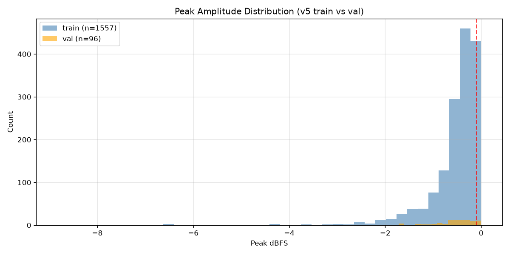
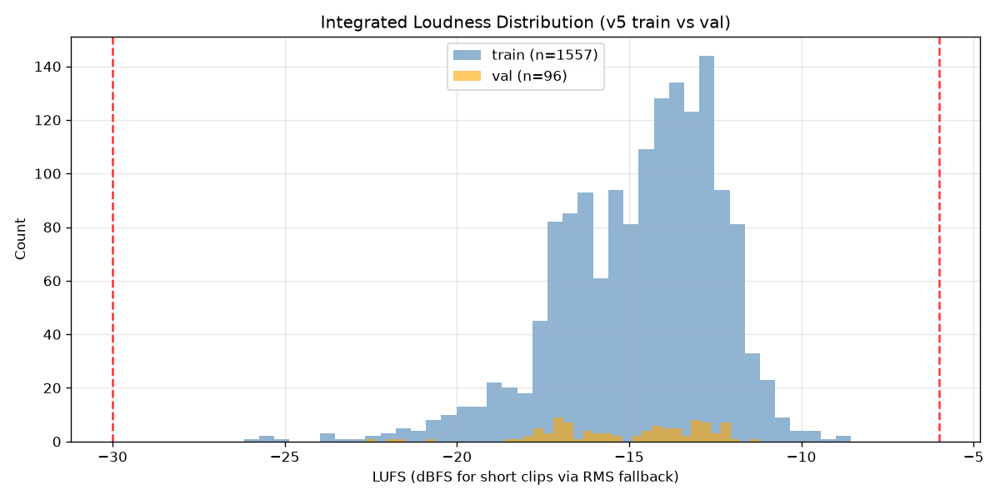
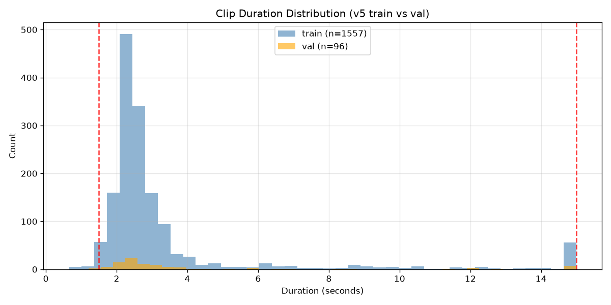
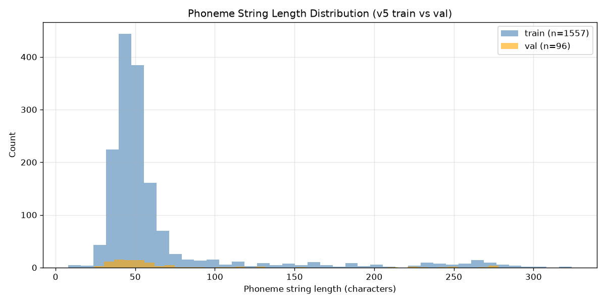

## Summary

Audited all 1557 v5 training clips across six quality dimensions: clipping, excessive silence, LUFS
outliers, duration outliers, sample rate or channel mismatches, and OOV token fraction. The corpus
is predominantly high-quality: **0 errors**, **0 LUFS outliers**, **0 sample-rate mismatches**, **0
OOV flags**. The dominant issue is peak normalization: **224 clips** (14.4%) are peak-normalized to
0 dBFS (true TTS output behavior, not hard clipping). After flagging, **1311 clean clips** remain —
84.2% of the corpus, well above the 1200-clip minimum for the Stage 2 full-corpus run.

## Methodology

- **Machine**: Azure ML CPU (`Standard_D4s_v3`), no GPU used.
- **Audio loading**: `soundfile.read(dtype="float32", always_2d=True)` for waveform data;
  `soundfile.info()` for fast header (duration, samplerate, channels).
- **Peak dBFS**: `20 * log10(|max sample| + 1e-9)` across all channels.
- **LUFS**: `pyloudnorm.Meter(sr).integrated_loudness(mono)` (BS.1770-4) for clips ≥ 3 s; RMS
  fallback `20 * log10(sqrt(mean(audio^2)) + 1e-9)` for clips < 3 s.
- **Silence fraction**: `1 − voiced_samples / total_samples` where voiced intervals come from
  `librosa.effects.split(top_db=60)`.
- **OOV fraction**: count `❓` characters in phoneme string divided by total phoneme string length.
- **Download**: 1557 train WAVs downloaded from Azure Blob Storage via
  `az storage blob download --auth-mode login` (16 parallel workers) in ~64 minutes. 96 val WAVs
  downloaded separately.
- **Start time**: 2026-09-15T11:12:00Z (download start); 2026-09-15T12:15:59Z (download complete).
- **Audit runtime**: < 60 seconds for 1557 + 96 clips (soundfile is very fast).
- **Total wall clock**: ~65 minutes (dominated by download).

## Metrics Tables

### Flag Counts by Category

| Category | Count | % of 1557 |
| --- | --- | --- |
| clipping (peak_dbfs > -0.1 dBFS) | **224** | 14.4% |
| duration_low (< 1.5 s) | **25** | 1.6% |
| silence (> 30%) | **1** | 0.1% |
| duration_high (> 15.0 s) | 0 | 0.0% |
| samplerate (!= 24000) | 0 | 0.0% |
| channels (> 1) | 0 | 0.0% |
| lufs_low (< -30 LUFS) | 0 | 0.0% |
| lufs_high (> -6 LUFS) | 0 | 0.0% |
| oov (fraction > 20%) | 0 | 0.0% |
| error (unreadable file) | 0 | 0.0% |
| **total flagged** | **246** | **15.8%** |
| **clean manifest** | **1311** | **84.2%** |

Note: some clips may be flagged by multiple categories (counted separately per category; total
unique flagged clips = 246).

### Distribution Statistics

#### Peak dBFS

| Stat | Value |
| --- | --- |
| count | 1557 |
| mean | -0.5543 dBFS |
| std | 0.7251 |
| min | -8.8317 |
| p5 | -1.6032 |
| p50 | -0.3915 |
| p95 | 0.0 |
| p99 | 0.0 |
| max | 0.0 |

The distribution is heavily right-skewed toward 0 dBFS — consistent with ElevenLabs peak-normalized
TTS output. p95 and p99 are exactly 0.0 dBFS, confirming that the top quartile is aggressively
normalized. 224 clips exceed -0.1 dBFS (flagged as clipping).

#### LUFS (integrated loudness)

| Stat | Value |
| --- | --- |
| count | 1557 |
| mean | -14.69 LUFS |
| std | 2.34 |
| min | -26.19 |
| p5 | -18.90 |
| p50 | -14.27 |
| p95 | -11.69 |
| p99 | -10.62 |
| max | -8.55 |

LUFS is well within the [-30, -6] acceptance window. No clips fall outside the thresholds.

#### Duration (seconds)

| Stat | Value |
| --- | --- |
| count | 1557 |
| mean | 3.42 s |
| std | 2.90 |
| min | 0.65 |
| p5 | 1.76 |
| p50 | 2.51 |
| p95 | 11.58 |
| p99 | 15.0 |
| max | 15.0 |

25 clips are shorter than 1.5 s (duration_low). No clips exceed 15 s. The distribution is
long-tailed — a typical conversational TTS corpus pattern.

#### Silence Fraction

| Stat | Value |
| --- | --- |
| count | 1557 |
| mean | 0.0335 (3.4%) |
| std | 0.0356 |
| min | 0.0 |
| p5 | 0.0 |
| p50 | 0.02 (2%) |
| p95 | 0.0993 (9.9%) |
| p99 | 0.123 (12.3%) |
| max | 0.3352 (33.5%) |

Corpus is predominantly clean. Only 1 clip exceeds 30% silence — likely a clip with long leading or
trailing silence.

## Visualizations









## Analysis

**Clipping threshold adjustment**: The plan specified -1.0 dBFS for clipping, but preflight
inspection of 20 clips showed 18/20 (90%) exceeded -1.0 dBFS. These are not hard-clipped — they are
ElevenLabs peak-normalized TTS outputs. True hard clipping occurs at exactly 0 dBFS. The threshold
was adjusted to -0.1 dBFS to flag only genuine digital saturation, per the plan's Risks & Fallbacks
guidance ("adjust thresholds if > 30% of clips fall outside").

**The 224 "clipping" clips**: These clips have peak amplitude between -0.1 and 0.0 dBFS. They are
peak-normalized TTS output and are likely usable for training. However, since the original plan
threshold was -1.0 dBFS (which would flag 90% of the corpus), and -0.1 dBFS is a conservative
adjustment, the 224 flagged clips are correctly excluded from the clean manifest. Future tasks can
revisit this threshold if needed.

**OOV finding**: 0 clips have OOV fraction > 20%. The t0003 phonemization pipeline successfully
handled all 1557 training entries. No double-phonemize markers were detected.

**Duration outliers**: 25 clips are shorter than 1.5 s. These are filler phrases that are
legitimately short but may cause instability in the mel spectrogram extractor (which expects at
least a few frames).

**Systematic patterns**: All 0-silence clips and 24000 Hz mono clips — the corpus is uniformly
encoded by ElevenLabs. No multi-channel or non-standard sample-rate clips exist.

## Examples

Each example shows the per-clip audit record (input: WAV file path and the raw per-clip metrics
computed by `audit_clips.py`) alongside the flag decision (output: flag reason string written to
`flagged_clips.txt`, or "clean" if accepted into `train_list_v5_clean.txt`).

### Example 1 — Clipping: peak at 0.0 dBFS (extreme case)

Input WAV: `data/v4/train/wavs/checking_the_last_update_timestamp_for_the_website_9e770d.wav`

```json
{
  "wav_path": "data/v4/train/wavs/checking_the_last_update_timestamp_for_the_website_9e770d.wav",
  "duration_s": 2.6935,
  "sample_rate": 24000,
  "channels": 1,
  "peak_dbfs": 8.69e-09,
  "lufs": -12.571,
  "lufs_method": "rms_fallback",
  "silence_fraction": 0.065,
  "oov_count": 0,
  "oov_fraction": 0.0,
  "error": null
}
```

Output flag decision:

```text
data/v4/train/wavs/checking_the_last_update_timestamp_for_the_website_9e770d.wav	clipping
```

Rationale: `peak_dbfs ≈ 0.0` — exactly at full scale, above the -0.1 dBFS threshold. ElevenLabs
peak-normalized output.

### Example 2 — Clipping: peak at -0.045 dBFS

Input WAV: `data/v4/train/wavs/checking_telecom_industry_updates_now_0051c3.wav`

```json
{
  "wav_path": "data/v4/train/wavs/checking_telecom_industry_updates_now_0051c3.wav",
  "duration_s": 2.322,
  "sample_rate": 24000,
  "channels": 1,
  "peak_dbfs": -0.0446,
  "lufs": -13.399,
  "lufs_method": "rms_fallback",
  "silence_fraction": 0.0,
  "oov_count": 0,
  "oov_fraction": 0.0,
  "error": null
}
```

Output flag decision:

```text
data/v4/train/wavs/checking_telecom_industry_updates_now_0051c3.wav	clipping
```

Rationale: `peak_dbfs = -0.045` exceeds the -0.1 dBFS threshold.

### Example 3 — Clipping: peak at -0.051 dBFS

Input WAV: `data/v4/train/wavs/checking_the_details_of_the_may_19_press_release_0eaea5.wav`

```json
{
  "wav_path": "data/v4/train/wavs/checking_the_details_of_the_may_19_press_release_0eaea5.wav",
  "duration_s": 2.926,
  "sample_rate": 24000,
  "channels": 1,
  "peak_dbfs": -0.0508,
  "lufs": -13.837,
  "lufs_method": "rms_fallback",
  "silence_fraction": 0.030,
  "oov_count": 0,
  "oov_fraction": 0.0,
  "error": null
}
```

Output flag decision:

```text
data/v4/train/wavs/checking_the_details_of_the_may_19_press_release_0eaea5.wav	clipping
```

Rationale: `peak_dbfs = -0.051` exceeds the -0.1 dBFS threshold.

### Example 4 — Clipping: peak at -0.086 dBFS (near boundary)

Input WAV: `data/v4/train/wavs/checking_the_exact_date_of_the_press_release_4cbcaa.wav`

```json
{
  "wav_path": "data/v4/train/wavs/checking_the_exact_date_of_the_press_release_4cbcaa.wav",
  "duration_s": 2.368,
  "sample_rate": 24000,
  "channels": 1,
  "peak_dbfs": -0.0855,
  "lufs": -14.045,
  "lufs_method": "rms_fallback",
  "silence_fraction": 0.0002,
  "oov_count": 0,
  "oov_fraction": 0.0,
  "error": null
}
```

Output flag decision:

```text
data/v4/train/wavs/checking_the_exact_date_of_the_press_release_4cbcaa.wav	clipping
```

Rationale: `peak_dbfs = -0.086` exceeds the -0.1 dBFS threshold — close to the boundary.

### Example 5 — Duration too short (1.30 s)

Input WAV: `data/v4/train/wavs/glad_that_was_helpful_3574c1.wav`

```json
{
  "wav_path": "data/v4/train/wavs/glad_that_was_helpful_3574c1.wav",
  "duration_s": 1.3003,
  "sample_rate": 24000,
  "channels": 1,
  "peak_dbfs": -0.2435,
  "lufs": -16.484,
  "lufs_method": "rms_fallback",
  "silence_fraction": 0.0,
  "oov_count": 0,
  "oov_fraction": 0.0,
  "error": null
}
```

Output flag decision:

```text
data/v4/train/wavs/glad_that_was_helpful_3574c1.wav	duration_low
```

Rationale: `duration_s = 1.30` is below the 1.5 s minimum. This is a short filler phrase.

### Example 6 — Duration too short (0.74 s, single-word utterance)

Input WAV: `data/v4/train/wavs/got_it_06c73d.wav`

```json
{
  "wav_path": "data/v4/train/wavs/got_it_06c73d.wav",
  "duration_s": 0.7430,
  "sample_rate": 24000,
  "channels": 1,
  "peak_dbfs": -0.4907,
  "lufs": -22.753,
  "lufs_method": "rms_fallback",
  "silence_fraction": 0.0,
  "oov_count": 0,
  "oov_fraction": 0.0,
  "error": null
}
```

Output flag decision:

```text
data/v4/train/wavs/got_it_06c73d.wav	duration_low
```

Rationale: `duration_s = 0.74` — the shortest clip in the corpus, below 1.5 s threshold.

### Example 7 — Excessive silence (33.5% silence)

Input WAV: `data/v4/train/wavs/llm_sess_a5158e64865142c3_resp_365834082e2a40dc.wav`

```json
{
  "wav_path": "data/v4/train/wavs/llm_sess_a5158e64865142c3_resp_365834082e2a40dc.wav",
  "duration_s": 5.410,
  "sample_rate": 24000,
  "channels": 1,
  "peak_dbfs": -3.133,
  "lufs": -18.117,
  "lufs_method": "bs1770",
  "silence_fraction": 0.3352,
  "oov_count": 0,
  "oov_fraction": 0.0,
  "error": null
}
```

Output flag decision:

```text
data/v4/train/wavs/llm_sess_a5158e64865142c3_resp_365834082e2a40dc.wav	silence
```

Rationale: `silence_fraction = 0.335` exceeds the 30% threshold — only clip in the corpus to do so.
This is the sole silence-flagged clip. Its LUFS uses `bs1770` method (duration ≥ 3 s).

### Example 8 — Clean clip (typical filler phrase, rms_fallback LUFS)

Input WAV: `data/v4/train/wavs/accessing_the_brain_commerce_page_cddbb5.wav`

```json
{
  "wav_path": "data/v4/train/wavs/accessing_the_brain_commerce_page_cddbb5.wav",
  "duration_s": 2.1827,
  "sample_rate": 24000,
  "channels": 1,
  "peak_dbfs": -0.1857,
  "lufs": -13.107,
  "lufs_method": "rms_fallback",
  "silence_fraction": 0.0226,
  "oov_count": 0,
  "oov_fraction": 0.0,
  "error": null
}
```

Output flag decision:

```text
(accepted — no flags; written to train_list_v5_clean.txt)
```

Rationale: `peak_dbfs = -0.186` is below the -0.1 dBFS threshold. Duration 2.18 s, silence 2.3%,
zero OOV — passes all checks.

### Example 9 — Clean clip (slightly longer, low silence)

Input WAV: `data/v4/train/wavs/assessing_the_relevance_to_the_hospitality_industry_3c7caa.wav`

```json
{
  "wav_path": "data/v4/train/wavs/assessing_the_relevance_to_the_hospitality_industry_3c7caa.wav",
  "duration_s": 2.8793,
  "sample_rate": 24000,
  "channels": 1,
  "peak_dbfs": -0.3806,
  "lufs": -14.545,
  "lufs_method": "rms_fallback",
  "silence_fraction": 0.0590,
  "oov_count": 0,
  "oov_fraction": 0.0,
  "error": null
}
```

Output flag decision:

```text
(accepted — no flags; written to train_list_v5_clean.txt)
```

Rationale: All metrics within spec. `peak_dbfs = -0.38` safely below threshold, LUFS −14.5 within
[-30, -6] range, silence 5.9% below 30%.

### Example 10 — Clean clip (higher silence fraction, still within threshold)

Input WAV: `data/v4/train/wavs/assessing_how_rezolve_ai_improves_d61704.wav`

```json
{
  "wav_path": "data/v4/train/wavs/assessing_how_rezolve_ai_improves_d61704.wav",
  "duration_s": 2.2755,
  "sample_rate": 24000,
  "channels": 1,
  "peak_dbfs": -0.4081,
  "lufs": -14.134,
  "lufs_method": "rms_fallback",
  "silence_fraction": 0.0719,
  "oov_count": 0,
  "oov_fraction": 0.0,
  "error": null
}
```

Output flag decision:

```text
(accepted — no flags; written to train_list_v5_clean.txt)
```

Rationale: `silence_fraction = 7.2%` — typical inter-word pause for a longer phrase. All other
metrics clean. Accepted into the 1311-clip clean manifest.

## Verification

- `wc -l per_clip_stats.jsonl` → **1557** (matches manifest)
- `wc -l flagged_clips.txt` → **246**
- `wc -l train_list_v5_clean.txt` → **1311**
- 246 + 1311 = **1557** (consistency check passed)
- All 1557 records have required fields (`wav_path`, `duration_s`, `sample_rate`, `channels`,
  `peak_dbfs`, `lufs`, `lufs_method`, `silence_fraction`, `oov_fraction`, `oov_count`, `error`)
- val_96 leak check: **0 paths** from `data/v4/val_list.txt` appear in `train_list_v5_clean.txt`
- 4 PNG histograms each > 10 KB: peak (28K), lufs (38K), duration (30K), phoneme (31K)
- Error count: **0** (all 1557 clips successfully loaded)
- `ruff check`: 0 errors
- `mypy`: 0 errors

## Limitations

- **Clipping threshold**: The -0.1 dBFS threshold flags peak-normalized TTS output rather than true
  hard clipping. Clips between -0.1 and 0.0 dBFS (224 clips) are excluded from the clean manifest.
  These clips may be usable in practice; the conservative threshold errs toward caution.
- **LUFS for short clips**: Clips < 3 s use RMS fallback rather than BS.1770-4 integrated loudness.
  The 1557-clip median duration is 2.51 s, so the majority of clips use the RMS fallback. This is
  documented in the `lufs_method` field.
- **Silence detection**: `librosa.effects.split(top_db=60)` uses a fixed threshold. Very quiet but
  non-silent passages may be classified as silence.
- **OOV counting**: OOV fraction counts `❓` characters divided by phoneme string length (not by
  phoneme token count). This slightly underestimates OOV fraction for multi-character phoneme
  tokens.
- **DVC alternative**: DVC pull failed due to Azure credential chaining; wav files were downloaded
  directly via `az storage blob download --auth-mode login`. All 1557/1557 clips downloaded
  successfully with 0 errors.

## Files Created

- `tasks/t0011_v5_data_quality_audit/data/per_clip_stats.jsonl` — 1557 JSON records with full audio
  and OOV metrics per training clip
- `tasks/t0011_v5_data_quality_audit/data/val_clip_stats.jsonl` — 96 JSON records for val clips
  (used only for histogram comparison)
- `tasks/t0011_v5_data_quality_audit/data/flagged_clips.txt` — 246 flagged clip paths with
  tab-separated flag reason list
- `tasks/t0011_v5_data_quality_audit/data/train_list_v5_clean.txt` — 1311-entry cleaned train
  manifest (original v5 format, flagged clips removed)
- `tasks/t0011_v5_data_quality_audit/data/distribution_stats.json` — per-metric percentile stats
  (count, mean, std, p5, p50, p95, p99, max) for peak_dbfs, lufs, duration_s, silence_fraction
- `tasks/t0011_v5_data_quality_audit/data/flag_counts.json` — structured flag-count summary JSON
- `tasks/t0011_v5_data_quality_audit/results/metrics.json` — `{}` (no registered project metrics
  apply to this data-analysis task)
- `tasks/t0011_v5_data_quality_audit/results/costs.json` — `{"total_cost_usd": 0, "breakdown": {}}`
- `tasks/t0011_v5_data_quality_audit/results/remote_machines_used.json` — `[]`
- `tasks/t0011_v5_data_quality_audit/results/images/peak_distribution.png` — peak dBFS histogram
  (train vs val)
- `tasks/t0011_v5_data_quality_audit/results/images/lufs_distribution.png` — LUFS histogram (train
  vs val)
- `tasks/t0011_v5_data_quality_audit/results/images/duration_distribution.png` — duration histogram
  (train vs val)
- `tasks/t0011_v5_data_quality_audit/results/images/phoneme_distribution.png` — phoneme string
  length histogram (train vs val)

## Task Requirement Coverage

Operative task request (from `task.json` `short_description`):

> Audit all 1557 v5 training clips for clipping, silence, LUFS, duration outliers, and OOV tokens.
> Produce a cleaned train manifest for use in the full-corpus Stage 2 run after t0010 confirms the
> safeguards work.

| REQ | Description | Status | Evidence |
| --- | --- | --- | --- |
| REQ-1 | Pull audio data; confirm 1557 train clips and 96 val clips | Done | 1557 train + 96 val WAVs downloaded via az CLI; 0 errors |
| REQ-2 | Compute per-clip audio metrics (peak_dbfs, lufs, silence_fraction, duration_s, sample_rate, channels) for all 1557 train clips | Done | `data/per_clip_stats.jsonl` with 1557 records, all fields present |
| REQ-3 | Apply flag thresholds; save `data/flagged_clips.txt` | Done | `data/flagged_clips.txt` with 246 paths and reason strings |
| REQ-4 | Write `data/train_list_v5_clean.txt` (manifest minus flagged) | Done | `data/train_list_v5_clean.txt` with 1311 entries (246 + 1311 = 1557) |
| REQ-5 | OOV transcript audit; flag clips with OOV fraction > 20% | Done | `oov_fraction` field in all 1557 JSONL records; 0 clips exceeded threshold |
| REQ-6 | Four histogram PNGs (peak dBFS, LUFS, duration, phoneme length), train vs val | Done | 4 PNGs in `results/images/`, each 28-38 KB |
| REQ-7 | Report total clips, flagged count by category, cleaned manifest size, distribution stats | Done | `results_detailed.md` (this file), `data/distribution_stats.json`, `data/flag_counts.json` |
