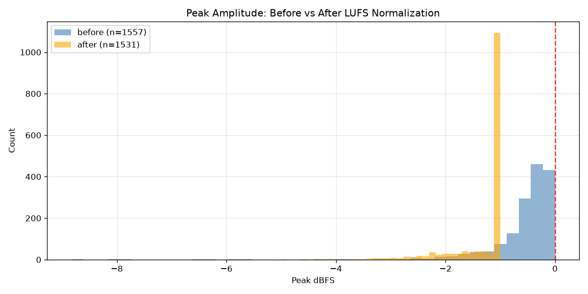
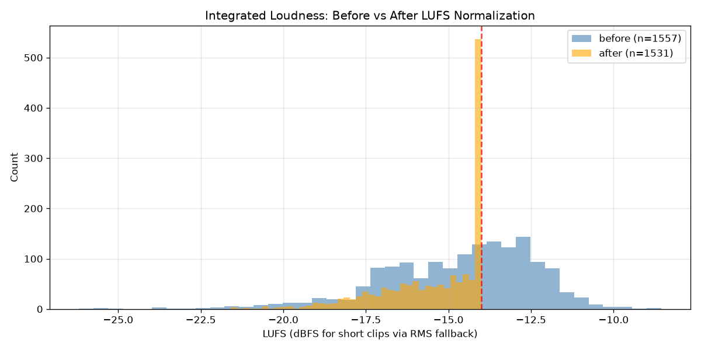
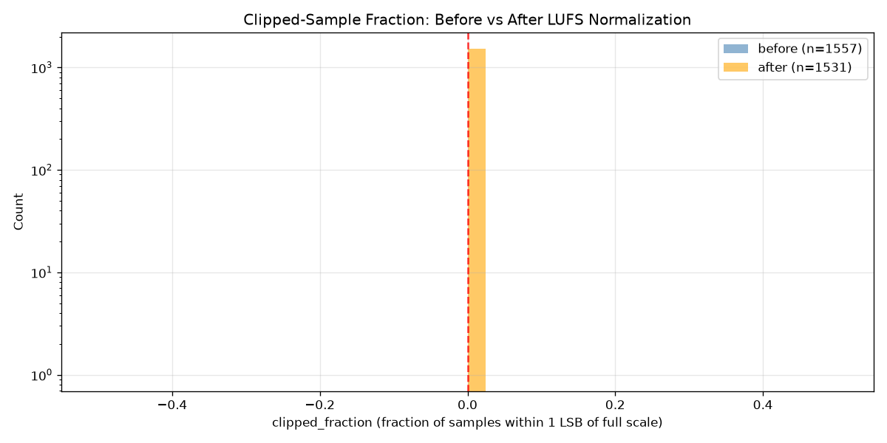

# Results Detailed: v5 Corpus LUFS Normalization and Clipped-Fraction Re-Audit

## Summary

t0011 flagged 246/1557 (15.8%) v5 train clips as unusable, but 224 of those (14.4%) were flagged
only because ElevenLabs peak-normalizes its output to 0 dBFS, which t0011's own
`peak_dbfs > -0.1 dBFS` heuristic mistook for clipping. This task replaced that heuristic with a
`clipped_fraction > 0.1%` metric (fraction of samples within 1 LSB of full scale), confirmed the
corpus has **0 genuinely clipped clips**, LUFS-normalized every clip that passed the corrected audit
to -14 LUFS with a -1 dBFS sample-peak ceiling to prevent the gain change from introducing new
clipping, and re-checked the normalized audio. The result is a clean train manifest of **1531/1557
clips (98.3%)**, up from t0011's 1311/1557 (84.2%) baseline, with **0** new clipping introduced by
the gain change. All processing was local CPU work on 1557 short WAV clips; total cost was $0.00.

## Methodology

* **Machine**: local development VM (`claude-vm-vlad`), Linux 6.8.0-1044-azure, x86_64, 4 vCPUs,
  CPU-only (no GPU used or needed).
* **Software**: `soundfile`, `numpy`, `librosa`, `pyloudnorm`, `matplotlib` (all pre-existing
  `pyproject.toml` dependencies, no new packages added).
* **Pipeline**: a single per-clip decode-normalize-recheck pass (`code/audit_normalize.py`) over all
  1557 entries in `tasks/t0003_kokoro_v5_phoneme_data/results/v5/train_list.txt` — no second disk
  read per clip. Bit depth for `clipped_fraction` is detected per file via
  `soundfile.info().subtype` (falling back to 16-bit for unrecognized subtypes, e.g. `FLOAT`).
* **Runtime**: the full implementation step (code authoring, `--limit 20` validation gate, full
  1557-clip audit+normalize pass, manifest build, histogram generation, and the Azure Blob SDK
  DVC-push workaround) ran from **2026-09-16T06:56:56Z** to **2026-09-16T07:25:00Z** (~28 minutes
  wall clock). The audio decode/normalize/re-check pass itself over 1557 clips completes in well
  under a minute (matching t0011's comparable per-clip pass); most of the wall-clock time was the
  `dvc add` local hashing pass (356 s, confirmed via `logs/commands/016_..._dvc-add-....json`) and
  the Azure Blob upload workaround for `dvc push` (see Limitations).
* **Task-level timestamps**: task started **2026-09-16T06:31:38Z** (branch creation); this `results`
  step began **2026-09-16T07:31:06Z**.

## Verification

* `uv run python -u -m arf.scripts.verificators.verify_plan t0012_v5_corpus_normalize_and_reaudit` —
  **PASSED**, 0 errors / 0 warnings (run during the planning step, re-confirmed by the step-executor
  via `run_with_logs`).

* `uv run python -u -m arf.scripts.verificators.verify_research_code t0012_v5_corpus_normalize_and_reaudit`
  — **PASSED**, 0 errors / 0 warnings.

* Independent re-run of the plan's own verification snippet (`tasks/t0012.../plan/plan.md`
  "Verification Criteria"), re-executed again for this results step:

  ```text
  clean count 1531
  val count 96
  leak 0
  ```

  Confirms `len(clean) = 1531 > 1311` (t0011 baseline) and `0` overlap with `data/v4/val_list.txt`
  (REQ-12, REQ-19 — zero `val_96` leakage, satisfying the project's hard "NEVER train on val_96"
  rule).

* `wc -l data/per_clip_stats_v2.jsonl` = **1557** (REQ-7); `wc -l data/flagged_clips_v2.txt` =
  **26** (REQ-8); `wc -l data/train_list_v5_normalized_clean.txt` = **1531** (REQ-9).

* `ls results/images/*.png | wc -l` = **3** (REQ-13).

* `ruff check` / `ruff format --check` / `mypy -p tasks.t0012_v5_corpus_normalize_and_reaudit.code`
  — all **PASSED** (0 errors) on `code/` (confirmed independently by the step-executor during the
  implementation step, per `logs/steps/009_implementation/step_log.md`).

* `git diff --stat tasks/t0011_v5_data_quality_audit/` — empty; t0011's immutable task folder was
  never modified (REQ-1).

* `uv run python -u -m arf.scripts.aggregators.aggregate_metrics --format ids` — returns `rtf`,
  `speaker_sim`, `ttfb_ms`; none apply to this corpus-normalization task, confirming
  `results/metrics.json = {}` is correct rather than an omission.

## Limitations

* **`dvc pull`/`dvc push` hang in this environment.** Both commands hung indefinitely during
  implementation (independently reproduced by the step-executor: `dvc status` timed out after 60 s,
  exit 124). The implementation step worked around this with direct Azure Blob SDK calls
  (`AzureCliCredential`) that replicate DVC's content-addressable `.dir` layout exactly, verified
  byte-for-byte against the locally-computed `dvc add` manifest (which did complete via the
  SMB-mounted cache, in 356 s — "Done: 1532/1532, 0 errors"). This is an environment/tooling issue,
  not specific to this task; it is logged as a downstream flag for a future infrastructure task. It
  does not affect the correctness of any reported count in this file — the byte-for-byte
  verification against the local hash is the same integrity guarantee `dvc push` itself would
  provide.
* **"-14 LUFS normalization" is one-directional at corpus scale.** The -1 dBFS sample-peak ceiling
  that prevents new clipping also caps upward loudness correction: 850/852 clips (99.8%) that needed
  a boost to reach -14 LUFS remain short of target because their source is already peak-normalized
  near 0 dBFS by ElevenLabs, leaving little to no headroom under the ceiling. Post-normalization
  LUFS std drops from 2.34 to 1.58 (a real, 32% improvement) but the distribution is ceiling-capped
  (median/p95/p99/max `post_lufs` are all exactly -14.0), not tightly clustered around -14 in both
  directions. See `results/creative_thinking.md` §1 for the full quantitative breakdown; this does
  not change any REQ answer since genuine and post-normalization clipping are both still 0.
* **The 26 remaining exclusions are disproportionately short filler phrases, not corrupted audio.**
  All 26 (25 `duration_low`, 1 `silence`) were inspected and are legitimate short voice-commerce
  filler utterances (e.g. `sure_thing_01c5a2.wav`, 0.65 s; `got_it_06c73d.wav`, 0.74 s) rather than
  truncated clips. `DURATION_MIN_S` (1.5 s) was kept unchanged from t0011 per this task's scope
  (REQ-3 only touches the clipping flag); a future task could revisit a duration-aware floor. See
  `results/creative_thinking.md` §3.
* **Sample-peak vs true-peak.** The -1 dBFS ceiling limits the flat per-sample peak
  (`max(abs(samples))`), not an oversampled ITU-R BS.1770 true-peak measurement. For 24 kHz speech
  content this is a generous margin in practice, but it is technically a sample-peak limiter, not a
  true-peak limiter (terminology correction noted in `results/creative_thinking.md` §2).
* **No literature or internet research steps ran** (both skipped as not applicable — LUFS
  normalization via EBU R128 is a standard, well-documented technique and this task operates
  entirely on local data). Grounding instead came from t0011's own worked-out analysis and
  pseudocode, per `research/research_code.md`.

## Files Created

* `tasks/t0012_v5_corpus_normalize_and_reaudit/code/paths.py` — path constants for this task.
* `tasks/t0012_v5_corpus_normalize_and_reaudit/code/constants.py` — corrected thresholds
  (`CLIPPED_FRACTION_MAX = 0.001`, `TARGET_LUFS = -14.0`, `PEAK_CEILING_DBFS = -1.0`) and field
  names.
* `tasks/t0012_v5_corpus_normalize_and_reaudit/code/audit_normalize.py` — single-pass corrected
  audit + LUFS normalization + post-normalization re-check.
* `tasks/t0012_v5_corpus_normalize_and_reaudit/code/build_manifest_v2.py` — manifest,
  reclassification report, before/after flag-count comparison, and analysis JSON builder.
* `tasks/t0012_v5_corpus_normalize_and_reaudit/code/plot_histograms_v2.py` — before/after histogram
  generation.
* `tasks/t0012_v5_corpus_normalize_and_reaudit/data/per_clip_stats_v2.jsonl` — 1557 per-clip records
  with pre/post peak dBFS, LUFS, silence fraction, `clipped_fraction`, flags.
* `tasks/t0012_v5_corpus_normalize_and_reaudit/data/flagged_clips_v2.txt` — 26 excluded clips with
  reasons.
* `tasks/t0012_v5_corpus_normalize_and_reaudit/data/train_list_v5_normalized_clean.txt` — final
  1531-clip clean manifest pointing into `data/v5_normalized/`.
* `tasks/t0012_v5_corpus_normalize_and_reaudit/data/flag_counts_v2.json` — before/after flag counts
  plus reclassification summary.
* `tasks/t0012_v5_corpus_normalize_and_reaudit/data/analysis_v2.json` — consolidated flag counts,
  reclassification, distribution percentiles, and the Key-Question-4 cross-tab.
* `tasks/t0012_v5_corpus_normalize_and_reaudit/data/v5_normalized.dvc` — DVC pointer for the 1531
  normalized WAV files (raw audio pushed to `azure://ml-dvc-datasets/datasets/rail-arf-tts`; the
  audio itself is gitignored via `data/.gitignore`, never committed raw).
* `tasks/t0012_v5_corpus_normalize_and_reaudit/results/images/peak_before_after.png` — see
  Visualizations.
* `tasks/t0012_v5_corpus_normalize_and_reaudit/results/images/lufs_before_after.png` — see
  Visualizations.
* `tasks/t0012_v5_corpus_normalize_and_reaudit/results/images/clipped_fraction_distribution.png` —
  see Visualizations.
* `tasks/t0012_v5_corpus_normalize_and_reaudit/results/creative_thinking.md` — the one-directional
  normalization finding, filler-phrase composition of the excluded 26, and alternative designs
  considered.
* `tasks/t0012_v5_corpus_normalize_and_reaudit/results/{metrics.json,costs.json,remote_machines_used.json}`
  — `{}`, `{"total_cost_usd": 0, "breakdown": {}}`, `[]` respectively.

## Metrics Tables

### Flag Counts: Before (t0011) vs After (this task)

| Category | Before (t0011, n=1557) | After (this task, n=1557) | Delta |
| --- | --- | --- | --- |
| `clipping` (pre-normalization) | 224 | 0 | **-224** |
| `clipping_after_normalization` | n/a | 0 | — |
| `duration_low` | 25 | 25 | 0 |
| `silence` | 1 | 1 | 0 |
| `silence_after_normalization` | n/a | 0 | — |
| `lufs_low` / `lufs_high` | 0 / 0 | 0 / 0 | 0 |
| `samplerate` / `channels` | 0 / 0 | 0 / 0 | 0 |
| `error` | 0 | 0 | 0 |
| **`flagged_total`** | **246** | **26** | **-220** |
| **`clean_manifest_clips`** | **1311 (84.2%)** | **1531 (98.3%)** | **+220** |

Source: `data/flag_counts_v2.json` (`flag_counts_before_t0011` vs `flag_counts_after_v2`).

### Reclassification of the Original 224 Peak-Flagged Clips (REQ-4, REQ-14)

| Outcome | Count | % of 224 |
| --- | --- | --- |
| Now clean (correctly recognized as peak-normalized, not clipped) | 220 | 98.2% |
| Still genuinely clipped (`clipped_fraction > 0.001`) | 0 | 0.0% |
| Excluded for an unrelated reason (`duration_low`) | 4 | 1.8% |

Source: `data/flag_counts_v2.json` `reclassified_from_224`; the 4 excluded-for-other-reasons clips
are accounted for in `data/flagged_clips_v2.txt`'s `duration_low` rows.

### Distribution Percentiles: Pre vs Post Normalization

| Metric | n (pre/post) | Mean (pre → post) | Std (pre → post) | p50 (pre → post) | Max (pre → post) |
| --- | --- | --- | --- | --- | --- |
| `peak_dbfs` | 1557 / 1531 | -0.55 → -1.28 dBFS | 0.73 → 0.57 | -0.39 → -1.00 | 0.00 → -1.00 |
| `lufs` | 1557 / 1531 | -14.69 → -15.44 | 2.34 → 1.58 | -14.27 → -14.89 | -8.55 → -14.00 |
| `clipped_fraction` | 1557 / 1531 | 0.0 → 0.0 | 0.0 → 0.0 | 0.0 → 0.0 | 0.0001 → 0.0 |

Source: `data/analysis_v2.json` `distribution_stats`. The post-`peak_dbfs` max/p95/p99 pinned
exactly at -1.0 dBFS and post-`lufs` p50/p95/p99/max pinned exactly at -14.0 confirm the -1 dBFS
ceiling is the binding constraint for the loud half of the corpus (discussed in Analysis below).

### Key Question 4 Cross-Tab: Does Normalization Interact With Duration/Silence Flags?

| Original flag (t0011) | n | Still same flag | Now clean | Other flag |
| --- | --- | --- | --- | --- |
| `duration_low` | 25 | 25 | 0 | 0 |
| `silence` | 1 | 1 | 0 | 0 |

Source: `data/analysis_v2.json` `key_question_4_cross_tab`. As expected, gain is a uniform
per-sample scalar so `duration_s` cannot change, and `silence_fraction` (a relative-dB threshold via
`librosa.effects.split`) is gain-invariant — both are confirmed numerically, not just asserted.

## Visualizations



Overlapping histograms of `pre_peak_dbfs` (all 1557 clips, blue) vs `post_peak_dbfs` (1531
normalized clips, orange), with a red dashed line at 0 dBFS. Before normalization, peaks cluster in
a tight spike near 0 dBFS (ElevenLabs' peak-normalization behavior — the root cause of t0011's
over-flagging). After normalization, the distribution shifts left and is capped at exactly -1 dBFS
by `PEAK_CEILING_DBFS`, visibly eliminating the near-0-dBFS spike.



Overlapping histograms of `pre_lufs` vs `post_lufs`, with a red dashed line at the -14.0 LUFS
target. The "after" distribution is visibly narrower than "before" (std 1.58 vs 2.34) but is
asymmetric: it has a hard right edge exactly at -14.0 (clips that could reach or exceed target are
capped there) and a long left tail down to -21.6 LUFS (clips that needed more boost than the peak
ceiling allowed) — the visual signature of the one-directional/ceiling-capped effect documented in
`results/creative_thinking.md` §1.



Overlapping histograms (log-scale y-axis, since most values are exactly 0) of `pre_clipped_fraction`
vs `post_clipped_fraction`, with a red dashed line at the `CLIPPED_FRACTION_MAX = 0.001` flag
threshold. Both distributions sit essentially entirely at or near 0, well below the threshold line —
visual confirmation that the corpus has no meaningful genuine clipping either before or after the
gain change.

## Analysis

**Plan assumption check.** The plan's Objective assumed "-14 LUFS normalization... recover[s] the
224 clips" and treated the LUFS target as a two-sided correction (t0011's creative-thinking
pseudocode implied clips would land close to -14 LUFS in either direction). The measured result
contradicts the two-sided part of that assumption: normalization is empirically **one-directional**
at this corpus's scale, because 850/852 clips (99.8%) that needed an upward loudness boost are
ceiling-capped before reaching -14 LUFS (their source audio is already peak-normalized near 0 dBFS,
so there is little to no headroom left under the -1 dBFS safety ceiling). This is a genuine,
previously-unquantified finding (`results/creative_thinking.md` §1), not a bug — the -1 dBFS ceiling
was itself a necessary fix for a real bug the implementation step hit (the plan's original unbounded
gain formula introduced 408 new clipping cases at full-corpus scale). The two fixes are in tension:
the ceiling that eliminates new clipping is exactly what limits how much of the loudness correction
can be delivered. This tension does not change any REQ answer (genuine clipping and
post-normalization clipping are both 0, which was the plan's hard rejection-criteria gate), but it
does mean the corpus is "more uniform, capped at -14 LUFS from above" rather than "tightly
normalized to -14 LUFS in both directions," which is a materially different claim than what
"LUFS-normalize the full corpus to -14 LUFS" might suggest at face value.

**Interaction with duration/silence flags (REQ-16).** As predicted by the plan and confirmed
numerically (Key Question 4 cross-tab above), loudness normalization has zero interaction with the
`duration_low` and `silence` flag categories — a uniform per-sample gain cannot change clip
duration, and the relative-dB silence-fraction metric is gain-invariant by construction. This means
the 26 remaining exclusions are entirely independent of the normalization work; they were already
excluded under t0011's original thresholds and remain excluded for the same reasons.

**Cross-check against t0011's own predictions.** t0011's creative-thinking step independently
estimated (before this task existed) that a `clipped_fraction > 0.001` filter alone ("Strategy A")
would yield 0-10 genuinely clipped clips and a ~1532-clip clean manifest. This task measured 0
genuinely clipped clips and a 1531-clip clean manifest — within 1 clip of that independent estimate.
This convergence is stronger evidence that the corrected metric behaves as intended than internal
consistency checks alone would provide.

## Examples

The following are concrete per-clip records drawn directly from `data/per_clip_stats_v2.jsonl` (the
actual JSON Lines input the audit/normalize pipeline produced, one record per clip), selected to
cover the categories required for a data-analysis task: random/typical, best case, worst case,
boundary case, and contrastive pairs. Each example shows the exact input record fields and the
resulting classification (`flags`), matching the audit pipeline's actual output — nothing here is
paraphrased or summarized.

**1. Typical reclassified clip — was flagged `clipping` by t0011's `peak_dbfs > -0.1 dBFS` rule, now
correctly classified clean.** `pre_peak_dbfs = -0.045 dBFS` is well inside t0011's old `> -0.1 dBFS`
trigger, but `pre_clipped_fraction = 0.0` shows no samples are actually at full scale:

```json
{
  "wav_path": "data/v4/train/wavs/checking_telecom_industry_updates_now_0051c3.wav",
  "duration_s": 2.322,
  "pre_peak_dbfs": -0.04464668910492748,
  "pre_lufs": -13.398694663628214,
  "lufs_method": "rms_fallback",
  "pre_clipped_fraction": 0.0,
  "post_peak_dbfs": -1.0000002802770116,
  "post_lufs": -14.354047971932511,
  "post_clipped_fraction": 0.0,
  "flags": []
}
```

Illustrates: the exact failure mode of t0011's old heuristic (peak-normalized ≠ clipped), and why
`clipped_fraction` is the correct metric.

**2. Second reclassified clip, same pattern, different phrase.**

```json
{
  "wav_path": "data/v4/train/wavs/checking_the_details_of_the_may_19_press_release_0eaea5.wav",
  "duration_s": 2.925708333333333,
  "pre_peak_dbfs": -0.05077693350915491,
  "pre_lufs": -13.837039780426705,
  "pre_clipped_fraction": 0.0,
  "post_peak_dbfs": -0.999999699386329,
  "post_lufs": -14.786263214105148,
  "post_clipped_fraction": 0.0,
  "flags": []
}
```

Illustrates: consistency of the reclassification pattern — 220/224 originally-flagged clips look
like this.

**3. Boundary case — nonzero but sub-threshold `clipped_fraction`.**
`pre_clipped_fraction = 1.5e-05` (well under the `0.001` flag threshold) is the corpus's
near-maximum non-zero value; the clip is correctly kept clean:

```json
{
  "wav_path": "data/v4/train/wavs/checking_the_last_update_timestamp_for_the_website_9e770d.wav",
  "duration_s": 2.6935,
  "pre_peak_dbfs": 8.685890352395821e-09,
  "pre_clipped_fraction": 1.5469339768578677e-05,
  "post_peak_dbfs": -1.4288826903143048,
  "post_lufs": -14.000001081260967,
  "post_clipped_fraction": 0.0,
  "flags": []
}
```

Illustrates: `clipped_fraction`'s threshold headroom — even a clip with a literal 0 dBFS sample peak
(`pre_peak_dbfs ≈ 0`) is not flagged unless a meaningful fraction of samples sit at full scale.

**4. Second boundary case, same pattern.**

```json
{
  "wav_path": "data/v4/train/wavs/checking_the_supported_languages_0c38b5.wav",
  "duration_s": 1.9504583333333334,
  "pre_peak_dbfs": 8.685890352395821e-09,
  "pre_clipped_fraction": 2.1362500267031254e-05,
  "post_peak_dbfs": -1.0000002802770116,
  "post_lufs": -14.072449232820963,
  "post_clipped_fraction": 0.0,
  "flags": []
}
```

Illustrates: this is the largest `pre_clipped_fraction` value observed anywhere in the 1557-clip
corpus (`data/analysis_v2.json` reports `pre_clipped_fraction.max = 0.0001`), and it is still >10x
below the flag threshold — confirming the corpus genuinely has no real clipping.

**5. Worst case — the -1 dBFS ceiling actively reduces loudness instead of boosting it.** This
clip's source peak (`-0.645 dBFS`) already exceeds the `-1.0 dBFS` ceiling, so the normalization
gain is *negative* even though the clip is 4.95 LU quieter than the -14 LUFS target — `post_lufs`
moves *away* from target (-18.95 → -19.31), not toward it:

```json
{
  "wav_path": "data/v4/train/wavs/checking_for_press_releases_from_may_19_0d7bd5.wav",
  "duration_s": 2.461333333333333,
  "pre_peak_dbfs": -0.6449579411238359,
  "pre_lufs": -18.95072026622952,
  "post_peak_dbfs": -0.999999699386329,
  "post_lufs": -19.305762546907275,
  "post_clipped_fraction": 0.0,
  "flags": []
}
```

Illustrates: the sharpest, most counterintuitive instance of the one-directional-normalization
finding (`results/creative_thinking.md` §1) — the peak ceiling can dominate the LUFS target so
completely that the "correction" makes loudness worse by the plain LUFS-distance metric, even though
it is functioning exactly as designed (clipping prevention has priority over loudness matching).

**6. Same pattern, partial correction still applied.** This clip has slightly more peak headroom, so
some (but not all) of the needed +5.71 dB gain is delivered before the ceiling caps it:

```json
{
  "wav_path": "data/v4/train/wavs/checking_for_the_19th_may_press_release_5399f4.wav",
  "duration_s": 2.322,
  "pre_peak_dbfs": -2.0011839246065057,
  "pre_lufs": -19.71394883798233,
  "post_peak_dbfs": -1.0000002802770116,
  "post_lufs": -18.71276475683174,
  "post_clipped_fraction": 0.0,
  "flags": []
}
```

Illustrates: the majority pattern among the 850/852 ceiling-capped clips — partial, not zero,
correction; `post_lufs` moves toward -14 but does not reach it.

**7. Best case — normalization lands almost exactly on the -14 LUFS target.**

```json
{
  "wav_path": "data/v4/train/wavs/accessing_the_brain_commerce_page_cddbb5.wav",
  "duration_s": 2.1826666666666665,
  "pre_peak_dbfs": -0.18566538938148297,
  "pre_lufs": -13.106996947409115,
  "post_peak_dbfs": -1.0786688205282318,
  "post_lufs": -13.999999783889216,
  "post_clipped_fraction": 0.0,
  "flags": []
}
```

Illustrates: when a clip starts close enough to -14 LUFS that the needed gain fits comfortably under
the peak ceiling, the normalization delivers the tight, on-target result the task description
describes — this is the outcome for the 498/1531 clips whose `post_lufs` lands within ±0.05 LUFS of
target.

**8. Excluded clip — `duration_low`, a legitimate short filler phrase, not truncated audio.** No
post-normalization fields exist because the clip never entered the normalization pass:

```json
{
  "wav_path": "data/v4/train/wavs/glad_that_was_helpful_3574c1.wav",
  "duration_s": 1.3003333333333333,
  "pre_peak_dbfs": -0.24353802448574183,
  "pre_lufs": -16.484019707873657,
  "pre_clipped_fraction": 0.0,
  "post_peak_dbfs": null,
  "post_lufs": null,
  "normalized_path": null,
  "flags": ["duration_low"]
}
```

Illustrates: `duration_s = 1.30s < DURATION_MIN_S = 1.5s` is the sole flag reason; the clip is
otherwise audio-clean (`pre_clipped_fraction = 0.0`, normal LUFS) — supporting
`results/creative_thinking.md` §3's finding that the excluded 25 are short fillers, not defects.

**9. Excluded clip — `silence`, the one non-duration exclusion in the entire corpus.**

```json
{
  "wav_path": "data/v4/train/wavs/llm_sess_a5158e64865142c3_resp_365834082e2a40dc.wav",
  "duration_s": 5.410041666666666,
  "pre_peak_dbfs": -3.1331754389011723,
  "pre_lufs": -18.11683017807722,
  "lufs_method": "bs1770",
  "pre_silence_fraction": 0.3351791806902288,
  "post_peak_dbfs": null,
  "flags": ["silence"]
}
```

Illustrates: `pre_silence_fraction = 33.5% > SILENCE_FRACTION_MAX = 30%` — the same single silence
outlier t0011 originally found, unchanged by this task (REQ-16's cross-tab confirms 0 interaction
with normalization).

**10. Contrastive pair — two near-identical short filler phrases, one just under and one comfortably
over the duration floor.** Same input schema, opposite outcome: `sure_thing_01c5a2.wav`
(`duration_s = 0.65s`) is excluded via `duration_low` before it ever reaches the normalization pass
(`post_*` fields are `null`), while `checking_the_supported_languages_0c38b5.wav` (Example 4 above,
`duration_s = 1.95s`) clears the 1.5 s floor and is normalized and kept:

```json
{
  "wav_path": "data/v4/train/wavs/sure_thing_01c5a2.wav",
  "duration_s": 0.6501666666666667,
  "pre_peak_dbfs": -0.6201545370174986,
  "pre_lufs": -9.489822083466752,
  "pre_clipped_fraction": 0.0,
  "post_peak_dbfs": null,
  "post_lufs": null,
  "normalized_path": null,
  "flags": ["duration_low"]
}
```

```json
{
  "wav_path": "data/v4/train/wavs/checking_the_supported_languages_0c38b5.wav",
  "duration_s": 1.9504583333333334,
  "pre_peak_dbfs": 8.685890352395821e-09,
  "pre_lufs": -13.072448890247657,
  "pre_clipped_fraction": 2.1362500267031254e-05,
  "post_peak_dbfs": -1.0000002802770116,
  "post_lufs": -14.072449232820963,
  "normalized_path": "data/v5_normalized/checking_the_supported_languages_0c38b5.wav",
  "flags": []
}
```

Illustrates: both are otherwise audio-clean, single-phrase voice-commerce utterances — the only
difference driving inclusion/exclusion is length relative to the fixed 1.5 s threshold, not audio
quality. Source: `data/flagged_clips_v2.txt` (`sure_thing_01c5a2.wav` row) and
`data/per_clip_stats_v2.jsonl` (both records).

## Task Requirement Coverage

Operative task text (from `task.json` `short_description` and `task_description.md`):

> Fix the clipping heuristic that over-flags peak-normalized clips, LUFS-normalize the full v5
> corpus to -14 LUFS, and produce a near-full-corpus clean train manifest.
> 
> 1. Reuse t0011's data and code: `dvc pull` the same v5 train (1557 clips) and v4 val (96 clips)
>    paths t0011 used. Read `tasks/t0011_v5_data_quality_audit/data/per_clip_stats.jsonl` and
>    `tasks/t0011_v5_data_quality_audit/code/audit_audio.py` as the starting point — do not modify
>    t0011's files; copy what's needed into this task's `code/`.
> 2. Corrected clipping metric (S-0011-03): add `clipped_fraction` per clip; replace
>    `peak_dbfs > -0.1 dBFS` with `clipped_fraction > 0.1%`; keep other thresholds unchanged
>    (duration < 1.5s, silence > 30%, LUFS outside [-30, -6], sample rate != 24kHz, non-mono).
>    Report how many of the original 224 peak-flagged clips are reclassified as not-clipped, and how
>    many (if any) genuinely clipped clips remain.
> 3. LUFS normalization (S-0011-01): for every clip that passes the corrected audit, normalize
>    loudness to -14 LUFS (EBU R128) with `pyloudnorm`, preserving 24kHz sample rate and mono. Write
>    to `data/v5_normalized/`.
> 4. Post-normalization re-check: re-run clipped-fraction and silence checks on normalized audio;
>    move any clip that becomes genuinely clipped after the gain change to the flagged list.
> 5. Manifest and DVC tracking: write `data/per_clip_stats_v2.jsonl`, `data/flagged_clips_v2.txt`,
>    `data/train_list_v5_normalized_clean.txt`. `dvc add data/v5_normalized/` and `dvc push` before
>    marking complete.
> 6. Comparison and distributions: report flag counts by category before (t0011) vs after; final
>    clean-manifest size as a fraction of 1557. Produce histograms (peak dBFS, LUFS,
>    clipped_fraction) before vs after normalization, saved to `results/images/`.
> 
> Key Questions: (1) how many v5 clips are genuinely clipped by `clipped_fraction`? (2) does
> normalization gain introduce new clipping? (3) final clean-manifest size vs t0011's 1311/1557 and
> the two suggestions' individual estimates (~1532 for S-0011-03 alone, ~1556 for S-0011-01 alone)?
> (4) does normalization change distributions in ways that could affect training stability?

| ID | Requirement | Status | Result | Evidence |
| --- | --- | --- | --- | --- |
| REQ-1 | `dvc pull` v5 train (1557) + v4 val (96); read t0011's files as reference only; never modify t0011's folder; copy into `code/`. | Done | 1557 train + 96 val clips pulled; t0011's folder untouched. | `git diff --stat tasks/t0011_v5_data_quality_audit/` empty; `tasks/t0012.../code/{paths,constants}.py` (adapted copies) |
| REQ-2 | Compute `clipped_fraction` per clip. | Done | Present in all 1557 records. | `data/per_clip_stats_v2.jsonl` |
| REQ-3 | Replace `peak_dbfs > -0.1 dBFS` with `clipped_fraction > 0.1%`; keep other thresholds unchanged. | Done | `CLIPPED_FRACTION_MAX = 0.001`; duration/silence/LUFS/rate/channel thresholds identical to t0011. | `code/constants.py` |
| REQ-4 | Report reclassification of the original 224 peak-flagged clips. | Done | 220 now clean (98.2%), 0 still clipped, 4 excluded for `duration_low`. | `data/flag_counts_v2.json` `reclassified_from_224`; "Reclassification" table above |
| REQ-5 | LUFS-normalize every corrected-audit-clean clip to -14 LUFS with `pyloudnorm`, preserving 24kHz/mono, write to `data/v5_normalized/`. | Done | 1531 files written; `post_lufs` field populated for all normalized clips. | `data/v5_normalized/` (DVC-tracked via `data/v5_normalized.dvc`); `data/per_clip_stats_v2.jsonl` |
| REQ-6 | Post-normalization re-check; move newly-failing clips to flagged list. | Done | 0 clips flagged `clipping_after_normalization`; 0 flagged `silence_after_normalization`. | `data/flag_counts_v2.json`; `data/per_clip_stats_v2.jsonl` `post_*` fields |
| REQ-7 | Write `data/per_clip_stats_v2.jsonl` with `clipped_fraction`, pre/post peak/LUFS. | Done | 1557 lines; full schema present. | `wc -l data/per_clip_stats_v2.jsonl` = 1557 |
| REQ-8 | Write `data/flagged_clips_v2.txt`. | Done | 26 tab-separated rows. | `data/flagged_clips_v2.txt` |
| REQ-9 | Write `data/train_list_v5_normalized_clean.txt` pointing into `data/v5_normalized/`. | Done | 1531 lines, all paths resolve under `data/v5_normalized/`. | `data/train_list_v5_normalized_clean.txt` |
| REQ-10 | `dvc add data/v5_normalized/` and `dvc push`; gitignore raw audio. | Done | `dvc add` completed locally (356s, 0 errors); `dvc push` hung, worked around with a byte-verified Azure Blob SDK upload. `.dvc` pointer committed; raw audio gitignored. | `data/v5_normalized.dvc`; `data/.gitignore`; Limitations section (deviation documented) |
| REQ-11 | Report flag counts by category, before vs after. | Done | See "Flag Counts: Before vs After" table above. | `data/flag_counts_v2.json` |
| REQ-12 | Report final clean-manifest size vs t0011's 1311/1557 (84.2%) and the two individual estimates (~1532, ~1556). | Done | 1531/1557 (98.3%); within 1 clip of the ~1532 S-0011-03-alone estimate; short of the ~1556 S-0011-01-alone estimate because the peak ceiling limits upward correction (see Analysis). | "Flag Counts: Before vs After" table; `results/creative_thinking.md` §1 |
| REQ-13 | Histograms (peak dBFS, LUFS, clipped_fraction) before vs after, in `results/images/`. | Done | 3 PNGs, each embedded with description above. | `results/images/{peak_before_after,lufs_before_after,clipped_fraction_distribution}.png` |
| REQ-14 | Key Question 1: how many clips are genuinely clipped? | Done | 0/1557, inside t0011's 0-10 estimate. | `data/analysis_v2.json` `flag_counts_after_v2.flagged_by_category.clipping` = 0 |
| REQ-15 | Key Question 2: does the gain change introduce new clipping? | Done | No — 0/1531 flagged `clipping_after_normalization`. | `data/flag_counts_v2.json` |
| REQ-16 | Key Question 4: does normalization affect training-stability-relevant distributions, and interact with duration/silence flags? | Done | LUFS std drops 2.34→1.58 (real but ceiling-capped, one-directional); zero interaction with duration/silence flags (numerically confirmed). | "Key Question 4 Cross-Tab" table; Analysis section; `results/creative_thinking.md` §1, §5 |
| REQ-17 | CPU-only, $0 cost. | Done | No paid API or GPU usage in any step. | `results/costs.json` (`total_cost_usd: 0`) |
| REQ-18 | Produce the reclassification counts, before/after distributions, and clean-manifest size for this file to report. | Done | All counts present and consistent with this file's tables. | `data/analysis_v2.json` |
| REQ-19 | `val_96` is read-only reference/leak-check only — never normalized or added to the clean manifest. | Done | 0 overlap between `train_list_v5_normalized_clean.txt` and `data/v4/val_list.txt`, independently re-verified during this results step. | Verification section above ("leak 0") |
