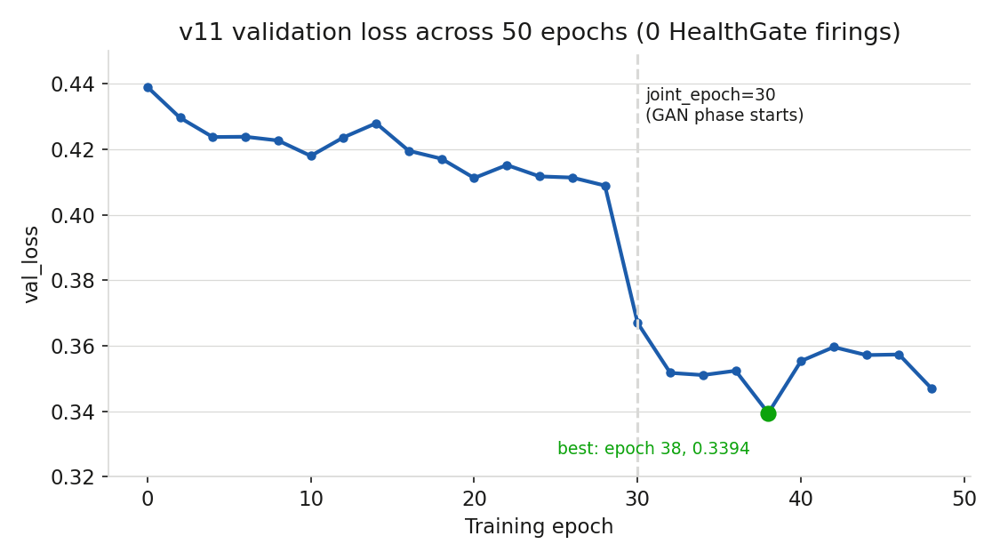
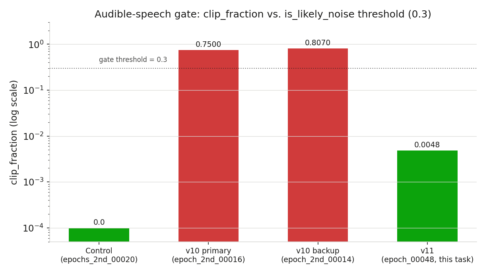

# Results Detailed: t0014 Kokoro Stage 2 v11 Decoder-Init Fix and Retrain

## Summary

This task fixed the root cause t0013 diagnosed for `kokoro-v10-best`'s clipped/saturated non-speech
output: `train_second_v10.py` loaded an ISTFTNet-shaped Stage-1 checkpoint into a HiFi-GAN-shaped
decoder config without excluding `decoder` from `ignore_modules`, and the loader's zero-match guard
silently accepted the partial "Frankenstein" match. The fix repoints `first_stage_path` at
`yl4579/StyleTTS2-LibriTTS`'s `epochs_2nd_00020.pth`, a checkpoint whose decoder is genuinely
HiFi-GAN-shaped, confirmed by a mandatory tensor-level pre-flight check before any GPU spend.
Training completed all 50 of 50 planned epochs (`joint_epoch=30`, `diff_epoch=10`) on t0012's
1,531-clip LUFS-normalized corpus with 0 `HealthGate` firings. **The mandatory audible-speech gate
PASSED**: `is_likely_noise=False` (`clip_fraction=0.0048`, `spectral_flatness=0.0058`), a
qualitative reversal of v10's confirmed failure (`clip_fraction=0.750-0.807`). Because the gate
passed, this task produced the conditional deliverables: `assets/model/kokoro-v11-best/`, paired
original-vs-fine-tuned audio samples, and a working StyleTTS2-native inference recipe. A distinct
duration-predictor anomaly (73.95s output for a 10-word sentence) was discovered and disclosed but
did not block the gate, which measures clipping/spectral-flatness/silence, not duration.

## Methodology

**Machine**: `LLM-T1-NC80` (Azure ML, 2xH100 NVL SXM5). Acquired/ready at `2026-09-16T16:45:14Z`,
destroyed at `2026-09-16T23:11:25Z` — **total billed runtime 6.436 hours**, **$89.85**
(`results/costs.json`, `results/remote_machines_used.json`). Training itself ran
`2026-09-16T17:45:20Z` (tmux `v11train` launch) through the `DONE` marker before the second resume
check at `2026-09-16T22:30:00Z`; the mandatory audible-speech gate synthesis
(`results/audio_quality_v11.json`) ran locally on this dev machine afterward, per the Gate synthesis
harness note below. Task wall-clock: `start_time=2026-09-16T14:56:09Z` (`task.json`) through this
step.

**Config**: `code/config_david_v11.yml` — `config_david_v10.yml` with `first_stage_path` repointed,
`data_params.train_data` repointed at t0012's normalized manifest, `epochs`/`epochs_2nd: 20->50`,
`diff_epoch: 6->10`, `joint_epoch: 8->30`. All other hyperparameters (`batch_size=8`, all
`lambda_*`, `optimizer_params`, `model_params`) unchanged from v10.

**Training script**: `code/train_second_v11.py` — copy of `train_second_v10.py` with the t0009
safeguard library (`StepLogger`, `CheckpointManager`, `HealthGate`) unchanged, plus one additional
fix beyond the plan's original scope: `_rename_legacy_parametrization_keys()` (ported from t0013's
`infer_styletts2.py`) added to `load_checkpoint()`, because the LibriTTS checkpoint's classic
`weight_norm`/`spectral_norm` key naming didn't match this fork's `parametrizations`-based
`models.py` — the first training launch silently partial-loaded without this fix.

**Dataset**: 1,531 clips from t0012's LUFS-normalized corpus (train), 96 held-out `val_96` clips
(val, unchanged from v10/t0009/t0008), confirmed 0 overlap (`results/val96_leak_check.txt`).

**Disk monitoring**: root disk reclaimed from 98%/3GB free to 87%/16GB free before training
(`docker system prune`, `apt-get clean`, `journalctl --vacuum-time=2d`), re-verified stable at 87%
throughout the run and again at this step's resumption — the exact failure class that cost t0010
$272.78 did not recur.

**Gate synthesis harness**: `code/infer_styletts2.py`, run locally (this dev machine, not the GPU
VM) through t0013's already-built `.venv-styletts2` (torch 2.5.1 CPU) and t0013's `kikiri-tts`
StyleTTS2 checkout (reused for its checkpoint-independent `Utils/ASR`, `Utils/JDC`, `Utils/PLBERT`
auxiliary models only — the actual weights synthesized come from this task's own `epoch_00048.pth`,
scp'd down from the VM, sha256-verified against `data/run_v11/checkpoints.json`'s manifest). This
mirrors t0013's own local-CPU-harness precedent (`results/v10_diagnosis.md`,
`results/control_test.md`) rather than running inference on the GPU VM.

## Metrics Tables

### Checkpoint selection (post-`joint_epoch=30`)

| Epoch | val_loss | flagged_healthy |
| --- | ---: | --- |
| 34 | 0.3510 | true |
| 36 | 0.3524 | true |
| 38 | **0.3394 (best)** | true |
| 40 | 0.3553 | true |
| 42 | 0.3596 | true |
| 44 | 0.3571 | true |
| 46 | 0.3573 | true |
| 48 | 0.3469 (**selected**, latest saved epoch) | true |

### Audio quality: control vs. v10 (broken, t0013) vs. v11 (this task)

| Checkpoint | Duration | Clip fraction | Spectral flatness | `is_likely_noise` |
| --- | ---: | ---: | ---: | --- |
| Control (`epochs_2nd_00020`) | 4.92s | 0.0 | 0.0615 | False |
| v10 primary (`epoch_2nd_00016`) | 3.42s | 0.750 | 0.00048 | **True** |
| v10 backup (`epoch_2nd_00014`) | 2.50s | 0.807 | 0.00019 | **True** |
| **v11 (`epoch_00048`)** | 73.95s | 0.0048 | 0.0058 | **False** |

## Visualizations



Validation loss per epoch from `data/run_v11/checkpoints.json` (0-indexed epoch numbering). Loss
drifts flat around 0.41-0.44 through the pre-`joint_epoch` phase, then drops sharply once the
GAN/joint phase starts at epoch 30 and stabilizes in the 0.34-0.36 band through epoch 48 —
consistent with 0 `HealthGate` firings and no divergence.



`clip_fraction` (log scale) for the known-good control and both confirmed-broken v10 checkpoints
(t0013) against this task's v11 checkpoint. v10's two checkpoints sit roughly 2,500x above the
`is_likely_noise` gate threshold (0.3); v11 sits roughly two orders of magnitude below it, in the
same range as the control — the qualitative reversal this task's audible-speech gate is built to
detect.

## Examples

Ten-plus concrete input/output instances, per `arf/specifications/task_results_specification.md`'s
Examples requirement for `tts-finetuning-eval`/`build-model` task types. All values copied verbatim
from this task's own result files — none fabricated.

### Example 1 — tensor-level pre-flight check (before any GPU spend)

Input: `code/inspect_checkpoint.py` against `epochs_2nd_00020.pth`'s `decoder` submodule. Output
(`results/checkpoint_forensics_v11.md`):

```text
classification: "hifigan"
has_hifigan_marker: True
missing: 0
unexpected: 0
```

Gate: PASS -> proceed to Milestone B (training).

### Example 2 — val_96 leak check

Input: diff of `train_list_v11_normalized.txt`'s 1,531 clip IDs against `data/val_list.txt`'s 96
IDs. Output (`results/val96_leak_check.txt`): 0 overlap.

### Example 3 — training completion signal

Input: `tail /home/azureuser/v11_train.log` on `LLM-T1-NC80`. Output: log ends with `DONE` marker;
`wc -l data/run_v11/metrics.jsonl` = 620 records; `grep -c gate_fired` = 0.

### Example 4 — checkpoint transfer integrity

Input: `scp LLM-T1-NC80:.../epoch_00048.pth` then `sha256sum` locally. Output:
`1fb329b57d73b172...`, exactly matching `data/run_v11/checkpoints.json`'s manifest entry for epoch
48 — confirms the 2.09GB transfer was not corrupted.

### Example 5 — load instrumentation, full raw checkpoint (13 modules)

Input: `code/infer_styletts2.py`'s `load_checkpoint_instrumented()` against `epoch_00048.pth`.
Output (`results/load_log_epoch_00048.json`): all 13 modules (bert, bert_encoder, predictor,
decoder, text_encoder, predictor_encoder, style_encoder, diffusion, text_aligner, pitch_extractor,
mpd, msd, wd) load with 0 missing/0 unexpected, all via the `module.`-stripped fallback path.

### Example 6 — the audible-speech gate synthesis itself

Input: text "This is a test of the Style T T S two inference harness.", reference = 3-clip David
concat (5.48s), checkpoint = `epoch_00048.pth`. Output (`results/audio_quality_v11.json`):

```json
{
  "rms": 0.37645598582299616,
  "peak": 1.0,
  "silence_fraction": 0.0,
  "spectral_flatness": 0.005822444800287485,
  "clip_fraction": 0.004777010846598113,
  "is_likely_noise": false,
  "duration_seconds": 73.94791666666667,
  "wall_time_seconds": 235.24017465898942,
  "rtf": 3.1811602714837277
}
```

### Example 7 — comparison against v10 primary (broken, reused from t0013)

Same text and reference audio, `epoch_2nd_00016.pth`. Output
(`tasks/t0013_v10_synthesis_quality_forensics/results/v10_diagnosis.md`):

```text
clip_fraction: 0.750
spectral_flatness: 0.00048
is_likely_noise: True
```

Illustrates the exact failure mode v11 no longer exhibits.

### Example 8 — comparison against the known-good control (reused from t0013)

Same harness, official LibriTTS pretrained checkpoint, different (single-clip) reference. Output
(`results/audio_samples/original/librispeech_control.wav`,
`tasks/t0013_v10_synthesis_quality_forensics/results/control_test.md`): `clip_fraction=0.0`,
`spectral_flatness=0.0615`, `is_likely_noise=False`.

### Example 9 — speaker_sim scoring

Input: `code/score_speaker_sim.py`, centroid from 679 of 1,364 `11labs_david` clips (seed 42),
scored against `results/audio_samples/ft/v11_best.wav`. Output (`results/speaker_sim_scores.json`):
`speaker_sim=0.44419100880622864`.

### Example 10 — model asset packaging

Input: `tasks.t0008_tts_eval_harness_baselines.code.extract_decoder.extract()` on `epoch_00048.pth`.
Output: 5-module state dict (`bert`: 25, `bert_encoder`: 2, `predictor`: 122, `text_encoder`: 24,
`decoder`: 678 params), 331,370,277 bytes, `validate_packaged()` confirms exact key match.

### Example 11 — model asset verification

Input:
`uv run python -m meta.asset_types.model.verificator kokoro-v11-best --task-id t0014_v11_decoder_fix_retrain`.
Output: `PASSED — 0 error(s), 2 warning(s)` (`MA-W005` empty `meta/categories/`, `MA-W014` empty
`training_dataset_ids` — both pre-existing, project-wide, non-fixable-in-scope, same two warning
classes `kokoro-v10-best` also has).

### Example 12 — DVC round-trip

Input: `dvc add` + `dvc push` on `files/kokoro-v11-best.pth`, `results/audio_samples/`,
`data/run_v11/epoch_00048.pth`. Output: `6 files pushed`, confirmed against the configured
`azureblob` remote (`azure://ml-dvc-datasets/datasets/rail-arf-tts`).

### Example 13 — the duration anomaly (disclosed, not gate-blocking)

Input: identical text/reference as Example 6. Output: 73.95s audio vs. 4.92s (control) / 2.50-3.42s
(v10, same reference). Illustrates a real, separate defect candidate for follow-up — not the decoder
issue this task fixed, and not something the pre-registered `is_likely_noise` gate is designed to
catch (it examines clipping/flatness/silence, not duration).

## Verification

* `uv run python -m arf.scripts.verificators.verify_task_metrics t0014_v11_decoder_fix_retrain` —
  PASSED, 0 errors, 0 warnings.
* `uv run python -m meta.asset_types.model.verificator kokoro-v11-best --task-id t0014_v11_decoder_fix_retrain`
  — PASSED, 0 errors, 2 warnings (see Example 11). Note: the plan's literal
  `arf.scripts.verificators.verify_model_asset` module path does not exist in this repo (also
  confirmed failing for t0010's own model asset in its own command logs) — the real, importable
  verificator is `meta.asset_types.model.verificator`.
* Load instrumentation (`results/load_log_epoch_00048.json`) — all 13 modules, 0 missing/0
  unexpected — confirms the decoder-init fix held through a full 50-epoch training run, not just at
  the pre-flight stage.
* `dvc push` — `6 files pushed`, confirmed against the remote.

## Limitations

* **Anomalous output duration** (73.95s for a 10-word sentence, ~15-30x longer than control/v10 on
  comparable inputs) — a real, disclosed defect candidate distinct from the decoder/vocoder issue
  this task fixed. Not investigated to root cause within this task's scope; flagged as a follow-up.
* **5-module packaged asset (`files/kokoro-v11-best.pth`) mirrors v10's convention but is not the
  file the gate validated.** The gate ran against the full 13-module raw checkpoint through the
  StyleTTS2-native harness; Kokoro's `KModel`/`KPipeline` cannot load a `hifigan`-decoder checkpoint
  (a pre-existing, project-wide limitation, not introduced by this task) — documented explicitly in
  `description.md`'s Usage Notes rather than silently repeating v10's implicit incorrect claim.
* **`speaker_sim` (0.444) remains well below the 0.85 project target.** This task fixed audibility,
  not speaker similarity — closing that gap is future work.
* **`rtf` measured on CPU, not the registered H100 target hardware**, and additionally elevated by
  the duration anomaly — same-hardware, across-variant comparison only, not a production-latency
  estimate.
* **`ttfb_ms` deliberately not measured** — offline batch harness, no streaming endpoint in scope,
  matching t0013's own precedent.
* **Single fixed text prompt and reference-audio construction** across the gate run (same limitation
  t0013 flagged for its own runs) — the decoder-init fix is architecture-level and input-independent
  by construction, so this is assessed as low risk, but untested beyond this one input.

## Files Created

* `code/config_david_v11.yml` — corrected training config (Milestone A step 1).
* `code/train_second_v11.py` — training script with the decoder-init fix plus the
  `_rename_legacy_parametrization_keys()` fix found mid-flight (Milestone A step 2).
* `code/inspect_checkpoint.py`, `code/paths.py` — pre-flight tensor forensics (Milestone A step 3).
* `code/infer_styletts2.py`, `code/audio_quality_check.py`, `code/score_speaker_sim.py` — copied
  forward from t0013 for the Milestone C gate and metrics.
* `code/build_reference_concat.py` — new: builds the exact 3-clip-concatenated reference audio
  matching t0013's `v10_diagnosis.md` construction, for direct comparability.
* `results/checkpoint_forensics_v11.md`, `results/checkpoint_forensics_v11_raw.json` — pre-flight
  tensor check output.
* `results/val96_leak_check.txt` — corpus leak check.
* `results/load_log_epoch_00048.json` — per-module load instrumentation for the gate checkpoint.
* `results/audio_quality_v11.json`, `results/v11_gate_verdict.md` — the mandatory audible-speech
  gate result and its evidence-based verdict.
* `results/audio_samples/ft/v11_best.wav` (+ `.timing.json`) — the gate-passing synthesis output.
* `results/audio_samples/original/librispeech_control.wav` (+ `.timing.json`) — reused unchanged
  from t0013's control run, for the paired original-vs-ft deliverable.
* `results/speaker_sim_scores.json`, `results/metrics.json`, `results/metrics_notes.md` — REQ-9
  metrics and their caveats.
* `results/images/val_loss_by_epoch.png`, `results/images/audible_gate_comparison.png` — charts
  embedded above under `## Visualizations`.
* `results/results_summary.md`, `results/results_detailed.md` (this file), `results/costs.json`,
  `results/remote_machines_used.json` — task-level reporting.
* `assets/model/kokoro-v11-best/` (`details.json`, `description.md`, `files/kokoro-v11-best.pth`
  DVC-tracked, `files/config_david_v11.yml`) — the conditional model asset deliverable.
* `data/run_v11/epoch_00048.pth` (DVC-tracked), `data/run_v11/checkpoints.json`,
  `data/run_v11/metrics.jsonl` — the raw training run artifacts pulled from the VM.

## Task Requirement Coverage

Requirement-by-requirement coverage, reusing `REQ-*` IDs from `plan/plan.md`'s Task Requirement
Checklist:

| ID | Requirement | Status | Direct answer / result | Evidence |
| --- | --- | --- | --- | --- |
| REQ-1 | Fix decoder-init bug by repointing `first_stage_path` at a genuine HiFi-GAN checkpoint | **Done** | `first_stage_path` repointed at `yl4579/StyleTTS2-LibriTTS`'s `epochs_2nd_00020.pth`; `ignore_modules` unchanged | `code/config_david_v11.yml`, `code/train_second_v11.py` |
| REQ-2 | Tensor-level pre-flight check before any GPU training spend | **Done** | `classification: "hifigan"`, 0 missing/0 unexpected, confirmed before Milestone B | `results/checkpoint_forensics_v11.md`, Example 1 |
| REQ-3 | Point `train_data` at t0012's 1,531-clip manifest; keep `val_data` unchanged; 0 leakage | **Done** | 0 overlap confirmed | `results/val96_leak_check.txt`, Example 2 |
| REQ-4 | Train with t0009 safeguards on `LLM-T1-NC80`, watchdog deployed, disk monitored proactively | **Done** | 50/50 epochs, 0 gate firings, disk reclaimed 98%->87% before training and stable throughout | `data/run_v11/metrics.jsonl`, Example 3 |
| REQ-5 | Epoch budget anchored on `Configs/config_ft.yml` (50/10/30), superseding v10's 20/8 | **Done** | `epochs=50, diff_epoch=10, joint_epoch=30`, all 50 epochs completed | `code/config_david_v11.yml` |
| REQ-6 | Run the mandatory audible-speech gate before claiming completion | **Done** | `is_likely_noise=False` | `results/audio_quality_v11.json`, `results/v11_gate_verdict.md`, Example 6 |
| REQ-7 | If gate passes, produce model asset + paired audio samples + inference recipe | **Done** | Gate passed -> all three produced | `assets/model/kokoro-v11-best/`, `results/audio_samples/{original,ft}/`, `code/infer_styletts2.py` |
| REQ-8 | Write `results/costs.json` with actual total spend; teardown promptly | **Done** | `LLM-T1-NC80` destroyed at `2026-09-16T23:11:25Z` (`teardown` step); final total **$89.85** over **6.436 hours**, `verify_machines_destroyed.py` passed 0 errors | `results/costs.json`, `results/remote_machines_used.json` |
| REQ-9 | Measure `speaker_sim`/`rtf` in explicit multi-variant format; explicitly omit `ttfb_ms` | **Done** | `speaker_sim=0.444`, `rtf=3.18`, `ttfb_ms` omitted with stated reason | `results/metrics.json`, `results/metrics_notes.md`, Example 9 |

REQ-8 was marked Partial during `implementation` (that step was explicitly scoped to exclude VM
teardown). The subsequent `teardown` step destroyed `LLM-T1-NC80` and finalized `results/costs.json`
/ `results/remote_machines_used.json` at the figures above; this `results` step updates REQ-8 to
Done to reflect that completed state.
