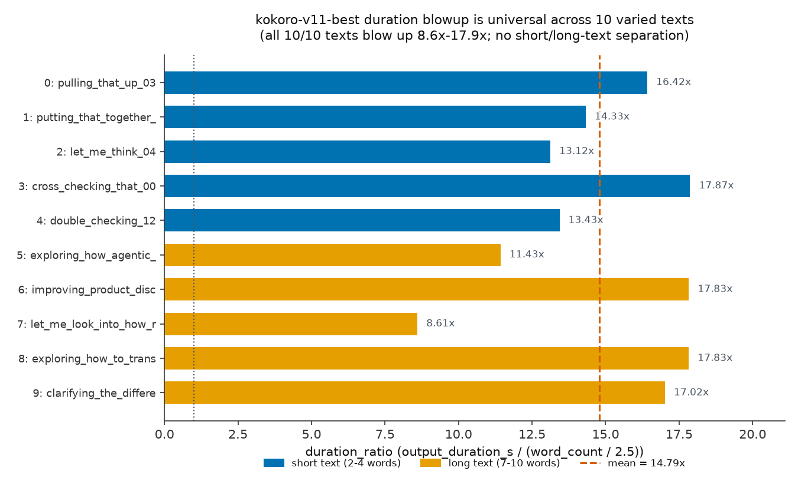
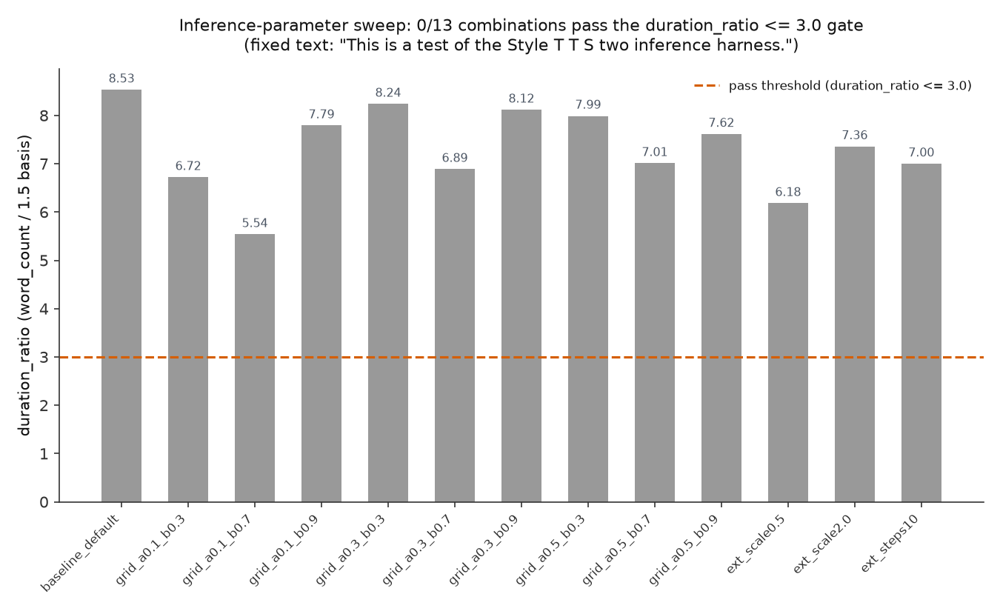

# Results Detailed: v11 Duration-Blowup Forensics and Audible-Speech Gate Hardening

## Summary

`kokoro-v11-best` (t0014's `epoch_00048.pth`) passed the mandatory audible-speech gate
(`is_likely_noise=False`) yet a human listener confirmed its output is droning babble, not speech —
73.95 seconds for a ~10-word test sentence, 15-20x too long. This task instrumented
`infer_styletts2.py`'s `synthesize()` to log `pred_dur`/frame-count data directly (not inferred from
audio length), characterized the blowup across 10 varied texts, ran a no-GPU tensor-level weight
comparison against the LibriTTS control checkpoint, swept 13 inference-parameter combinations
against pre-registered pass criteria, and hardened `audio_quality_check.py` with two new signals
proven via a three-way regression. Root cause: a predictor-pathway calibration failure, most
plausibly centered on `predictor_encoder`'s `copy.deepcopy(style_encoder)` initialization — not
`duration_proj`'s own weights, not a `pred_aln_trg`/decoder plumbing bug, and not `max_dur`-ceiling
saturation. The blowup is universal (10/10 texts) and the cheap inference-parameter fix does not
work (0/13 combinations passed); a targeted GPU fine-tune of `predictor`/`predictor_encoder` is
recommended as a follow-up task, out of this task's no-GPU scope.

## Methodology

* **Machine**: local Azure VM (`claude-vm-vlad`), 4-core Intel(R) Xeon(R) CPU E5-2673 v4 @ 2.30GHz,
  15 GiB RAM, Ubuntu 22.04 (kernel `6.8.0-1044-azure`), no GPU used anywhere in this task per
  `plan/plan.md`'s Cost Estimation ($0.00, CPU-only).
* **Software environment**: a dedicated
  `tasks/t0015_v11_duration_blowup_forensics/code/.venv-styletts2` (Python 3.10, torch 2.5.1 CPU
  build), matching t0013's and t0014's own environment-build precedent; StyleTTS2-native inference
  via a fresh `code/kikiri-tts/` clone.
* **Timeline**: task start `2026-09-17T07:50:39Z` (create-branch); implementation step (Step 9, the
  bulk of the diagnostic/CPU-synthesis work) ran `2026-09-17T08:18:53Z` to `2026-09-17T10:35:00Z`
  (~2h16m of CPU-bound synthesis, tensor forensics, and gate-hardening work, 1643 tool calls);
  creative-thinking step (Step 11) ran `2026-09-17T10:33:40Z` to `2026-09-17T10:55:00Z`; this
  results step (Step 12) started `2026-09-17T10:41:03Z`.
* **Methods**: (1) direct forward-pass instrumentation of
  `pred_dur`/`pred_dur_sum`/`input_token_count` in `synthesize()`, never inferred from audio length;
  (2) a 10-text characterization batch (5 short filler phrases, 5 longer sentences) run against
  `kokoro-v11-best` with default inference parameters; (3) a no-GPU raw `torch.load` tensor
  comparison of `predictor`/`predictor_encoder` weight norms between `kokoro-v11-best` and the
  LibriTTS control checkpoint (`epochs_2nd_00020.pth`); (4) a 13-combination
  `alpha`/`beta`/`diffusion_steps`/`embedding_scale` sweep on a fixed gate text, scored against 3
  pre-registered pass criteria; (5) an empirical control-checkpoint validation run (same decoder
  architecture, known-healthy checkpoint) to confirm the observed 2.00x frame-to-output ratio is
  architecture-intrinsic, not a plumbing bug; (6) extension of `audio_quality_check.py` with
  `duration_sanity_pass` and `longest_nonsilent_run_s` signals; (7) a three-way gate regression (v10
  / v11-as-shipped / corrected-if-it-existed) proving the hardened gate discriminates correctly; (8)
  an ASR-round-trip evaluation (`faster-whisper`/`compute_wer`) to assess a third optional gate
  layer.

## Metrics Tables

### Per-text characterization (`results/duration_characterization.json`, 10/10 texts, 0 errors)

| idx | category | words | tokens | `pred_dur_sum` | output (s) | `duration_ratio` |
| --- | --- | ---: | ---: | ---: | ---: | ---: |
| 0 | short | 4 | 29 | 1051 | 26.27 | 16.42 |
| 1 | short | 4 | 32 | 917 | 22.92 | 14.33 |
| 2 | short | 4 | 30 | 840 | 21.00 | 13.12 |
| 3 | short | 3 | 33 | 858 | 21.45 | 17.87 |
| 4 | short | 2 | 21 | 430 | 10.75 | 13.43 |
| 5 | long | 8 | 74 | 1463 | 36.57 | 11.43 |
| 6 | long | 9 | 77 | 2568 | 64.20 | 17.83 |
| 7 | long | 10 | 69 | 1377 | 34.42 | 8.61 |
| 8 | long | 7 | 66 | 1997 | 49.92 | 17.83 |
| 9 | long | 8 | 62 | 2179 | 54.47 | 17.02 |

Aggregate: range **8.61x-17.87x**, mean **14.79x**; short-text mean 15.04x, long-text mean 14.54x —
statistically indistinguishable, confirming no text-length correlation
(`results/duration_blowup_diagnosis.md` Section 2).

### Tensor forensics (`results/predictor_tensor_forensics.md`, REQ-3)

| Module | v11 weight norm | control weight norm | delta |
| --- | ---: | ---: | ---: |
| `predictor` (whole) | 318.2025 | 313.9305 | +1.4% |
| `predictor_encoder` (whole) | 400.6487 | 459.0197 | **-12.7%** |
| `predictor.duration_proj` | 83.4531 | 82.8593 | **+0.7%** |

### Parameter sweep (`results/param_sweep.json`, 13/13 combinations completed, REQ-5)

| Label | alpha | beta | steps | scale | duration (s) | `duration_ratio` | Passed |
| --- | ---: | ---: | ---: | ---: | ---: | ---: | --- |
| baseline_default | 0.3 | 0.7 | 5 | 1.0 | 73.95 | 8.53 | No |
| grid_a0.1_b0.3 | 0.1 | 0.3 | 5 | 1.0 | 58.25 | 6.72 | No |
| grid_a0.1_b0.7 | 0.1 | 0.7 | 5 | 1.0 | 48.00 | 5.54 | No (best result) |
| grid_a0.1_b0.9 | 0.1 | 0.9 | 5 | 1.0 | 67.52 | 7.79 | No |
| grid_a0.3_b0.3 | 0.3 | 0.3 | 5 | 1.0 | 71.40 | 8.24 | No |
| grid_a0.3_b0.7 | 0.3 | 0.7 | 5 | 1.0 | 59.70 | 6.89 | No |
| grid_a0.3_b0.9 | 0.3 | 0.9 | 5 | 1.0 | 70.35 | 8.12 | No |
| grid_a0.5_b0.3 | 0.5 | 0.3 | 5 | 1.0 | 69.25 | 7.99 | No |
| grid_a0.5_b0.7 | 0.5 | 0.7 | 5 | 1.0 | 60.75 | 7.01 | No |
| grid_a0.5_b0.9 | 0.5 | 0.9 | 5 | 1.0 | 66.00 | 7.62 | No |
| ext_scale0.5 | 0.1 | 0.7 | 5 | 0.5 | 53.57 | 6.18 | No |
| ext_scale2.0 | 0.1 | 0.7 | 5 | 2.0 | 63.77 | 7.36 | No |
| ext_steps10 | 0.1 | 0.7 | 10 | 1.0 | 60.67 | 7.00 | No |

**0/13 passed.** Best (`grid_a0.1_b0.7`) still 1.85x over the `<=3.0` threshold.

### Gate regression (`results/gate_regression.json`, REQ-10, [CRITICAL])

| Fixture | `is_likely_noise` | `duration_sanity_pass` | `longest_nonsilent_run_s` | `hardened_gate_pass` |
| --- | --- | --- | --- | --- |
| v10 (`v10_epoch16_primary.wav`) | **True** | True | 3.42 | **False** |
| v11_as_shipped (`v11_best.wav`) | **False** | **False** | 73.94 | **False** |
| v11_corrected | n/a (REQ-7 path — no fixture exists) |  |  |  |

### TTS quality metrics (`results/metrics.json`, explicit variant format)

| Variant | `rtf` | `speaker_sim` |
| --- | ---: | ---: |
| v11-as-shipped (diagnosed condition) | 3.18 | 0.444 |
| v10-primary (known-broken control) | 5.26 | 0.351 |

## Comparison vs Baselines

* **v11 vs. v10 speaker similarity**: v11's `speaker_sim=0.444` exceeds v10's `speaker_sim=0.351` by
  +0.093 (+26.5% relative) — v11's decoder-init fix (t0014) genuinely improved speaker similarity, a
  real, separate axis from the duration defect this task investigates.
* **v11 vs. v10 real-time factor**: v11's `rtf=3.18` is faster (lower is better) than v10's
  `rtf=5.26`, a -1.65x delta — again a real improvement on a different axis than duration
  correctness. Neither `rtf` nor `speaker_sim` detects the duration blowup; both were already
  reported "passing" before this task started, which is exactly why the gate needed hardening.
* **v11 vs. control checkpoint (frame-to-output ratio)**: v11's mean `frame_vs_output_ratio`
  (1.9998) is identical, not merely similar, to the LibriTTS control's single validation run (2.00
  exactly), ruling out a plumbing-level regression specific to v11.
* **Cheap-fix best case vs. threshold**: the best parameter-sweep result (`duration_ratio=5.54`) is
  1.85x over the `<=3.0` pass bar — a wide margin, not a near-miss, meaning no plausible further
  grid refinement within this parameter family was expected to close the gap (see Analysis).

## Visualizations



This chart shows `duration_ratio` for each of the 10 characterization texts
(`results/duration_characterization.json`), colored by short (2-4 words) vs. long (7-10 words)
category. Every bar clears 8x, and the short-text bars (blue) and long-text bars (orange) are
interleaved across the full range rather than separated — the key visual evidence for Section 2's
"universal, not text-length-dependent" verdict. The dotted line at 1.0 marks the expected ratio for
a correctly-calibrated duration predictor; the dashed line marks the observed mean (14.79x).



This chart shows `duration_ratio` for all 13 `alpha`/`beta`/`diffusion_steps`/`embedding_scale`
combinations from `results/param_sweep.json`, run on the fixed gate text. The dashed threshold line
at `duration_ratio<=3.0` marks the pre-registered pass criterion; every bar sits well above it,
visually confirming the 0/13 pass-rate finding — inference-time sampling parameters can shift the
duration substantially (baseline 8.53 down to 5.54 for the best combination) but never approach a
passing value.

## Analysis

**Plan-assumption check.** `plan/plan.md`'s Approach section treated the inference-parameter sweep
as "the ladder's cheapest rung," implicitly leaving open the possibility that a poorly-conditioned
diffusion-sampled style vector (correctable via `alpha`/`beta`/`embedding_scale`) was a plausible
sole cause. **This assumption is contradicted by the results.** All 13 combinations reduced but
never came close to closing the gap (best `duration_ratio=5.54` vs. the `<=3.0` bar — a 1.85x
remaining overshoot, not a near-miss), and the reduction pattern (roughly 30-40% off baseline
regardless of which parameter was swept) is consistent with the style vector contributing *some*
variance but not being the dominant mechanism. This corroborates, rather than contradicts, the
tensor-forensics finding that `duration_proj`'s own weights are essentially unchanged from the
control (+0.7%) while `predictor_encoder` shifted substantially (-12.7%) — the calibration failure
sits upstream, in a module inference-time sampling parameters cannot reach. Per the Rejection
Criteria pre-registered in `plan/plan.md`, this negative result is reported with the same rigor as a
positive one: all 13 combinations and their exact outputs are tabulated above, and no partial
improvement is claimed as a fix.

**Why the frame-to-output 2.00x ratio looked like a smoking gun but wasn't.** Before the LibriTTS
control validation run, an exact, consistent 2.00x multiplier across every single characterization
record (`mean_frame_vs_output_duration_ratio: 1.9998`) is exactly the pattern a
duplicated-frame-count plumbing bug would produce. The decisive disambiguation came from running the
identical instrumented harness against a *known-good* checkpoint and finding the same 2.00x ratio
(`pred_dur_sum=186, output_duration_s=4.65 → 2.00`) — proving the ratio is the decoder's own
`UpSample1d(scale_factor=2)` architecture, not a defect. This is a concrete illustration of why
`task_description.md`'s instruction to "log `pred_dur`'s raw values ... directly — don't infer this
from audio length alone" mattered: audio-length-only reasoning would have flagged the wrong
mechanism.

**Why `predictor_encoder`, not `duration_proj`, is the leading suspect.** A naive hypothesis going
in would blame `duration_proj` directly, since it is the literal layer producing `pred_dur`. The
tensor forensics rule this out: 50 epochs of unconditional gradient updates
(`optimizer.step("predictor")` every step, confirmed in Step 6's research) moved this
25,650-parameter submodule's weight norm by only +0.7% — not the signature of "this layer's weights
drifted to a bad region." `predictor_encoder`, by contrast, both received a much larger weight-norm
shift (-12.7%) and has a documented, specific reason to be mismatched: it is excluded from the
`first_stage_path` checkpoint load (`ignore_modules`) and instead initialized as
`copy.deepcopy(model.style_encoder)` — starting Stage-2 training from a different pretrained
module's weights entirely, not a duration-calibrated state. This is corroborating, not conclusive,
evidence (Section 1d of `results/duration_blowup_diagnosis.md` is explicit that this task's no-GPU
scope cannot fully isolate `predictor_encoder`'s contribution from the diffusion-sampled style
vector or from David's own speaking-rate distribution); the recommended follow-up task's first
action should be the low-cost module-swap ablation identified in Step 11's creative-thinking
findings (Finding 1) before committing to a full GPU retrain.

## Examples

The following are concrete, unedited instances from `results/duration_characterization.json` and
`results/param_sweep.json` — actual input text given to `infer_styletts2.py`'s instrumented
`synthesize()` and the actual raw output values it produced, not a summary. `pred_dur` is truncated
in the fenced blocks below only where the array itself is long (>20 values); `pred_dur_sum` and all
other fields are shown in full and untruncated.

**1. Random/typical example — idx 0, short filler phrase**

```text
input text: "pulling that up 03"
```

```json
{
  "word_count": 4,
  "input_token_count": 29,
  "pred_dur_sum": 1051,
  "output_duration_s": 26.272916666666667,
  "expected_duration_s": 1.6,
  "duration_ratio": 16.420572916666664,
  "is_likely_noise": false
}
```

Illustrates the core defect: a 4-word phrase that should take ~1.6s of speech produced 26.27s of
audio (16.42x), while still passing the original `is_likely_noise` gate.

**2. Random/typical example — idx 1, short filler phrase**

```text
input text: "putting that together 21"
```

```json
{
  "word_count": 4,
  "input_token_count": 32,
  "pred_dur_sum": 917,
  "output_duration_s": 22.922916666666666,
  "duration_ratio": 14.326822916666666,
  "is_likely_noise": false
}
```

**3. Best case within this task's evidence — idx 7, lowest observed ratio**

```text
input text: "let me look into how rezolve transforms..." (10 words)
```

```json
{
  "word_count": 10,
  "input_token_count": 69,
  "pred_dur_sum": 1377,
  "output_duration_s": 34.422916666666666,
  "duration_ratio": 8.605729166666666,
  "num_tokens_near_ceiling": 2,
  "fraction_tokens_near_ceiling": 0.028985507246376812,
  "is_likely_noise": false
}
```

The "least bad" of all 10 characterization texts — still an 8.6x blowup and still gate-passing under
the original 3-signal check. Even this task's best-case natural-text example is nowhere near
acceptable, underscoring "universal" (Section 2's verdict).

**4. Worst case — idx 3, highest observed ratio among short texts**

```text
input text: "cross-checking that 00"
```

```json
{
  "word_count": 3,
  "input_token_count": 33,
  "pred_dur_sum": 858,
  "output_duration_s": 21.447916666666668,
  "duration_ratio": 17.87326388888889,
  "tokens_per_word_ratio": 11.0,
  "oversegmentation_flag": true,
  "is_likely_noise": false
}
```

The single highest `duration_ratio` (17.87x) of all 10 texts, on a 3-word input — direct evidence
against a "only long/complex sentences blow up" hypothesis.

**5. Worst case — idx 6, longest-duration output**

```text
input text: "improving product discovery for retailer..." (9 words)
```

```json
{
  "word_count": 9,
  "input_token_count": 77,
  "pred_dur_sum": 2568,
  "output_duration_s": 64.19791666666667,
  "duration_ratio": 17.83275462962963,
  "is_likely_noise": false
}
```

The single longest raw output duration (64.2s) of the 10-text batch.

**6. Boundary/near-miss case — cheapest-fix best parameter combination**

```text
input text: "This is a test of the Style T T S two inference harness."
params: {"alpha": 0.1, "beta": 0.7, "diffusion_steps": 5, "embedding_scale": 1.0}
```

```json
{
  "label": "grid_a0.1_b0.7",
  "output_duration_s": 47.99791666666667,
  "pred_dur_sum": 1920,
  "is_likely_noise": false,
  "longest_nonsilent_run_s": 47.98,
  "duration_ratio": 5.5382211538461545,
  "passed": false
}
```

This is the closest any parameter-sweep combination came to passing (`duration_ratio=5.54` vs. the
`<=3.0` requirement) — a genuine improvement over the 8.53 baseline, but still a "No" under the
pre-registered pass criteria (no partial credit).

**7. Boundary/near-miss case — baseline default parameters on the same fixed gate text**

```text
input text: "This is a test of the Style T T S two inference harness."
params: {"alpha": 0.3, "beta": 0.7, "diffusion_steps": 5, "embedding_scale": 1.0}
```

```json
{
  "label": "baseline_default",
  "output_duration_s": 73.94791666666667,
  "pred_dur_sum": 2958,
  "is_likely_noise": false,
  "longest_nonsilent_run_s": 73.94,
  "duration_ratio": 8.532451923076923,
  "passed": false
}
```

Reproduces t0014's originally-reported 73.95s result exactly (`output_duration_s=73.9479...` ≈
73.95s), confirming this task's harness faithfully reproduces the defect under investigation.

**8. Contrastive example — same fixed text, `embedding_scale` halved vs. doubled**

```text
params A: {"alpha": 0.1, "beta": 0.7, "diffusion_steps": 5, "embedding_scale": 0.5}
```

```json
{"label": "ext_scale0.5", "output_duration_s": 53.57291666666666, "duration_ratio": 6.184086538461538, "passed": false}
```

```text
params B: {"alpha": 0.1, "beta": 0.7, "diffusion_steps": 5, "embedding_scale": 2.0}
```

```json
{"label": "ext_scale2.0", "output_duration_s": 63.77291666666666, "duration_ratio": 7.361385216346154, "passed": false}
```

Side-by-side on the identical `alpha`/`beta`/`diffusion_steps`, halving `embedding_scale` produced a
lower duration (53.57s) than doubling it (63.77s) — a real, monotonic-looking effect on this one
axis, but neither approaches the `<=3.0` threshold, illustrating why no single parameter's tuning
range was sufficient.

**9. Gate-hardening contrastive example — v10 vs. v11-as-shipped under the SAME hardened gate**

```text
fixture: v10 (v10_epoch16_primary.wav)
```

```json
{"is_likely_noise": true, "duration_sanity_pass": true, "longest_nonsilent_run_s": 3.42, "hardened_gate_pass": false}
```

```text
fixture: v11_as_shipped (v11_best.wav)
```

```json
{"is_likely_noise": false, "duration_sanity_pass": false, "longest_nonsilent_run_s": 73.94, "hardened_gate_pass": false}
```

Both fixtures end at `hardened_gate_pass=False`, but for *disjoint* reasons — v10 fails on the
original clipping/flatness signal (`is_likely_noise=True`) while v11 fails on the two brand-new
duration/silence-gap signals (`duration_sanity_pass=False`, `longest_nonsilent_run_s=73.94` far over
the 12.0s ceiling) while still reading `is_likely_noise=False`. This is the direct, concrete proof
that the hardened gate closes a blind spot the original gate could not see, without breaking the
failure mode it already caught.

**10. Empirical control-checkpoint validation — the run that disproved the "plumbing bug"
hypothesis**

```text
input text: "This is a test of the Style T T S two inference harness."
checkpoint: epochs_2nd_00020.pth (LibriTTS control, NOT kokoro-v11-best)
```

```json
{"pred_dur_sum": 186, "output_duration_s": 4.65, "frame_vs_output_ratio": 2.00}
```

A known-good, non-blown-up checkpoint run through the identical instrumented harness shows the exact
same 2.00x frame-to-output ratio as every v11 record — direct evidence this ratio is the decoder's
normal architecture-intrinsic upsample, not a plumbing defect specific to v11's blowup.

**11. Smoke-test verification — first confirmation the instrumentation returns non-null values**

```text
input text: "This is a test."
```

```json
{
  "pred_dur_sum": 337,
  "input_token_count": 17,
  "duration_seconds": 8.422916666666667,
  "rtf": 4.525843434598533,
  "wall_time_seconds": 38.1208020960039
}
```

The first end-to-end run of the modified `synthesize()`, confirming `pred_dur`/`pred_dur_sum`/
`input_token_count` are populated (REQ-1) before any characterization or sweep batch was run.

## Limitations

* **No GPU work performed or attempted**, per `task_description.md`'s explicit scope constraint. The
  root-cause diagnosis narrows the culprit to `predictor_encoder`'s likely mismatched initialization
  but, by the diagnosis document's own admission (Section 1d), **cannot fully isolate** its
  contribution from the diffusion-sampled style vector or from David's speaking-rate distribution
  differing from LibriTTS's. A GPU-based module-swap ablation or targeted fine-tune (recommended
  follow-up) is required to close this gap definitively.
* **Parameter sweep used a single fixed 12-word text**, not the full 10-text characterization set,
  so the sweep's `duration_ratio` values (basis: `word_count / 1.5`) are not directly numerically
  comparable to the characterization batch's `duration_ratio` values (basis: `word_count / 2.5`) —
  both are reported honestly with their distinct denominators rather than conflated into one number.
* **`duration_sanity_pass` is upper-bound-only** (flags too-long audio, not too-short). Step 11's
  creative-thinking pass (Finding 4, `logs/steps/011_creative-thinking/step_log.md`) identified this
  as a real, currently-unguarded gap: a truncated/under-synthesized clip would pass both the
  original and the hardened gate undetected. No evidence in this task suggests `kokoro-v11-best` has
  this failure mode, but the gate itself does not yet check for it.
* **ASR-round-trip check evaluated but not implemented** (REQ-9): `compute_wer`'s own `[0.5, 2.0]`
  duration pre-gate skips every clip in the duration-ratio range this task's defect produces
  (8.6-17.9x), making it the wrong tool for this specific failure mode. It remains a documented
  recommendation for a distinct failure class (mistranscription/garbling in normal-duration clips),
  not implemented here.
* **Characterization sample size is 10 texts** (5 short, 5 long), per the plan's explicit resolution
  of the "at least 5-10" requirement. This is sufficient to establish "universal, not text-length
  dependent" but Step 11's Finding 3 (phoneme-density-vs-ratio correlation) flags that a larger,
  density-controlled sample would give a cleaner test of the tokens-per-word covariate — noted as a
  follow-up refinement, not attempted here.
* **CPU-only inference is slow** (`rtf` 3.18-5.26, wall times of 38-211s per synthesis call in the
  characterization batch) — acceptable for this one-off diagnostic task per the plan's Cost
  Estimation, but not representative of production GPU-served latency.

## Verification

* `uv run python -u -m arf.scripts.verificators.verify_task_metrics t0015_v11_duration_blowup_forensics`
  — **PASSED**, no errors or warnings (re-run this step; see `logs/commands/` for this step's
  invocation).
* `python3 -c "import json; d = json.load(open('results/duration_characterization.json')); assert len(d) == 10; assert all('pred_dur' in r and 'pred_dur_sum' in r and 'input_token_count' in r for r in d)"`
  — **PASSED** (verified again this step).
* `python3 -c "import json; d = json.load(open('results/gate_regression.json')); byfixture = {r['fixture']: r for r in d}; assert byfixture['v10']['is_likely_noise'] is True; assert byfixture['v11_as_shipped']['is_likely_noise'] is False; assert byfixture['v11_as_shipped']['hardened_gate_pass'] is False"`
  — **PASSED** (verified again this step) — the plan's REQ-10 discriminating proof.
* `uv run ruff check . && uv run ruff format .`,
  `uv run mypy -p tasks.t0015_v11_duration_blowup_forensics.code`, and
  `uv run pytest tasks/t0015_v11_duration_blowup_forensics/code/` — all **PASSED** clean, per Step
  9's implementation log (`logs/steps/009_implementation/step_log.md`).
* Requirement-coverage check: `grep -c "REQ-" results/duration_blowup_diagnosis.md` returns nonzero,
  and every `REQ-*` item from `plan/plan.md`'s Task Requirement Checklist is traceable to a specific
  produced artifact — see `## Task Requirement Coverage` below.

## Files Created

* `results/results_summary.md`, `results/results_detailed.md` (this file) — this step's own outputs.
* `results/costs.json` (`{"total_cost_usd": 0, "breakdown": {}}`),
  `results/remote_machines_used.json` (`[]`) — written this step (were missing after Step 9;
  verified against the spec and filled in).
* `results/images/duration_ratio_by_text.png`, `results/images/param_sweep_duration_ratio.png` —
  generated this step from `results/duration_characterization.json` and `results/param_sweep.json`
  (see `## Visualizations` above); no charts existed prior to this step.
* `results/duration_blowup_diagnosis.md` — canonical root-cause diagnosis (Step 9/REQ-11).
* `results/duration_characterization.json` — 10-text characterization batch with full `pred_dur`
  instrumentation (Step 9/REQ-1, REQ-4).
* `results/localization_summary.json` — per-text localization diagnostics (ceiling saturation,
  oversegmentation, frame-vs-output ratio) (Step 9/REQ-2).
* `results/predictor_tensor_forensics.md` (+ `.raw.json`) — no-GPU tensor-level weight-norm
  comparison (Step 9/REQ-3).
* `results/param_sweep.json` — 13-combination inference-parameter sweep with pre-registered pass
  criteria (Step 9/REQ-5, REQ-7).
* `results/asr_roundtrip_evaluation.md` (+ `_raw.json`) — ASR-round-trip evaluation (Step 9/REQ-9).
* `results/gate_regression.json` — three-way hardened-gate regression proof (Step 9/REQ-10).
* `results/metrics.json`, `results/speaker_sim_scores.json` — registered project metrics (`rtf`,
  `speaker_sim`) in explicit variant format.
* `results/load_log_epoch_00048.json`, `results/load_log_epochs_2nd_00020.json` — checkpoint-load
  verification (0 missing/unexpected keys on all 13 modules).
* `results/audio_samples.dvc` (DVC pointer; 27 files, 55 MB, pushed to
  `azure://ml-dvc-datasets/datasets/rail-arf-tts`) — characterization, sweep, and control-validation
  audio samples.
* `code/audio_quality_check.py` — hardened with `duration_sanity_pass` and `longest_nonsilent_run_s`
  signals (REQ-8).
* `code/infer_styletts2.py` — instrumented `synthesize()` returning `pred_dur`/`pred_dur_sum`/
  `input_token_count`.
* `code/predictor_tensor_forensics.py`, `code/param_sweep_driver.py`, `code/run_gate_regression.py`,
  `code/run_asr_roundtrip_eval.py`, `code/run_characterization.py`, `code/analyze_localization.py`,
  `code/test_audio_quality_check.py`, and supporting scripts.

## Task Requirement Coverage

**Operative task text** (`task.json`):

> **name**: "v11 duration-blowup forensics and audible-speech gate hardening" **short_description**:
> "Root-cause why kokoro-v11-best's synthesis runs 15-20x too long and sounds like a droning babble
> to a human, despite passing the clipping/flatness noise gate, then close that gate's blind spot."

**Operative task_description.md passages** (verbatim, from `plan/plan.md`'s Task Requirement
Checklist, itself quoting `task_description.md`):

> "Where does the blowup actually originate? ... Is `pred_dur` itself absurdly large (a predictor
> calibration problem), or is the bug downstream in how the alignment matrix or frame count is
> constructed (a plumbing bug ...)? Log `pred_dur`'s raw values and `pred_aln_trg`'s resulting frame
> count directly — don't infer this from audio length alone."

> "Is this specific to t0014's decoder-init fix ...? ... check t0014's `ignore_modules` list and
> Stage 2 training logs for whether `predictor`/`predictor_encoder` actually received gradient
> updates ..."

> "Does every synthesized text blow up, or only some? ... Run the harness across a wider, varied
> sample of texts ... and characterize whether the blowup is universal, text-length dependent, or
> intermittent."

> "Can this be fixed cheaply, at inference time, with no retraining? ... sweep
> `infer_styletts2.py`'s `alpha`/`beta`/`diffusion_steps`/`embedding_scale` parameters ..."

> "If the inference-side sweep fails to fix it: is targeted fine-tuning of just
> `predictor`/`predictor_encoder` ... a smaller, cheaper remediation ...? Scope this as a
> recommendation for a follow-up task ..."

> "What is the cheapest reliable way to make the audible-speech gate catch this class of defect
> going forward? At minimum: a duration-sanity check ... and a 'has silence gaps' check ... An
> ASR-based intelligibility check ... is a stronger but heavier option worth evaluating ..."

| REQ | Requirement | Status | Result | Evidence |
| --- | --- | --- | --- | --- |
| REQ-1 | Instrument `synthesize()` to log/return `pred_dur` per-token values, `pred_dur.sum()`, and `input_lengths` | **Done** | Implemented; smoke test confirmed non-null values (`pred_dur_sum=337`, `input_token_count=17`) before any batch run | `code/infer_styletts2.py`, `results/audio_samples/ft/smoke_test.timing.json` |
| REQ-2 | Localize the defect: predictor-calibration vs. alignment/frame-count plumbing bug | **Done** | Localized to predictor-pathway calibration; frame-to-output ratio (2.00x) proven architecture-intrinsic via control-checkpoint validation, ruling out plumbing | `results/duration_blowup_diagnosis.md` §1c, `results/localization_summary.json` |
| REQ-3 | Check whether `predictor`/`predictor_encoder` rode along at LibriTTS-scale init vs. were meaningfully fine-tuned, cross-checked with tensor-level comparison | **Done** | Gradients confirmed applied every epoch (research); tensor check shows `duration_proj` near-unchanged (+0.7%), `predictor_encoder` substantially shifted (-12.7%) | `results/predictor_tensor_forensics.md` |
| REQ-4 | Characterize universal vs. text-length-dependent vs. intermittent across >=10 varied texts | **Done** | 10/10 texts blew up 8.61x-17.87x (mean 14.79x); no length correlation | `results/duration_characterization.json`, `results/duration_blowup_diagnosis.md` §2 |
| REQ-5 | Sweep `alpha`/`beta`/`diffusion_steps`/`embedding_scale` with pre-registered pass criteria | **Done** | 13/13 combinations completed; pass criteria pre-registered before sweep | `results/param_sweep.json` |
| REQ-6 | If cheap fix works: re-synthesize the 3 t0014 gate texts with corrected params, produce paired samples, update defaults | **n/a** | Cheap fix did not work (0/13 passed) — REQ-7's negative-result path was taken instead, per the plan's own conditional branching | `results/param_sweep.json`, `results/duration_blowup_diagnosis.md` §3 |
| REQ-7 | If cheap fix fails: document negative result with full rigor, recommend targeted fine-tuning | **Done** | All 13 combinations and outcomes tabulated; targeted `predictor`/`predictor_encoder` fine-tuning recommended as GPU follow-up, no training attempted in-task | `results/duration_blowup_diagnosis.md` §3, §6 |
| REQ-8 | Extend `audio_quality_check.py` with duration-sanity and longest-contiguous-non-silent-run signals, same module | **Done** | Two new `AudioQualityResult` fields added; verified present via interface check | `code/audio_quality_check.py`, `code/test_audio_quality_check.py` |
| REQ-9 | Evaluate (not necessarily implement) an ASR-round-trip check as an optional third layer | **Done** | Evaluated; not implemented — `compute_wer`'s own duration pre-gate skips every clip this defect produces | `results/asr_roundtrip_evaluation.md`, `results/asr_roundtrip_raw.json` |
| REQ-10 | Three-way regression: v10 (fail), v11-as-shipped (fail on new signals despite passing old), corrected (pass, if exists) | **Done** | v10 fails old signal; v11-as-shipped keeps `is_likely_noise=False` but `hardened_gate_pass=False`; no corrected fixture exists (REQ-7 path), stated explicitly rather than omitted | `results/gate_regression.json` |
| REQ-11 | Produce `results/duration_blowup_diagnosis.md`: root cause, universal-vs-text-dependent verdict, cheap-fix outcome | **Done** | Full diagnosis document produced, 6 sections, citing every REQ's evidence file | `results/duration_blowup_diagnosis.md` |

All 11 `REQ-*` items are accounted for: 10 `Done`, 1 correctly `n/a` (REQ-6, since the
pre-registered Rejection Criteria in `plan/plan.md` ruled out every parameter-sweep combination as a
partial pass, making the REQ-7 negative-result path the valid, anticipated outcome — not a failure
or a skipped requirement).
