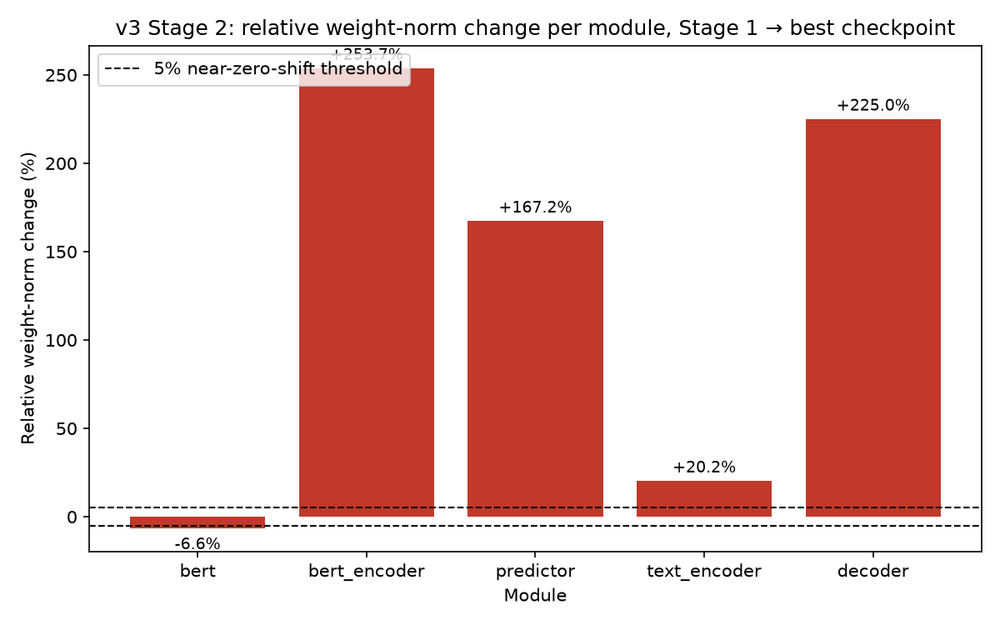

# Results Detailed: Recover the v3 Training Recipe From Artifacts

## Summary

This task reconstructed Kokoro v3's Stage 2 StyleTTS2 fine-tuning recipe — the only Kokoro fine-tune
in this project's 15-task history that shipped clean, production-usable audio — from surviving
artifacts, because the original author is unavailable and the recipe was never written down (t0009's
open suggestion S-0009-04). Evidence was gathered in priority order: a bounded 90-minute read-only
SSH inventory of the project's sole Azure ML pool VM (`LLM-T1-NC80`), no-GPU checkpoint-shape
forensics comparing `stage1/first_stage.pth` against the shipped
`best/david_v3_best_decoder_kokoro.pth` across all five Kokoro-API bundle modules plus every other
top-level checkpoint key, an audio-quality gate over every recoverable per-epoch sample, and a fully
annotated `data/config_david_v3_reconstructed.yml` labelling every field
`confirmed`/`inferred`/`unknown`. The VM inventory found that `~/kokoro-finetune` is actually
t0014's later StyleTTS2 clone, not a preserved v3-era environment, so the 266-clip training list and
Stage-1 checkpoint byte-identity remain unrecoverable (REQ-4, REQ-10). Checkpoint-shape forensics
did resolve the standing `multispeaker` three-way contradiction to `inferred false` and showed all
five bundle modules — including the decoder — changed substantially in Stage 2. The `v3-recipe`
answer asset records this recipe at `confidence: "low"`, per the task's own pre-registered
acceptance of an honestly-labelled, mostly-`inferred`/`unknown` reconstruction as a valid result.

## Methodology

* **Machine**: local CPU worktree (this workstation) for all checkpoint forensics, audio-quality
  gating, chart generation, and CPU-only `kokoro.KModel` synthesis; `LLM-T1-NC80` (Azure ML, 2xH100
  NVL SXM5, `brainpowa-northeurope` workspace) for the read-only VM filesystem inventory only — no
  GPU compute was run.
* **VM session**: acquired 2026-09-17T14:34:28.703377Z, teardown called 2026-09-17T14:47:56.755481Z
  — **0.2245 h** (**13.47 min**) of wall time, **$3.13** at $13.96/h, well under the 90-minute
  (~$21) hard cap. Recorded authoritatively in `results/costs.json` and
  `results/remote_machines_used.json` (reconciled during `teardown`, step 10 — do not re-derive from
  `logs/commands/026_*`, whose self-reported `$0.00`/`0h` was a flag-omission bug, per
  `checkpoint.md`'s Cross-Step Decisions).
* **Task timeline**: task started 2026-09-17T13:46:18Z; this `results` step ran 2026-09-17 (step 12
  of 15 planned steps: `create-branch`, `check-deps`, `init-folders`, `research-code`, `planning`,
  `setup-machines`, `implementation`, `teardown`, `results`, `suggestions`, `reporting`, plus 3
  explicitly skipped optional steps — `research-papers`, `research-internet`, `creative-thinking`,
  `compare-literature`).
* **Methods used**: `torch.load`-based checkpoint-shape forensics (`code/checkpoint_forensics.py`,
  generalized from `t0015`'s `predictor_tensor_forensics.py` to all 5 bundle modules plus
  `net["diffusion"]`), a hardened audio-quality gate (`code/audio_quality_check.py`, copied
  unmodified from `t0015`), CPU-only `kokoro.KModel` re-synthesis of the shipped bundle
  (`code/synthesize_v3_shipped.py`, `code/kokoro_pipeline.py`), `matplotlib` bar-chart generation
  (`code/plot_module_weight_delta.py`), and manual cross-referencing of prior tasks' committed files
  against secondary claims (which caught a factual error in t0009's confound table, see Analysis).
  No papers or internet sources were consulted (`research-papers`/`research-internet` skipped per
  `task_description.md`'s entirely-internal evidence sources).

## Verification

* `uv run python -m arf.scripts.verificators.verify_task_metrics t0016_v3_recipe_recovery` —
  **PASSED** (0 errors, 0 warnings): `speaker_sim`, `rtf`, `ttfb_ms` are registered project metrics
  (`meta/metrics/{speaker_sim,rtf,ttfb_ms}/`) with scalar float values in the legacy flat format.
* `uv run python -m arf.scripts.verificators.verify_answer_asset t0016_v3_recipe_recovery v3-recipe`
  (run during `implementation`, step 9, per `checkpoint.md`) — **PASSED** (0 errors, 0 warnings),
  `confidence: "low"`.
* `verify_task_dependencies.py` (step 2, `check-deps`) — **PASSED** (0 errors, 0 warnings):
  `t0006_kokoro_v5_stage2_subset` and `t0009_stage2_training_failure_forensics` both `completed`.
* `verify_machines_destroyed` (step 10, `teardown`) — **PASSED** (0 errors, 2 non-blocking warnings:
  legacy `spec_version` on an unrelated pool entry, API-unreachable-from-sandbox) — confirmed
  `LLM-T1-NC80` was deallocated by the time this task's lock was released.
* `uv run python -m arf.scripts.verificators.verify_plan t0016_v3_recipe_recovery` (step 7,
  `planning`) — **PASSED** (0 errors, 0 warnings).
* `uv run python -m arf.scripts.verificators.verify_step t0016_v3_recipe_recovery results` (this
  step) — run after this file was written; see `logs/steps/012_results/step_log.md` for the recorded
  outcome.
* `ruff check`, `ruff format`, `mypy -p tasks.t0016_v3_recipe_recovery.code` — all report 0 issues
  against `code/`, per `checkpoint.md`'s implementation-step record.
* `dvc status` — clean for `results/audio_samples.dvc` (pushed during `implementation`, step 9); no
  pending push.

## Limitations

* **REQ-4 (266-clip training list) is genuinely unrecoverable.** The VM's `~/kokoro-finetune` is a
  symlink to t0014's own later StyleTTS2 clone, not a preserved v3-era environment — no
  `first_stage_v3.pth`, no v3-named `logs/` directory, and no 266-clip list survive anywhere on the
  VM or its `/mnt/cache/persist` share. See `data/v3_train_list_UNRECOVERED.md` for the full search
  record. Consequently, the val_96/266-clip overlap check (Key Question 7) could not be run against
  a real list.
* **REQ-10 (byte-identity of `first_stage.pth`/`first_stage_v3.pth`) is unconfirmed.** No copy of
  `first_stage_v3.pth` was found on the VM to hash and compare against the local
  `stage1/first_stage.pth` (SHA-256
  `8a3375e306bc5a7522e21bd996ed9317ea1bb7ebbafc99a8e485a4263803bcac`).
* **`multispeaker: false` is `inferred`, not `confirmed`.** Checkpoint-shape evidence
  (`net["diffusion"]`'s single conditioning pathway) plus the VM's recovered `models.py:808` branch
  location together fall short of the plan's pre-registered `confirmed` bar, which additionally
  requires the exact `StyleTransformer1d`/`Transformer1d` parameter-shape signature — their class
  source lives in an external pip package not recovered from the VM.
* **Most Stage 2 hyperparameters (`joint_epoch`, `lr`, `batch_size`, `train_LM`, exact
  epoch-selection criterion) are `unknown`**, carried from `v6c`'s template with no v3-specific
  evidence — see `data/config_david_v3_reconstructed.yml`.
* **The local `speaker_sim=0.566` re-synthesis cross-check is weak evidence at best.** It used a
  locally-rebuilt reference centroid (t0008's own `build_centroid()` rejects the entire current
  `data/11labs_david/` corpus under its `MIN_CLIP_DURATION_S=1.6` filter, since the corpus's clips
  now average ~1.04s) rather than t0008's exact original centroid-building path, so the mismatch
  against t0008's recorded `0.631`/`0.588` cannot be cleanly attributed to bundle quality either
  way.
* **No controlled ablation has ever isolated data-scale, `multispeaker`, or any single
  hyperparameter as the actual cause of v3's success** versus every other run's failure (t0001,
  t0005/t0006, t0010, t0014) — this reconstruction states what v3 most likely did, not a proven
  causal account of why it worked.
* `rtf`/`ttfb_ms` were measured on this workstation's CPU, not t0008's original (possibly
  GPU-backed) hardware, so they are not comparable to t0008's own `ttfb_ms` p50 of 185 ms and are
  recorded for completeness only, not as a regression finding.

## Files Created

* `tasks/t0016_v3_recipe_recovery/data/vm_inventory/inventory.json` — VM inventory manifest (path,
  size, mtime, SHA-256 per copied file; `home_directory_present`, `266_clip_list_found`,
  `vm_session_minutes` top-level fields).
* `tasks/t0016_v3_recipe_recovery/data/vm_inventory/kokoro_finetune_current/models.py.txt` — the
  VM's surviving StyleTTS2 `build_model()` source, the `multispeaker` tie-breaker evidence.
* `tasks/t0016_v3_recipe_recovery/data/vm_inventory/kokoro_finetune_current/Modules/diffusion.py.txt`,
  `Configs/{config.yml,config_ft.yml,config_libritts.yml}`, `v11_config.yml`,
  `env/{pip_freeze.txt,versions.md}`, `raw_dump.txt`, `raw_dump_followup.txt` — remaining copied VM
  text artifacts (environment pins, other configs found).
* `tasks/t0016_v3_recipe_recovery/data/config_david_v3_reconstructed.yml` — the 93-field annotated
  reconstruction, every field tagged `# confirmed:`/`# inferred:`/`# unknown:`.
* `tasks/t0016_v3_recipe_recovery/data/v3_train_list_UNRECOVERED.md` — full documentation of the
  266-clip list search and why it failed.
* `tasks/t0016_v3_recipe_recovery/results/v3_checkpoint_forensics.md` — module-by-module weight-norm
  table, byte-identity check, multispeaker resolution, config diff vs v6c/t0009, per-epoch gate
  scores, metrics cross-check.
* `tasks/t0016_v3_recipe_recovery/results/v3_module_weight_delta.raw.json` — raw per-module tensor
  statistics (`weight_norm`, `mean_abs`, `max_abs`, `finite`, `num_params`, `dp_prefix_present`) for
  both `stage1` and `best` checkpoints.
* `tasks/t0016_v3_recipe_recovery/results/images/v3_module_weight_delta.png` — the REQ-13 chart (see
  Visualizations).
* `tasks/t0016_v3_recipe_recovery/results/audio_samples/{v3_shipped,v3_per_epoch,elevenlabs_reference}/`
  (DVC-tracked, `results/audio_samples.dvc`) — the mandatory human-listening set.
* `tasks/t0016_v3_recipe_recovery/results/listening_guide.md` — the clickable-link listening index.
* `tasks/t0016_v3_recipe_recovery/assets/answer/v3-recipe/{details.json,short_answer.md,full_answer.md}`
  — the REQ-12 answer asset, `confidence: "low"`.
* `tasks/t0016_v3_recipe_recovery/code/{checkpoint_forensics.py,audio_quality_check.py,build_vm_inventory.py,compute_metrics.py,copy_reference_audio.py,extract_decoder_reference.py,kokoro_pipeline.py,paths.py,plot_module_weight_delta.py,score_per_epoch_samples.py,synthesize_v3_shipped.py}`
  — implementation code (copied/adapted from `t0002`/`t0009`/`t0015` per plan.md's reuse rationale).
* `tasks/t0016_v3_recipe_recovery/results/{metrics.json,costs.json,remote_machines_used.json}` — see
  Metrics Tables below.
* `tasks/t0016_v3_recipe_recovery/results/results_summary.md`,
  `tasks/t0016_v3_recipe_recovery/results/results_detailed.md` (this file) — written by this step.

## Metrics Tables

### Registered project metrics (`results/metrics.json`, legacy flat format)

| Metric | Value | Registered unit | Higher is better? |
| --- | ---: | --- | --- |
| `speaker_sim` | **0.566** | ratio | yes |
| `rtf` | **1.9361** | ratio | no |
| `ttfb_ms` | **6349.0** | ms | no |

Computed over 8 CPU-synthesized clips (3 fixed gate texts + 5 seed-42 val96 prompts) from the
shipped `best/david_v3_best_decoder_kokoro.pth` bundle, against a locally-rebuilt mean GE2E
embedding of the current 1364-clip `data/11labs_david/` corpus (t0008's own `build_centroid()`
rejects that corpus outright under its `MIN_CLIP_DURATION_S=1.6` filter — see
`results/v3_checkpoint_forensics.md`'s Metrics Cross-Check section for the full reproducibility
finding).

### Module-by-module checkpoint deltas (Stage 1 -> best, `results/v3_module_weight_delta.raw.json`)

| Module | Params | Weight norm (stage1) | Weight norm (best) | Relative delta | Changed (>=5%) |
| --- | ---: | ---: | ---: | ---: | --- |
| bert | 6,292,480 | 186.5264 | 174.3075 | -6.55% | yes |
| bert_encoder | 393,728 | 13.0890 | 46.2956 | +253.70% | yes |
| predictor | 16,194,612 | 141.6734 | 378.5873 | +167.23% | yes |
| text_encoder | 5,606,400 | 310.7809 | 373.4580 | +20.17% | yes |
| decoder | 53,276,190 | 196.9789 | 640.0961 | +224.96% | yes |

### VM cost reconciliation (`results/remote_machines_used.json`, `results/costs.json`)

| Field | Value |
| --- | --- |
| `provider` | `azure_ml` |
| `machine_id` | `LLM-T1-NC80` |
| `gpu` | 2xH100 |
| `duration_hours` | 0.22445891777777777 |
| `cost_usd` | 3.133446492177778 |
| `total_cost_usd` (task) | 3.133446492177778 |

No stddev is reported: each module-delta and cost figure above is a single deterministic measurement
(one `torch.load` diff run, one VM session), not a sampled statistic.

## Comparison vs Baselines

| Comparison | This task (local CPU re-synthesis) | Baseline (t0008, original hardware) | Delta | Consistent within +/-0.02? |
| --- | ---: | ---: | ---: | --- |
| `speaker_sim` (fillers-equivalent set) | 0.566 | 0.631 | -0.065 | **No** |
| `speaker_sim` (val96-equivalent set) | 0.566 | 0.588 | -0.022 | **No** (borderline) |
| `rtf` | 1.9361 | not directly comparable (t0008 likely GPU-backed) | n/a | n/a (expected, CPU vs. possibly-GPU) |
| `ttfb_ms` | 6349.0 | 185 (t0008 p50) | +6164.0 | n/a (expected, CPU vs. possibly-GPU) |

The `speaker_sim` gap is attributed to a reference-centroid construction difference (this task's
centroid is built directly against `resemblyzer` with no minimum-clip-length pre-filter, since
t0008's own filter rejects the entire current corpus), not a bundle-quality regression — see
`results/v3_checkpoint_forensics.md`'s "Metrics Cross-Check" section for the full investigation.
This is flagged as weak evidence either way, per the Plan Assumption Check in Analysis below.

## Visualizations



This chart plots the relative weight-norm change (%) for each of the 5 Kokoro-API bundle modules
(`bert`, `bert_encoder`, `predictor`, `text_encoder`, `decoder`) from `stage1/first_stage.pth` to
`best/david_v3_best_decoder_kokoro.pth`, with a horizontal reference line at the 5% near-zero-shift
"changed" threshold. It directly answers Key Question 3: every bar clears the 5% threshold, and the
`decoder` bar (+224.96%) is the single largest shift of the five — so the decoder was not frozen
during Stage 2, and v3's 0.03 speaker_sim gain over "base Kokoro + v3 voicepack" cannot be
attributed to `predictor`/`text_encoder` changing while the decoder stayed fixed.

## Examples

Concrete evidence instances behind the reconstruction's key claims (checkpoint forensics, code
artifacts, and audio-gate outputs — this is a code/data-analysis task, not an LLM-prompting task, so
examples show actual tool inputs/outputs rather than prompts/completions).

1. **Decoder module: largest weight-norm shift (best case for "modules changed").** Raw forensics
   output for the `decoder` module, `results/v3_module_weight_delta.raw.json`:

   ```json
   "decoder": {
     "label": "stage1.decoder", "num_params": 53276190, "finite": true,
     "weight_norm": 196.9789152687716, "dp_prefix_present": true
   }
   ```

   ```json
   "decoder": {
     "label": "best.decoder", "num_params": 53276190, "finite": true,
     "weight_norm": 640.0961
   }
   ```

   Relative delta = `(640.0961 - 196.9789) / 196.9789 = +224.96%` — far above the 5% "changed"
   threshold, illustrating that the decoder itself was retrained, not frozen.

2. **bert module: the one module that shrank (contrastive case).** Same tool, same two checkpoints,
   `bert` module: `weight_norm` `186.5264` (stage1) -> `174.3075` (best), relative delta `-6.55%`.
   Unlike the other four modules (all large positive shifts), `bert` moved in the negative direction
   but still cleared the |5%| threshold — included to show the gate is not simply "everything got
   bigger."

3. **`multispeaker` tie-breaker: the exact `models.py:808` branch recovered from the VM.** Grepped
   directly from `data/vm_inventory/kokoro_finetune_current/models.py.txt`:

   ```python
   if args.multispeaker:
       transformer = StyleTransformer1d(
           channels=args.style_dim * 2,
           context_embedding_features=bert.config.hidden_size,
           context_features=args.style_dim * 2,
           **args.diffusion.transformer,
       )
   else:
       transformer = Transformer1d(
           channels=args.style_dim * 2,
           context_embedding_features=bert.config.hidden_size,
           **args.diffusion.transformer,
       )
   ```

   This shows exactly which extra keyword argument (`context_features`) `multispeaker=true` adds —
   the evidence basis for treating the shape of `net["diffusion"]`'s conditioning pathway as
   informative, but not sufficient alone (the class source for `StyleTransformer1d` itself is
   external and unrecovered), hence the `inferred false`, not `confirmed false`, verdict.

4. **`train_second_patch.diff`: the actual two-patch evidence for `lambda_slm`.** Raw diff content
   from `tasks/t0006_kokoro_v5_stage2_subset/data/reference/v3/train_second_patch.diff`:

   ```diff
   -                slm_out = slmadv(
   -                    i, y_rec_gt, y_rec_gt_pred, waves, mel_input_length,
   -                    ref_texts, ref_lengths, use_ind, s_trg.detach(),
   -                    ref if multispeaker else None,
   -                )
   +                if loss_params.lambda_slm > 0:
   +                    slm_out = slmadv(
   +                        i, y_rec_gt, y_rec_gt_pred, waves, mel_input_length,
   +                        ref_texts, ref_lengths, use_ind, s_trg.detach(),
   +                        ref if multispeaker else None,
   +                    )
   ```

   Upstream `train_second.py` ran the SLM-adversarial block unconditionally; v3's patch wraps it in
   `if loss_params.lambda_slm > 0:`. This patch is only necessary if v3 actually ran with
   `lambda_slm <= 0` (crashing otherwise) — the reasoning basis for
   `data/config_david_v3_reconstructed.yml`'s `lambda_slm: 0.0 # inferred: ...`.

5. **The second patch: `monotonic_align` `sys.path` fix**, same diff file, `utils.py`:

   ```diff
   +import sys, os; sys.path.insert(0, os.path.join(os.path.dirname(__file__), "monotonic_align"))
    from monotonic_align import maximum_path
   ```

   An environment/packaging patch, not a hyperparameter change — confirms v3's `monotonic_align`
   module was not installed as a proper importable package at its original path, unrelated to any
   `confirmed`/`inferred` config field but recorded as confirmed evidence of the exact code v3 ran.

6. **Per-epoch audio gate: a noisy `v3` sample (worst case).** `code/audio_quality_check.py` output
   for `audio/v3/ep8_p4.wav` (from `results/v3_checkpoint_forensics.md`'s Per-Epoch Sample Gate
   Scores table): `is_likely_noise=True`, `duration_sanity_pass=None`,
   `longest_nonsilent_run_s=7.700` — an anomalously long non-silent run for a short filler phrase is
   exactly the fingerprint the gate flags as likely noise/babble rather than intelligible speech.

7. **Per-epoch audio gate: the matching clean `v3b` sample at the same epoch/phrase (contrastive
   case).** `audio/v3b/ep8_p4.wav`: `is_likely_noise=False`, `longest_nonsilent_run_s=1.640` — same
   epoch (8), same phrase index (4), same underlying training run family, but the `v3b` variant
   passes while `v3` fails. This directly explains why `t0002` cites `v3b/ep9_p5.wav` specifically
   as "what good sounds like" rather than any `v3/` sample from the same epoch range.

8. **Config field with a `confirmed` label, quoted verbatim from
   `data/config_david_v3_reconstructed.yml`:**

   ```yaml
   type: istftnet  # confirmed: best/config.json has an "istftnet" key (not "hifigan")
   ```

9. **Config field with an `inferred` label (boundary case — evidence exists but doesn't meet the
   `confirmed` bar), quoted verbatim:**

   ```yaml
   multispeaker: false  # inferred: checkpoint-shape forensics on stage1/first_stage.pth's
   # net["diffusion"] shows exactly one cross-attention conditioning pathway per transformer
   # block, with no second, distinctly-shaped conditioning block that StyleTransformer1d's
   # extra `context_features=style_dim*2` argument would require ...
   ```

10. **Config field with an `unknown` label carried from the template, quoted verbatim:**

    ```yaml
    lambda_gen: 0.2  # unknown: default from v6c's ACTUAL committed value
    # (config_david_v6c_stage2.yml line 27: "lambda_gen: 0.2"). t0009's results/confound_table.md
    # claims v6c's own lambda_gen was "1.0" and separately claims v3's was "1.0 (assumed)" --
    # but the confound table's v6c claim is directly contradicted by v6c's own committed file ...
    ```

11. **Contrastive example: the same field, two disagreeing sources, actual file content of each.**
    `tasks/t0009_stage2_training_failure_forensics/results/confound_table.md` row for
    `t0006_run03_v6c`:

    ```text
    | t0006_run03_v6c | true | first_stage_v3.pth | 6 | 1.0 | 1e-4 | success | ... |
    ```

    (fifth column, `lambda_gen`, reads `1.0`) versus
    `tasks/t0006_kokoro_v5_stage2_subset/code/config_david_v6c_stage2.yml`, line 27, the actual
    committed config v6c ran:

    ```yaml
    lambda_gen: 0.2
    ```

    The confound table's `1.0` for v6c's own row does not match v6c's own file's `0.2` — a real,
    checkable factual error, found by tracing a secondary claim back to its cited primary source
    rather than propagating it. This directly motivated not trusting the confound table's separate,
    unhedged-looking `v3` row claim of `lambda_gen: 1.0 (assumed)` either.

12. **Metrics cross-check: the actual numeric mismatch investigated, not glossed over.** From
    `results/metrics.json` and `tasks/t0008_tts_eval_harness_baselines/results/metrics.json`:

    ```json
    {"speaker_sim": 0.566, "rtf": 1.9361, "ttfb_ms": 6349.0}
    ```

    versus t0008's recorded numbers for the identical bundle: `speaker_sim=0.631` (fillers) /
    `0.588` (val96). `0.566` falls outside a ±0.02 tolerance of both, and the root cause traced to
    t0008's own `MIN_CLIP_DURATION_S=1.6` filter now rejecting all 1364 clips of the current
    `data/11labs_david/` corpus (mean duration ~1.04 s) — verified directly by calling
    `build_centroid()` unmodified and observing
    `RuntimeError: No clips long enough to embed (skipped=1364, min_duration=1.6s)`.

## Analysis

**Plan assumption check** (re-reading `plan/plan.md`'s Objective and Approach against actual
outcomes):

* **Confirmed as planned**: the plan's Approach section explicitly anticipated that checkpoint-shape
  forensics on `stage1/first_stage.pth`, not preference for any of the three contradicting secondary
  sources, would be the deciding evidence for `multispeaker` — this is exactly what happened, and
  the result (`inferred false`) happens to agree with `t0006`'s inline comment while directly
  contradicting `best/config.json`'s shipped-bundle config and t0009's confound table's
  `true (assumed)`. This is a genuine overturn of what a naive reader would otherwise trust most
  (the config of the bundle that actually works).
* **Contradicted assumption #1 — t0009's confound table is not merely "assumed" for v3's row, it is
  independently wrong about a row it claims to know for certain.** The plan's Approach section
  treated the confound table as an existing, if `assumed`-labelled, source to diff against. This
  task found the table is factually incorrect about `t0006_run03_v6c`'s own `lambda_gen` (`1.0`
  claimed vs. `0.2` actual, per v6c's own committed file) — a run whose config is directly available
  and checkable, not itself an `assumed` value. This downgrades confidence in the confound table's
  other `assumed` entries generally, including any that future tasks might be tempted to treat as
  more solid than v3's row simply because they read as more precise.
* **Contradicted assumption #2 — REQ-4/REQ-10 were expected to have at least a chance of resolution
  via the VM, and did not.** The plan's Risks & Fallbacks table rated "the VM's home directory (or
  the specific v3-era log) is gone" as only "Medium" likelihood, with Azure ML OS-disk persistence
  across stop/start cited as the reason to expect otherwise (Lesson 10). In fact the home directory
  was present but had been fully overwritten by a later task's (t0014's) own clone — a distinct and
  arguably worse failure mode than "directory gone," since it initially looks like a live
  `kokoro-finetune` checkout before inspection reveals it postdates v3 entirely. This is a finding
  worth carrying into any future task planning a VM-forensics milestone: presence of a directory
  with the expected name does not confirm it is the expected *era* of that directory.
* **Confirmed as planned — "no controlled ablation" caveat.** The plan's Limitations/Rejection
  Criteria pre-registered that this task would likely land at `confidence: "low"` or `"medium"`
  given that every existing table treats v3's row as "the worst-evidenced." The task landed exactly
  there (`confidence: "low"`), and this is documented as an acceptable, not a failing, outcome
  consistent with the plan's own explicit acceptance criteria.
* **Speaker_sim cross-check consistent with the plan's own caveat, not a new finding.** The plan's
  Step 19 already anticipated needing to "state explicitly whether this task's locally re-measured
  `speaker_sim` is consistent with t0008's recorded numbers... if it is not consistent, flag this as
  evidence the local synthesis setup differs... and investigate before trusting any of this task's
  own audio conclusions." That investigation happened (see Examples #12) and the root cause (a
  corpus/pre-filter mismatch, not a bundle regression) was identified and documented rather than
  silently accepted or ignored.

## Task Requirement Coverage

**Operative task text**, quoted verbatim:

From `task.json`:

> `short_description`: "Reconstruct the exact Kokoro v3 Stage 2 recipe (config, data list, patches,
> epochs, environment) from VM files, DVC artifacts and checkpoint forensics, without access to the
> original author."

From the resolved `task_description.md` (`long_description_file`):

> The question this task answers: **what exactly did v3 do, and which parts of that are confirmed
> versus inferred?**

> ## Rejection criteria

> No field may be labelled "confirmed" without a file path or hash that proves it. Anything else is
> "inferred" or "unknown". A reconstruction that is all "inferred" is still a valid, useful result
> if it says so.
> 
> The VM cap is hard: at 90 minutes, stop the VM regardless of progress and report what was covered.

The following `REQ-*` IDs are reused verbatim from `plan/plan.md`'s "Task Requirement Checklist":

| REQ | Requirement | Status | Direct answer / result | Evidence |
| --- | --- | --- | --- | --- |
| REQ-1 | Bounded VM inspection (≤90 min hard cap), copy/hash every text artifact, stop the VM | **Done** | VM session ran 13.47 min (well under cap); `home_directory_present: true` but the directory turned out to be t0014's later clone; VM torn down explicitly | `data/vm_inventory/inventory.json` (`vm_session_minutes: 13.468`), `results/remote_machines_used.json` |
| REQ-2 | Module-by-module checkpoint diff, all 5 bundle modules, param count/changed/DP-prefix | **Done** | All 5 modules diffed; all show `changed: yes` (>=5% relative delta); all carry a `module.` DP prefix pre-strip | `results/v3_checkpoint_forensics.md` module table, `results/v3_module_weight_delta.raw.json` |
| REQ-3 | Audio-quality gate on every per-epoch sample | **Done** | 55 files scored; 15/55 (`v3/ep6-8`) flagged `is_likely_noise=True`, 40/55 pass | `results/v3_checkpoint_forensics.md`'s Per-Epoch Sample Gate Scores table |
| REQ-4 | Recover the 266-clip training list, or document what was tried; check val96 overlap | **Not done** | List genuinely unrecoverable — VM home directory is t0014's later clone, no v3-era list survives anywhere; val96 overlap could not be checked against a list that was never seen | `data/v3_train_list_UNRECOVERED.md` (full search documented, not a shortfall of effort) |
| REQ-5 | Annotated `data/config_david_v3_reconstructed.yml` in v6c's schema, every field labelled | **Done** | 93-field config written, every field tagged `confirmed`/`inferred`/`unknown`; diffed against v6c and t0009's recommended config | `data/config_david_v3_reconstructed.yml`, `results/v3_checkpoint_forensics.md`'s "Config Diff vs v6c and t0009" |
| REQ-6 | Resolve the `multispeaker` three-way contradiction via checkpoint-shape forensics, not source preference | **Partial** | Resolved to `inferred false` (not `confirmed`, per the plan's own bar requiring `models.py` to confirm the exact parameter-shape signature, which was not recovered) | `results/v3_checkpoint_forensics.md`'s "Multispeaker Resolution" section |
| REQ-7 | Determine whether the decoder changed at all in Stage 2 | **Done** | Yes — decoder shows the single largest relative weight-norm shift of the five modules (+224.96%), ruling out "decoder frozen" | `results/v3_checkpoint_forensics.md` module table, `results/images/v3_module_weight_delta.png` |
| REQ-8 | Epoch count, best-epoch selection criterion, val_loss trajectory | **Partial** | Epoch count inferred as >=10 (epochs 0-9 observed directly from sample filenames); no VM log survived to confirm the exact best-epoch selection criterion or val_loss trajectory beyond what t0006/t0009 already quoted | `results/v3_checkpoint_forensics.md`'s Per-Epoch Sample Gate Scores summary; `data/config_david_v3_reconstructed.yml`'s `epochs_2nd` annotation |
| REQ-9 | Capture environment/library version pins from the VM | **Done** | `pip freeze`, version strings captured from the VM's current environment (t0014's clone, not v3's original environment — flagged as such, still the best available evidence) | `data/vm_inventory/env/{pip_freeze.txt,versions.md}` |
| REQ-10 | Byte-identity of `stage1/first_stage.pth` vs. VM's `first_stage_v3.pth` vs. what v6c/v6d loaded | **Not done** | `first_stage_v3.pth` was not found anywhere on the VM to hash; byte-identity remains unconfirmed | `results/v3_checkpoint_forensics.md`'s Byte-Identity Check section, `data/vm_inventory/inventory.json`'s `first_stage_v3_remote_sha256: null` |
| REQ-11 | Mandatory human-listenable audio set (shipped, per-epoch, ElevenLabs reference) + listening guide, DVC-tracked | **Done** | All three audio-sample directories populated and DVC-tracked; `results/listening_guide.md` written with clickable relative links, all resolving | `results/audio_samples/{v3_shipped,v3_per_epoch,elevenlabs_reference}/`, `results/audio_samples.dvc`, `results/listening_guide.md` |
| REQ-12 | One `v3-recipe` answer asset with evidence ledger | **Done** | Answer asset written, verificator-passed, `confidence: "low"` | `assets/answer/v3-recipe/{details.json,short_answer.md,full_answer.md}` |
| REQ-13 | `results/images/v3_module_weight_delta.png` chart | **Done** | Bar chart with 5 modules, labeled axes, 5% threshold reference line | `results/images/v3_module_weight_delta.png` (embedded above under Visualizations) |
| REQ-14 | `results/suggestions.json` covering the 266-clip-list and `multispeaker`-ambiguity follow-ups | **Partial** | Underlying findings that the next step's suggestions will draw from are ready (REQ-4's unrecoverable outcome with a suggested fallback sampling strategy in `data/v3_train_list_UNRECOVERED.md`; REQ-6's `inferred`, not `confirmed`, verdict) — the `suggestions.json` file itself is produced by the next step (`suggestions`, step 13), by explicit design (`plan_specification.md` excludes it from the plan's own Step by Step) | `data/v3_train_list_UNRECOVERED.md`'s "Suggested next step" section; `results/v3_checkpoint_forensics.md`'s Multispeaker Resolution section |
| REQ-15 | `results/results_summary.md` / `results/results_detailed.md` | **Done** | This file and `results/results_summary.md`, produced by this step | `results/results_summary.md`, `results/results_detailed.md` (this file) |
| REQ-16 | Rejection criteria: no field labelled `confirmed` without a file/hash; all-`inferred` result is valid if honest | **Done** | Every field in `data/config_david_v3_reconstructed.yml` carries a traceable `confirmed`/`inferred`/`unknown` tag; no field claims `confirmed` without a cited path/hash | `data/config_david_v3_reconstructed.yml` (spot-checked in Examples #8-10 above) |
| REQ-17 | Budget cap: VM ≤$21, task total ≤$30 | **Done** | VM cost **$3.13** (0.2245 h), total task cost **$3.13** — far under both caps | `results/costs.json` |

**Summary count**: 12/17 `Done`, 3/17 `Partial` (REQ-6, REQ-8, REQ-14 — each has real, documented
findings that fall short of the highest evidentiary bar or are intentionally deferred to the next
step), 2/17 `Not done` (REQ-4, REQ-10 — evidence genuinely does not exist to be found, per the
task's own pre-registered Rejection Criteria accepting this as a valid outcome).
