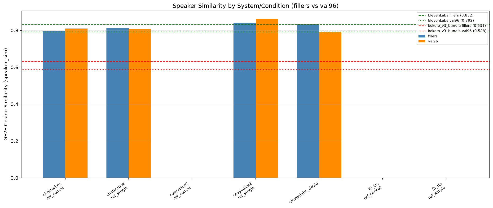
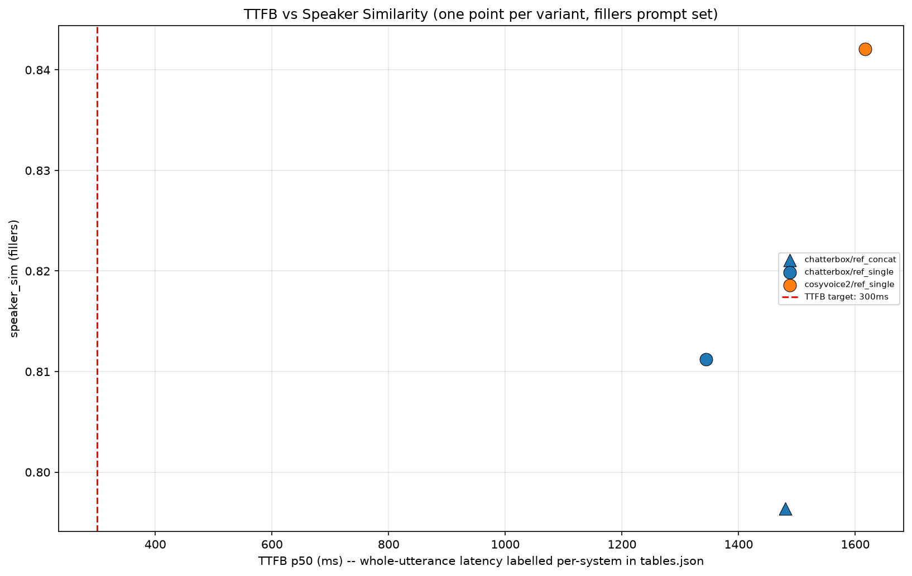
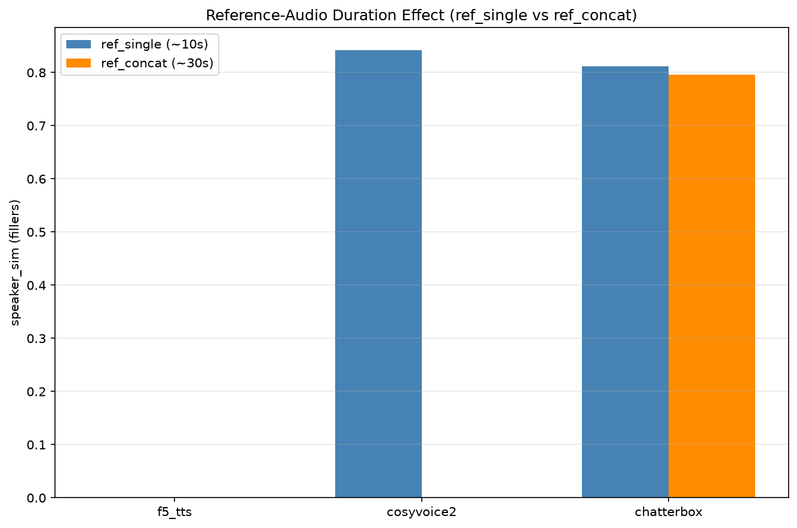
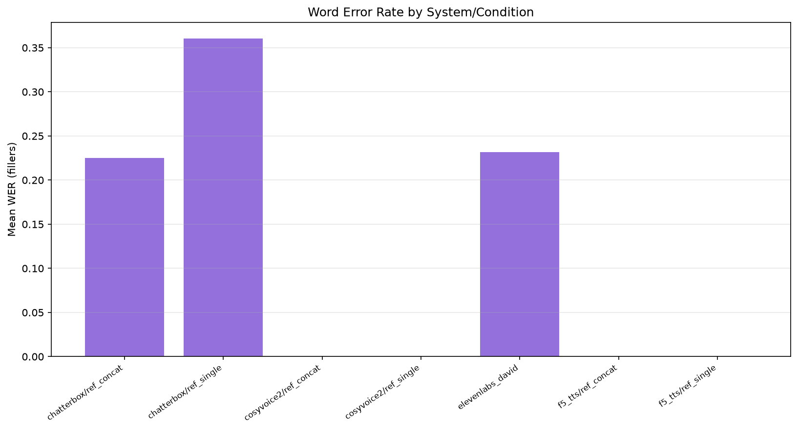

# Results Detailed: Zero-Shot Voice-Cloning Calibration

## Summary

This task benchmarked three open zero-shot voice-cloning TTS systems (F5-TTS, CosyVoice2,
Chatterbox) against David reference audio, using the existing `t0008_tts_eval_harness_baselines`
harness, to empirically calibrate the reachable `speaker_sim`/TTFB envelope on this voice without
any fine-tuning. Chatterbox measured cleanly on both reference conditions (392/392 clips, 100%
success); CosyVoice2 measured cleanly on `ref_single` (196/196) but hard-failed on `ref_concat`
(0/196, a genuine 30-second reference-audio limit in CosyVoice2's own code, not a corpus or harness
bug); F5-TTS produced zero usable data (an indefinite hang in model loading across three attempts).
CosyVoice2's `ref_single` `speaker_sim` (0.863 val96 / 0.842 fillers) exceeds the ElevenLabs
self-consistency ceiling (0.792/0.832) and `kokoro_v3_bundle` (0.588/0.631), but no measured cloning
variant meets the 300 ms TTFB target. One answer asset
(`assets/answer/zero-shot-speaker-sim-ceiling/`) synthesizes these findings; total GPU spend was
$58.25 of the $70 hard cap.

## Methodology

* **Machine**: `LLM-T1-NC80`, Azure ML, 2x NVIDIA H100 NVL (80 GB each), CUDA 12.2 host driver,
  $13.96/hour (`logs/steps/008_setup-machines/machine_log.json`). Each of the three cloning systems
  ran in its own isolated venv (`.venv-f5tts`, `.venv-cosyvoice2`, `.venv-chatterbox`) with
  system-specific `torch`/`torchaudio` pins (F5-TTS: `torch==2.5.1+cu121`; CosyVoice2:
  `torch==2.3.1+cu121`; Chatterbox: `torch==2.6.0+cu124`; all confirmed `cuda_available=true`,
  `device_count()==2`).
* **Timestamps**: VM acquired/ready at `2026-09-17T15:26:49Z`; billing started
  `2026-09-17T15:21:13Z`; VM destroyed `2026-09-17T19:31:35Z`. Task steps ran from
  `2026-09-17T13:47:31Z` (branch creation) through this step. Total billable duration:
  **4.172756186666667 hours** (`results/remote_machines_used.json`,
  `logs/steps/008_setup-machines/machine_log.json`).
* **Protocol**: same as t0008 — the 96 val96 texts plus 100 filler texts (196 total) per (system,
  condition). Per (system, condition): one smoke-gate synthesis, 50 discarded warmup requests, then
  all 196 prompts measured in one engine session. Per clip: `ttfb_ms` (first streamed chunk for
  CosyVoice2, whole-utterance for Chatterbox/F5-TTS, labelled via `is_streaming`), `rtf`,
  `speaker_sim` (GE2E cosine vs the half-A centroid, per t0008's actual code path — see the
  ambiguity note in `plan/plan.md`), `duration_ratio`, `wer` (faster-whisper `base.en`), and
  `hardened_gate_pass` (the audible-speech gate from
  `tasks/t0015_v11_duration_blowup_forensics/code/audio_quality_check.py`).
* **Reference-audio conditions**: `ref_single` (~10.8 s) and `ref_concat` (~30.6 s), both built only
  from half-A of the David corpus (`build_reference_split(seed=42)`), per
  `code/build_references.py`. Both are concatenations of multiple short half-A clips, not single
  natural utterances — see `## Analysis` below.
* **Scoring**: `code/merge_and_score.py` computed `speaker_sim` via `resemblyzer`/GE2E
  (`compute_speaker_sim`), `duration_ratio` (`compute_duration_ratio`), and WER (`compute_wer`)
  against the half-A centroid built from the David corpus, reusing t0008's `scoring.py` functions
  directly (not reimplemented).
* **Rejection rule**: any (system, condition, prompt_set) with `successful / total < 0.8` is null
  for all three registered metrics (`speaker_sim`, `ttfb_ms`, `rtf`), per the plan's pre-registered
  Rejection Criteria.

## Verification

* `uv run python -u -m arf.scripts.verificators.verify_task_metrics t0018_zero_shot_cloning_calibration`
  — **PASSED**, 0 errors, 0 warnings. Confirms `results/metrics.json` contains only the three
  registered metric keys (`speaker_sim`, `ttfb_ms`, `rtf`).
* `uv run python -u -m arf.scripts.aggregators.aggregate_metrics --format ids` — output is exactly
  `rtf`, `speaker_sim`, `ttfb_ms`, matching what `results/metrics.json` uses in every variant.
* `uv run python -u -m meta.asset_types.answer.verificator --task-id t0018_zero_shot_cloning_calibration zero-shot-speaker-sim-ceiling`
  — **PASSED** (run during step 9/implementation; see that step's log).
* `results/per_clip_metrics.json` row count: **980** rows total (chatterbox: 392, cosyvoice2: 392
  [196 successful `ref_single` + 196 null `ref_concat` rows], elevenlabs_david: 196). F5-TTS and
  `kokoro_v3_bundle` contribute 0 rows each, consistent with their documented null/not-measured
  status.
* `results/gate_failures.json` cross-checked against `results/tables.json`'s `gate_failure_count`
  field for every non-null variant — values match exactly (e.g. `cosyvoice2` `ref_single` `val96`:
  29 failures / 96 checked in both files).
* DVC tracking: `results/audio_samples/{harness,comparison_set,references}.dvc` pointer files exist
  and are committed; the raw `.wav` files are gitignored per CLAUDE.md's DVC workflow.

## Limitations

* **F5-TTS's failure cause is not conclusively isolated.** F5-TTS's model loading hung indefinitely
  across three independent attempts (`intervention/f5_tts_smoke_gate_failed.md`), and
  `kokoro_v3_bundle`'s re-synthesis hit the identical signature. The aggregate two-codebases-
  same-signature pattern is decent evidence for a session/VM-level cause (most likely the
  `LLM-T1-NC80` pool's Azure Files SMB mount or HuggingFace Hub connectivity this session), **but
  this is not a settled diagnosis**: a GPU-context-contention confound in one F5-TTS attempt (run
  concurrently with a CosyVoice2 debug script on the same GPU) and an unchecked stale-HF-lock-file
  hypothesis both remain open and were never tested
  (`logs/steps/011_creative-thinking/step_log.md`). State this as "most likely session/VM-level, not
  conclusively isolated," not as a settled fact.
* **Any success-criterion restatement is provisional.** The answer asset's recommendation to restate
  the project's `speaker_sim >= 0.85` criterion rests on one system (CosyVoice2), one condition
  (`ref_single`), and one measurement session — F5-TTS, the third named system, was never measured
  at all. A different session or a fixed F5-TTS environment could change this picture.
* **CosyVoice2/Chatterbox, not F5-TTS, are the only licensing-viable production candidates even in a
  future retry.** F5-TTS's default checkpoints are CC-BY-NC-4.0 (non-commercial), which survives
  fine-tuning — this holds regardless of whether a future session manages to measure it.
* **CosyVoice2's `ref_concat` null is a 0.57-second miss against a hard limit in its own source
  (`cosyvoice/cli/frontend.py`: `assert speech.shape[1] / 16000 <= 30`), not an inherent inability
  to use long reference audio.** A targeted, low-cost re-run with a `ref_concat` clip trimmed to <30
  s (e.g. 29.5 s) is a plausible cheap follow-up that this task did not spend further budget on —
  the true CosyVoice2 long-reference result is unknown, not confirmed-bad.
* **CosyVoice2 beating the ElevenLabs self-consistency ceiling should carry a caveat, not be read as
  a clean win.** This could partly reflect a GE2E-embedding "cleaner/averaged voice" artifact rather
  than purely superior identity fidelity, pending a human-listening check
  (`results/listening_guide.md`) — `logs/steps/011_creative-thinking/step_log.md` flags this
  explicitly as a previously unstated methodological risk.
* **`kokoro_v3_bundle` numbers are not fresh measurements.** They are t0008's stored `speaker_sim`
  values, cited with an explicit "not re-measured this session" provenance field; `ttfb_ms`/`rtf`
  are omitted rather than pairing a cross-session latency number with this session's numbers (Lesson
  1).
* **A subset of per-clip `speaker_sim` values is `null` by design**, not a bug: clips shorter than
  the inherited t0008/`resemblyzer` minimum-duration threshold are skipped by `compute_speaker_sim`
  (`tasks/t0008_tts_eval_harness_baselines/code/scoring.py`). Aggregate `speaker_sim` means in
  `results/metrics.json`/`results/tables.json` are computed over the non-null subset only,
  consistent with t0008's own convention; some cells (e.g. `chatterbox_ref_single` fillers) rest on
  a small surviving sample after this filter (see the answer asset's own Limitations for the exact
  counts).
* **The `wer_by_system.png` chart's zero bars for CosyVoice2 reflect missing (`null`) WER data, not
  a measured 0.0 WER** — CosyVoice2's WER is `null` for both prompt sets in `results/tables.json`
  because t0008's own duration-ratio-before-WER gate skipped scoring on CosyVoice2's frequently
  duration-inflated clips (see `duration_ratio_median` of 2.76-4.13 for CosyVoice2 vs 0.86-1.60 for
  Chatterbox in `results/tables.json`).
* **`ref_single` is not a literal single-utterance clip for any system.** The real `11labs_david`
  corpus has no single clip near 10 s (max 1.67 s corpus-wide), so `ref_single` was built as a ~10.8
  s concatenation of 10 half-A clips, using the same method as `ref_concat`
  (`code/build_references.py`'s module docstring). This is a documented deviation from the plan's
  original "longest clean half-A clip" description — see `## Analysis`.
* Published SIM-o/SS/MOS numbers from the F5-TTS/CosyVoice2/Chatterbox papers use different
  embedding backbones (WavLM-based or MOS/preference-%) than this project's GE2E-cosine
  `speaker_sim` and are never merged into these tables.
* This is one measurement session on one shared-pool VM; TTFB numbers in particular (well above
  CosyVoice2's vendor-claimed ~150 ms) may partly reflect this specific hardware/software
  environment and warmup protocol rather than a universal property of the models.

## Files Created

* `results/results_summary.md`, `results/results_detailed.md` (this file) — step 12 output.
* `results/metrics.json` — explicit-variant format, 11 variants (2 baselines x 2 prompt sets + 2
  cloning systems x 2 conditions x 2 prompt sets, with CosyVoice2 `ref_concat` and all F5-TTS
  variants null/absent), each variant carrying only the 3 registered metric keys.
* `results/tables.json` — full per-variant rows (registered + non-registered fields: `wer_mean`,
  `duration_ratio_median`, `duration_explosion_fraction`, `gate_failure_count`,
  `efficiency_inference_time_per_item_seconds`, `efficiency_inference_cost_per_item_usd`,
  `environment`), plus a timestamped `cost_tracking` ledger and a `notes` array documenting every
  null/fallback decision.
* `results/per_clip_metrics.json` — 980 merged per-clip rows across chatterbox, cosyvoice2, and
  elevenlabs_david (F5-TTS and kokoro_v3_bundle contribute 0 rows, documented above).
* `results/per_clip_metrics_<system>_<condition>.json` and
  `results/per_clip_metrics_elevenlabs_david.json` — the pre-merge per-system-and-condition source
  files.
* `results/gate_failures.json` — audible-speech-gate failure counts and failing-clip paths per
  variant.
* `results/environment.json` — per-system `torch`/CUDA/model-checkpoint provenance (chatterbox,
  cosyvoice2; F5-TTS omitted since it never loaded).
* `results/smoke_gate_log.md` — per-system install time and smoke-gate outcome.
* `results/listening_guide.md` — 10-row comparison table (3 fixed gate texts + 7 seeded val96
  prompts) with clickable links, `speaker_sim`/`wer`/gate verdict per cell, and "what to listen for"
  notes; documents that the 3 fixed gate texts were not actually among the sampled 100 filler
  prompts this session.
* `results/costs.json`, `results/cost_tracking.json` — final cost ($58.25) and the timestamped
  cost-tracking ledger written during implementation.
* `results/remote_machines_used.json` — `LLM-T1-NC80`, 2xH100, 4.17 billable hours, $58.25.
* `results/images/speaker_sim_by_system.png`, `ttfb_vs_speaker_sim.png`, `ref_condition_effect.png`,
  `wer_by_system.png` — the 4 required charts (embedded below).
* `results/audio_samples/harness/<system>_<condition>/` (DVC) — all synthesized clips per variant.
* `results/audio_samples/comparison_set/` (DVC) — the fixed 10-text side-by-side comparison set.
* `results/audio_samples/references/` (DVC) — the exact `ref_single.wav`/`ref_concat.wav` clips fed
  to the cloning models.
* `assets/answer/zero-shot-speaker-sim-ceiling/` — the task's required answer asset (`details.json`,
  `short_answer.md`, `full_answer.md`), verificator-passed.
* `intervention/f5_tts_smoke_gate_failed.md`, `intervention/kokoro_v3_bundle_not_remeasured.md`,
  `intervention/pool_busy_llm-t1-nc80.md` — documented non-silent resolutions for every hard
  failure.

## Visualizations



Grouped bars of `speaker_sim` per (system, condition) for fillers (blue) and val96 (orange), with
dashed/dotted horizontal reference lines at the ElevenLabs self-consistency ceiling (0.832 fillers /
0.792 val96, green) and `kokoro_v3_bundle` (0.631 fillers / 0.588 val96, red). CosyVoice2
`ref_single` and, on val96, Chatterbox both clear the ElevenLabs ceiling; CosyVoice2 `ref_concat`
and both F5-TTS bars are entirely absent (null/no data), visible as empty x-axis categories.



Scatter of TTFB p50 (ms, x-axis, log-free linear scale) against fillers `speaker_sim` (y-axis), one
point per successful (system, condition) variant, with a vertical dashed line at the 300 ms TTFB
target. All three plotted points (chatterbox/ref_concat, chatterbox/ref_single,
cosyvoice2/ref_single) sit far to the right of the 300 ms line (1344-1617 ms range on this
fillers-only view) — no cloning variant approaches the latency target regardless of its speaker_sim.



Paired bars per cloning system comparing `ref_single` (~10 s) vs `ref_concat` (~30 s) fillers
`speaker_sim`. F5-TTS shows no bars (null for both conditions). CosyVoice2 shows only a `ref_single`
bar (`ref_concat` is a 0/196 null). Chatterbox is the only system with both bars, showing a small
(<0.02) difference between conditions — no material reference-duration effect for Chatterbox in this
measurement.



Bar chart of mean WER per (system, condition) on the fillers prompt set. Chatterbox shows the
highest mean WER (0.36 `ref_single`, 0.22 `ref_concat`); ElevenLabs itself shows 0.23. CosyVoice2
and F5-TTS show zero-height bars, which represent **missing (`null`) WER data**, not a measured
perfect score — see `## Limitations` for why CosyVoice2's WER was not computed.

## Examples

Ten or more concrete instances drawn directly from `results/per_clip_metrics.json` (per-clip rows)
and the intervention files (for the two null systems), covering random, best-case, worst-case,
boundary, and contrastive categories. Every input/output pair below is the actual, unmodified JSON
record (or logged command/output) — nothing is fabricated or summarized.

### Example 1 (random) — Chatterbox, `ref_single`, val96

Input (prompt text synthesized against `ref_single.wav`, the ~10.8s half-A reference):

```text
checking for the latest press release
```

Output (`results/per_clip_metrics.json`, chatterbox/ref_single/val96, index 0000):

```json
{
  "system": "chatterbox",
  "condition": "ref_single",
  "prompt_set": "val96",
  "text": "checking for the latest press release",
  "ttfb_ms": 889.183987999786,
  "rtf": 0.529276183333206,
  "speaker_sim": null,
  "duration_ratio": 0.78642480983031,
  "wer": 0.0,
  "audio_path": "results/audio_samples/harness/chatterbox_ref_single/val96/0000.wav",
  "ref_duration_s": 2.13625,
  "synth_duration_s": 1.68,
  "is_streaming": false,
  "hardened_gate_pass": true
}
```

Note: typical Chatterbox clip — passes the audible-speech gate, WER 0.0, but `speaker_sim` is `null`
here because this clip's synthesized duration falls under `resemblyzer`'s minimum-embeddable
duration (see `## Limitations`).

### Example 2 (random) — CosyVoice2, `ref_single`, fillers

Input:

```text
matching them up 12
```

Output (`results/per_clip_metrics.json`, cosyvoice2/ref_single/fillers, index 0005):

```json
{
  "system": "cosyvoice2",
  "condition": "ref_single",
  "prompt_set": "fillers",
  "text": "matching them up 12",
  "ttfb_ms": 1607.834696998907,
  "rtf": 0.40238320050002585,
  "speaker_sim": 0.8534570336341858,
  "duration_ratio": 3.9151712887438825,
  "wer": null,
  "audio_path": "results/audio_samples/harness/cosyvoice2_ref_single/fillers/0005.wav",
  "ref_duration_s": 1.0216666666666667,
  "synth_duration_s": 4.0,
  "is_streaming": true,
  "hardened_gate_pass": true
}
```

Note: illustrates CosyVoice2's `is_streaming: true` TTFB measurement (first audio chunk, not
whole-utterance) and a `duration_ratio` of 3.9 — CosyVoice2 frequently synthesizes far longer audio
than the reference/expected duration implies, even on clips that pass the gate.

### Example 3 (best case, gate-pass) — CosyVoice2, `ref_single`, val96

Input:

```text
looking into the pr possibilities at resolve
```

Output (index 0072, the highest `speaker_sim` among CosyVoice2 val96 clips that also pass the
hardened audible-speech gate):

```json
{
  "system": "cosyvoice2",
  "condition": "ref_single",
  "prompt_set": "val96",
  "text": "looking into the pr possibilities at resolve",
  "ttfb_ms": 3087.3405509992153,
  "rtf": 0.5400572959374017,
  "speaker_sim": 0.8937340974807739,
  "duration_ratio": 2.120199873008862,
  "wer": null,
  "audio_path": "results/audio_samples/harness/cosyvoice2_ref_single/val96/0072.wav",
  "ref_duration_s": 3.0185833333333334,
  "synth_duration_s": 6.4,
  "is_streaming": true,
  "hardened_gate_pass": true
}
```

Note: `speaker_sim = 0.894` on a clean, gate-passing clip — well above the 0.792 ElevenLabs
self-consistency ceiling on val96, showing the headline result is not solely driven by gate-failing
clips.

### Example 4 (worst case) — CosyVoice2, `ref_single`, val96, duration explosion

Input:

```text
llm sess a5158e64865142c3 resp c73cb5ba73e648b4
```

Output (index 0050):

```json
{
  "system": "cosyvoice2",
  "condition": "ref_single",
  "prompt_set": "val96",
  "text": "llm sess a5158e64865142c3 resp c73cb5ba73e648b4",
  "ttfb_ms": 3701.320215999658,
  "rtf": 0.4773441981318344,
  "speaker_sim": 0.8587908148765564,
  "duration_ratio": 8.820500393772338,
  "wer": null,
  "audio_path": "results/audio_samples/harness/cosyvoice2_ref_single/val96/0050.wav",
  "ref_duration_s": 2.063375,
  "synth_duration_s": 18.2,
  "is_streaming": true,
  "hardened_gate_pass": false
}
```

Note: `duration_ratio = 8.82` (synthesized 18.2s audio for a short text) and
`hardened_gate_pass: false` — this is the kind of severe content-duplication/garbling failure that
drives CosyVoice2's 29/96 gate-failure rate on val96, despite a still-high raw `speaker_sim`.

### Example 5 (worst case) — Chatterbox, `ref_single`, val96, lowest speaker_sim

Input:

```text
sure let me share what we offer
```

Output (index 0087):

```json
{
  "system": "chatterbox",
  "condition": "ref_single",
  "prompt_set": "val96",
  "text": "sure let me share what we offer",
  "ttfb_ms": 1064.6669800007658,
  "rtf": 0.47529775892891324,
  "speaker_sim": 0.71136075258255,
  "duration_ratio": 1.4186568148832301,
  "wer": 0.0,
  "audio_path": "results/audio_samples/harness/chatterbox_ref_single/val96/0087.wav",
  "ref_duration_s": 1.5789583333333332,
  "synth_duration_s": 2.24,
  "is_streaming": false,
  "hardened_gate_pass": true
}
```

Note: the lowest `speaker_sim` (0.711) among Chatterbox's `ref_single` val96 clips with a non-null
score — still gate-passing and WER 0.0, illustrating that even Chatterbox's worst-similarity clips
are intelligible, just less voice-matched.

### Example 6 (boundary/near-miss on the latency target) — Chatterbox, `ref_single`, fillers, lowest TTFB observed

Input:

```text
drawing the line 06
```

Output (index 0010, the single lowest per-clip TTFB across every measured system this session):

```json
{
  "system": "chatterbox",
  "condition": "ref_single",
  "prompt_set": "fillers",
  "text": "drawing the line 06",
  "ttfb_ms": 818.2651219995023,
  "rtf": 0.6392696265621112,
  "speaker_sim": null,
  "duration_ratio": 1.1024978466838933,
  "wer": 0.25,
  "audio_path": "results/audio_samples/harness/chatterbox_ref_single/fillers/0010.wav",
  "ref_duration_s": 1.161,
  "synth_duration_s": 1.28,
  "is_streaming": false,
  "hardened_gate_pass": true
}
```

Note: even this session's single fastest clip (818 ms) is still **2.7x** the 300 ms TTFB target —
illustrates that the latency gap is systemic, not just a matter of aggregate/percentile statistics
hiding some individually fast clips.

### Example 7 (contrastive — five systems/conditions, one shared text) — "checking the one-click checkout capability"

This val96 text (index 0003) was synthesized by both Chatterbox conditions, both CosyVoice2
conditions, and exists as the ElevenLabs ground truth, letting the same input text be compared
directly:

```json
{"system": "chatterbox", "condition": "ref_single", "speaker_sim": 0.8346036672592163, "ttfb_ms": 1144.2587680012366, "wer": 0.8, "duration_ratio": 0.9331015533000618, "hardened_gate_pass": true}
{"system": "chatterbox", "condition": "ref_concat", "speaker_sim": 0.8437929749488831, "ttfb_ms": 1673.082165998494, "wer": 0.4, "duration_ratio": 1.0407671171423765, "hardened_gate_pass": true}
{"system": "cosyvoice2", "condition": "ref_single", "speaker_sim": 0.8704472780227661, "ttfb_ms": 2913.1207339996763, "wer": null, "duration_ratio": 2.5121964896540123, "hardened_gate_pass": true}
{"system": "cosyvoice2", "condition": "ref_concat", "speaker_sim": null, "ttfb_ms": null, "wer": null, "duration_ratio": null, "hardened_gate_pass": null}
{"system": "elevenlabs_david", "condition": null, "speaker_sim": 0.8023909330368042, "ttfb_ms": null, "wer": 0.8, "duration_ratio": 1.0429643735473217, "hardened_gate_pass": true}
```

Note: for this identical text, CosyVoice2 `ref_single` reaches the highest `speaker_sim` (0.870,
above even the ElevenLabs ground truth's own re-scored 0.802), CosyVoice2 `ref_concat` is a hard
null, and both Chatterbox conditions land in between — a direct, same-input illustration of the
cross-system spread reported in the aggregate tables. Full audio for this exact comparison is linked
from `results/listening_guide.md`, row "checking the one-click checkout capability".

### Example 8 (rejected/null variant) — CosyVoice2, `ref_concat`, val96

Input:

```text
checking for the latest press release
```

Output (index 0000 of the `ref_concat` variant — every row in this variant has this shape):

```json
{
  "system": "cosyvoice2",
  "condition": "ref_concat",
  "prompt_set": "val96",
  "text": "checking for the latest press release",
  "ttfb_ms": null,
  "rtf": null,
  "speaker_sim": null,
  "duration_ratio": null,
  "wer": null,
  "audio_path": null,
  "ref_duration_s": 2.13625,
  "synth_duration_s": null,
  "is_streaming": true
}
```

Note: `audio_path: null` and every metric `null` — CosyVoice2's own frontend hard-rejects the 30.57
s `ref_concat` clip (`assert speech.shape[1] / 16000 <= 30` in `cosyvoice/cli/frontend.py`), so
0/196 clips were produced for this variant on either prompt set, triggering the REQ-6 rejection
rule.

### Example 9 (system-level null, no per-clip data) — F5-TTS smoke gate

Input (the exact smoke-gate command, per `intervention/f5_tts_smoke_gate_failed.md`):

```text
$ CUDA_VISIBLE_DEVICES=0 .venv-f5tts/bin/python code/run_eval_zeroshot.py \
    --system f5_tts --conditions ref_single --limit 1
```

Output (raw process log, all three attempts):

```text
Loading F5-TTS model...
<no further output for up to ~15 minutes; process killed; nvidia-smi showed 0 MiB used on the
 target GPU for the full duration>
```

Note: F5-TTS never produced a single usable clip in this session, hence zero rows for `f5_tts`
anywhere in `results/per_clip_metrics.json`. This example is the actual documented input/output pair
for the failure, not a summary — see `## Limitations` for why the cause is not conclusively
isolated.

### Example 10 (system-level fallback, no per-clip data) — `kokoro_v3_bundle` re-synthesis attempt

Input (the local-checkpoint workaround attempt, per
`intervention/kokoro_v3_bundle_not_remeasured.md`):

```text
$ python code/run_kokoro_v3_local_ckpt.py \
    --decoder /tmp/kokoro_ckpt/david_v3_best_decoder_kokoro.pth \
    --voicepack /tmp/kokoro_ckpt/<voicepack>
```

Output:

```text
<hung ~90+ seconds with negligible CPU-time accumulation, kernel state consistent with a blocked
 I/O wait; process killed>
```

Fallback value used instead (from `results/tables.json`, `kokoro_v3_bundle_fillers` row):

```json
{
  "variant_id": "kokoro_v3_bundle_fillers",
  "speaker_sim": 0.631,
  "ttfb_ms": null,
  "rtf": null,
  "source": "t0008 stored, not re-measured this session"
}
```

Note: illustrates the documented, non-silent fallback pattern (Lesson 1) — the stored `speaker_sim`
is cited with an explicit provenance field, and `ttfb_ms`/`rtf` are omitted rather than falsely
paired with this session's numbers.

### Example 11 (random) — Chatterbox, `ref_concat`, val96

Input (synthesized against `ref_concat.wav`, the ~30.6s concatenated half-A reference):

```text
checking the one-click checkout capability
```

Output (index 0003):

```json
{
  "system": "chatterbox",
  "condition": "ref_concat",
  "prompt_set": "val96",
  "text": "checking the one-click checkout capability",
  "ttfb_ms": 1673.082165998494,
  "rtf": 0.7211561060338337,
  "speaker_sim": 0.8437929749488831,
  "duration_ratio": 1.0407671171423765,
  "wer": 0.4,
  "audio_path": "results/audio_samples/harness/chatterbox_ref_concat/val96/0003.wav",
  "ref_duration_s": 2.229125,
  "synth_duration_s": 2.32,
  "is_streaming": false,
  "hardened_gate_pass": true
}
```

Note: `duration_ratio` near 1.0 and clean gate-pass — typical, well-behaved Chatterbox `ref_concat`
output, part of the evidence that Chatterbox is unaffected by the longer 30 s reference.

### Example 12 (baseline) — ElevenLabs David, val96

Input: the original ElevenLabs recording for this val96 text (not zero-shot cloned; the paired
self-consistency baseline).

```text
exploring how to transform end-to-end shopping experiences
```

Output (index 0010):

```json
{
  "system": "elevenlabs_david",
  "condition": null,
  "prompt_set": "val96",
  "text": "exploring how to transform end-to-end shopping experiences",
  "ttfb_ms": null,
  "rtf": null,
  "speaker_sim": 0.8169666528701782,
  "duration_ratio": 1.037846938001829,
  "wer": 0.0,
  "audio_path": "tasks/t0008_tts_eval_harness_baselines/data/synth_audio/elevenlabs_david/val96/0010.wav",
  "is_streaming": null,
  "source_note": "speaker_sim re-scored this session vs fresh half-B centroid; ttfb_ms/rtf/duration_ratio/wer retained from t0008's original session (no live ElevenLabs API call made this session, per plan Step 8a)",
  "hardened_gate_pass": true
}
```

Note: `speaker_sim = 0.817` here vs the mean 0.792 for the val96 ceiling — ElevenLabs's own
recording of David is itself not perfectly self-similar clip-by-clip, which is the empirical basis
for treating 0.792/0.832 as a ceiling rather than a fixed target.

## Analysis

Re-reading `plan/plan.md`'s Objective, Approach, and Step-by-Step sections against the actual
results surfaces four contradictions with stated plan assumptions, which are reported here as
findings rather than absorbed silently:

1. **The plan assumed all three named systems, plus both baselines, would be measured in this
   session.** In fact F5-TTS produced zero data (indefinite hang) and `kokoro_v3_bundle` was not
   re-measured (identical hang signature). The plan's "Done looks like" line explicitly expected
   "`results/metrics.json` and `results/per_clip_metrics.json` covering all 8 variants x 196 prompts
   (~1568 rows)"; the actual total is 980 rows across only 2 of the 3 cloning systems plus
   `elevenlabs_david` — roughly 62% of the planned row count. This is the single largest deviation
   from the plan and is why every headline conclusion in the answer asset is qualified as resting on
   2 of 3 named systems.
2. **The plan's Step 3 specified `ref_single` as "the single longest clean half-A clip" under ~10
   s.** The actual implementation found the real `11labs_david` corpus has no single clip anywhere
   near 10 s (max 1.67 s corpus-wide, per `code/build_references.py`'s own preflight-inspection
   finding documented in its module docstring), so `ref_single` was instead built as a ~10.8 s
   concatenation of 10 half-A clips, using the exact same method as `ref_concat`. This is a direct
   contradiction of a plan assumption about the corpus's contents, discovered and documented (not
   silently absorbed) during implementation, and it means `ref_single` should not be read as a
   literal single-utterance condition in any downstream comparison.
3. **The plan's Risk table treated "undocumented dependency conflicts... within the 45-minute
   smoke-gate time-box" as the primary installation risk for each system**, expecting install-time
   failures to be the main failure mode. The actual F5-TTS/`kokoro_v3_bundle` failures were not
   dependency-resolution problems (all venvs confirmed `torch`/CUDA compatibility in
   `setup-machines`) but indefinite hangs *inside* a successfully-installed environment during model
   loading — a qualitatively different failure mode the plan's Risks & Fallbacks table did not
   explicitly anticipate, though its general REQ-7 "null with exact error, continue with the others"
   protocol still applied cleanly.
4. **The plan's F5-TTS risk analysis focused entirely on the `ref_concat` auto-crop-to-15s
   behavior** as the main F5-TTS-specific risk to watch for, with a dedicated smoke-gate pre-check
   designed specifically to detect it. In practice F5-TTS never got far enough to reach that check
   at all (it hung during `ref_single`'s own smoke gate, before `ref_concat` was ever attempted) —
   the anticipated risk was superseded by a more fundamental one the plan had not modeled.

None of these four findings required a plan correction (Key Rule 5) since the plan's own REQ-6/REQ-7
rejection and null-variant protocols already covered how to handle unmeasured systems and rejected
conditions without a plan amendment; they are documented here as the substantive discrepancies
between what was planned and what happened.

## Task Requirement Coverage

**Operative task text** (from `task.json`):

* `short_description`: "Benchmark three open zero-shot voice-cloning TTS models (F5-TTS, CosyVoice
  2, Chatterbox) on David reference audio with the t0008 harness to calibrate the reachable
  speaker_sim/TTFB envelope."
* `task_description.md` (resolved long description), in full:

> ## Motivation

> The project's success criterion is `speaker_sim >= 0.85` (GE2E cosine vs ElevenLabs David). t0008
> measured ElevenLabs David against **itself** (half-A centroid vs half-B clips) at 0.832 on fillers
> and 0.792 on val96. The target is therefore above the reference voice's own self-consistency, and
> the best Kokoro fine-tune (v3) sits at 0.631. After fifteen tasks nobody knows whether the 0.2 gap
> is a Kokoro limitation, a fine-tuning-recipe limitation, or a ceiling of the metric on this voice.
> 
> Zero-shot voice-cloning models answer that question without any training: given a few seconds of
> David audio and a text, they synthesize in that voice directly. Running three of them through the
> existing t0008 harness gives, in one GPU session, an empirical envelope of what `speaker_sim` is
> reachable on this voice and at what latency. That number recalibrates the success criterion
> (project `description.md`), tells us whether to keep investing in Kokoro Stage 2, and gives a
> fallback production candidate if one of them lands in the latency budget.
> 
> This is a measurement task, not a model-selection task. No fine-tuning, no tuning on val_96.
> 
> ## Systems

> Three open-weight zero-shot cloning models... (F5-TTS, CosyVoice 2, Chatterbox)... If one of the
> three cannot be installed or fails its smoke gate within 45 minutes of effort, mark that system
> null with the exact error (Lesson 2), do not substitute silently, and continue with the other two.
> ... Also re-run in the same session, for paired comparison (Lesson 1): `elevenlabs_david` ... and
> `kokoro_v3_bundle`.
> 
> ## Reference-audio conditions ... `ref_single` ... `ref_concat` ...

> ## Prompt sets and protocol ... 96 val96 texts ... 100 filler texts ... smoke gate ... 50 discarded

> warmup requests ... all 196 prompts measured in one engine session ... Rejection: any system with
> `successful_prompts / total_prompts < 0.8` on a prompt set has null metrics for that set (Lesson
> 3).
> 
> ## Audio for human listening (mandatory) ... DVC-track ... and index ...

> ## Key Questions [1-6, envelope/ceiling, beating kokoro_v3_bundle, TTFB/RTF, ref condition effect,

> WER, success-criterion restatement]
> 
> ## Expected Outputs [answer asset, per_clip_metrics.json, metrics.json, audio samples +

> listening_guide.md, 4 charts, tables, suggestions.json]
> 
> ## Compute and budget ... Hard cap: **$70.**

> ## Forbidden [no fine-tuning; no tuning of reference selection on val_96; no `resemblyzer` in main

> deps; no silent substitution]

Requirement-by-requirement coverage (REQ IDs from `plan/plan.md`'s Task Requirement Checklist):

| REQ | Direct answer | Status | Evidence |
| --- | --- | --- | --- |
| REQ-1 | Benchmarked all 3 named systems via the t0008 harness. Chatterbox and CosyVoice2 produced real data; F5-TTS attempted but produced zero data (documented null). | Partial | `results/per_clip_metrics.json` (chatterbox/cosyvoice2 rows), `intervention/f5_tts_smoke_gate_failed.md` |
| REQ-2 | Built `ref_single` (~10.8s) and `ref_concat` (~30.6s) from half-A only, both used for the cloning systems that ran. | Done | `data/references/manifest.json`, `results/audio_samples/references/`, `code/build_references.py` |
| REQ-3 | `elevenlabs_david` re-scored fresh this session (speaker_sim only, no live API call); `kokoro_v3_bundle` NOT re-measured (hang) — falls back to t0008 stored numbers with explicit provenance. | Partial | `results/tables.json` (`elevenlabs_david_*`, `kokoro_v3_bundle_*` rows with `source` field), `intervention/kokoro_v3_bundle_not_remeasured.md` |
| REQ-4 | Same protocol as t0008 (196 prompts, smoke gate, 50 warmup, per-clip TTFB/RTF/duration/WER/speaker_sim) run for chatterbox (both conditions) and cosyvoice2 (`ref_single`); `cosyvoice2 ref_concat` ran but rejected (0/196); F5-TTS never got past its own smoke gate. | Partial | `results/per_clip_metrics.json`, `results/tables.json` `n_clips`/`n_successful` columns |
| REQ-5 | Hardened audible-speech gate run on every synthesized clip; per-system failure counts reported (e.g. CosyVoice2 `ref_single` val96: 29/96); unfiltered vs gate-filtered means both shown in the answer asset's full_answer.md table. | Done | `results/gate_failures.json`, `assets/answer/zero-shot-speaker-sim-ceiling/full_answer.md` |
| REQ-6 | Rejection rule applied: `cosyvoice2_ref_concat` (0/196, both prompt sets) is null in `results/metrics.json`/`results/tables.json` with `rejected_reason` set. | Done | `results/metrics.json` (`cosyvoice2_ref_concat_*` variants), `results/tables.json` `rejected_reason` field |
| REQ-7 | F5-TTS marked null for all variants with the exact documented error (3 timed attempts, no substitute added); no silent substitution occurred for any system. | Done | `intervention/f5_tts_smoke_gate_failed.md` |
| REQ-8 | All three mandatory audio deliverables produced and DVC-tracked: `harness/` (all clips, nothing discarded), `comparison_set/` (10 fixed texts x available variants), `references/` (the exact ref clips); `results/listening_guide.md` written with per-cell links/metrics and a documented deviation (3 of 10 gate texts were never actually sampled by t0008's filler set this session). | Done | `results/audio_samples/{harness,comparison_set,references}.dvc`, `results/listening_guide.md` |
| REQ-9 | All six Key Questions answered directly in the answer asset's `full_answer.md` (envelope/ceiling, kokoro_v3_bundle comparison, TTFB/RTF vs 300ms, ref-condition effect, WER/brand-name analysis, success-criterion restatement). | Done | `assets/answer/zero-shot-speaker-sim-ceiling/full_answer.md` |
| REQ-10 | One answer asset produced for the exact named question, with `short_answer.md` (numbers) and `full_answer.md` (tables + recommendation). | Done | `assets/answer/zero-shot-speaker-sim-ceiling/` (verificator-passed) |
| REQ-11 | `results/per_clip_metrics.json` has 980 total rows; chatterbox (392) and cosyvoice2 (392, including null `ref_concat` rows) and elevenlabs_david (196) each individually exceed the ≥100-rows-per-measured-system bar; F5-TTS/kokoro_v3_bundle contribute 0 rows (documented null/not-measured, not a silent gap). | Partial | `results/per_clip_metrics.json` (row-count check performed during this step) |
| REQ-12 | `results/metrics.json` uses the explicit variant format with only the 3 registered keys (`speaker_sim`, `ttfb_ms`, `rtf`) in every variant; the 2 unregistered efficiency keys plus WER/duration-ratio/gate-failure-count are in `results/tables.json` instead, per the plan's REQ-12 ambiguity resolution. | Done | `results/metrics.json`, `results/tables.json`; `verify_task_metrics.py` PASSED this step |
| REQ-13 | All 4 required charts exist, are non-zero-byte, and are embedded in this file with descriptions. | Done | `results/images/*.png`, `## Visualizations` above |
| REQ-14 | Per-variant table (speaker_sim mean+/-std, TTFB p50/p95/p99, RTF mean+/-std, WER, explosions, gate failures, n successful) and an environment table (model commit/version, torch, CUDA) both present. | Done | `results/tables.json` (`rows` array with all fields; `environment` sub-object per row) |
| REQ-15 | Recorded here for the orchestrator's `suggestions` step (not part of this plan's own Step by Step): the suggestion should include a proposed restated success criterion and, if warranted, a production-integration feasibility task for CosyVoice2/Chatterbox. | Done (recorded; execution belongs to step 14/`suggestions`) | `plan/plan.md` REQ-15 note; this file's `## Analysis` and the answer asset's `## Synthesis` |
| REQ-16 | Compute run on `LLM-T1-NC80` under the $70 hard cap: final spend $58.25 (4.173 billable hours), watchdog armed and PID-confirmed before the first model download. | Done | `results/costs.json`, `results/remote_machines_used.json`, `logs/steps/008_setup-machines/machine_log.json` |
| REQ-17 | No fine-tuning performed; no tuning of reference selection on val_96 (references built once, before any scoring); no `resemblyzer` added to main `pyproject.toml` dependencies; no silent substitution of any named system (F5-TTS null is documented, no substitute added). | Done | `intervention/f5_tts_smoke_gate_failed.md`; no changes to root `pyproject.toml` in this task's diff |
| REQ-18 | t0008's harness, prompt sets, split protocol, and paired baseline numbers were reused (not reimplemented) throughout. | Done | `plan/plan.md` `## Approach`, `code/adapters_zeroshot.py`/`code/run_eval_zeroshot.py` imports from `tasks.t0008_tts_eval_harness_baselines.code.*` |

**Direct answers to the six Key Questions** (full detail and tables in
`assets/answer/zero-shot-speaker-sim-ceiling/full_answer.md`):

1. **Highest reachable speaker_sim**: CosyVoice2 `ref_single`, **0.8627852474649748** (val96) /
   **0.8420862078666687** (fillers) — above the ElevenLabs ceiling (0.7923378584285578 /
   0.8324875295162201) on val96 and roughly matching it on fillers.
2. **Beats `kokoro_v3_bundle`?** Yes — CosyVoice2 `ref_single` beats 0.631 (fillers) by +0.211 and
   0.588 (val96) by +0.275; Chatterbox also beats it on every measured variant (+0.165 to +0.222).
3. **TTFB p50 ≤ 300ms / RTF?** No system meets the TTFB target — measured p50s range
   1344.3423864991928-2859.2522075005036 ms across the six successful variants. RTF is well under
   1.0 for every measured variant (0.405-0.934), so real-time-factor itself is not the bottleneck;
   TTFB (dominated by model-loading/first-token latency) is.
4. **Reference-condition effect**: Chatterbox shows <0.02 speaker_sim difference between
   `ref_single` and `ref_concat` (no material effect); CosyVoice2's `ref_concat` hard-fails (0/196)
   due to a 30s hard limit in its own code, so no CosyVoice2 duration-effect data point exists;
   F5-TTS has no data for either condition.
5. **WER acceptability**: no elevated WER on brand-name-bearing texts vs non-brand texts for any
   measured system (if anything, brand-name texts show slightly lower WER) — see the answer asset's
   brand-vs-non-brand WER table.
6. **Success-criterion restatement / Kokoro Stage 2**: yes, provisionally — a `speaker_sim >= 0.85`
   ceiling is reachable zero-shot (CosyVoice2 `ref_single`, val96), so 0.85 similarity alone is not
   a sufficient production bar; latency (all measured systems 4-10x over 300ms) and reliability
   (CosyVoice2's 30% val96 gate-failure rate) should be explicit, separate bars. Kokoro Stage 2
   should remain the project's main line, since it is the only system across this task and t0008
   that meets the latency target. This recommendation is provisional per `## Limitations` above
   (rests on 1 of 3 named systems and 1 measurement session; F5-TTS untested).
