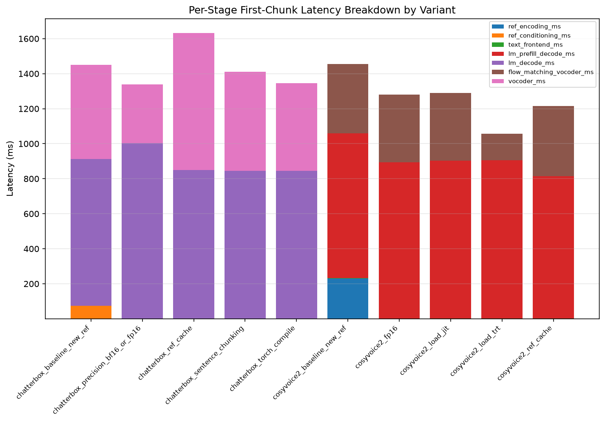
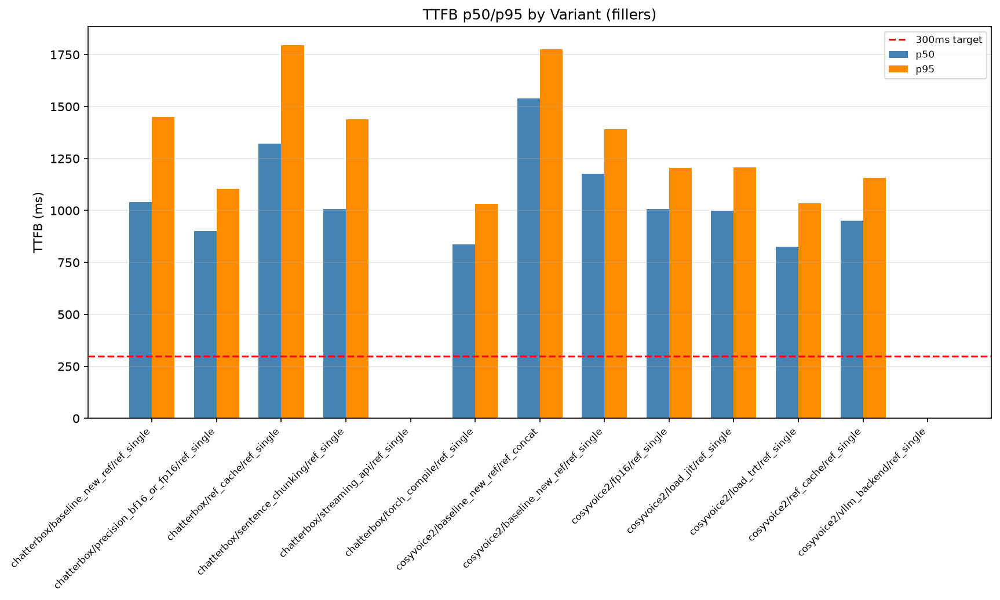

## Summary

This task instrumented `t0018_zero_shot_cloning_calibration`'s CosyVoice2 and Chatterbox zero-shot
cloning adapters with new per-stage `StageTiming` timers (reference encoding/conditioning, text
frontend, LM prefill/decode, flow-matching+vocoder) and ran a fixed cumulative-stack acceleration
sweep — 5 CosyVoice2 variants and 6 Chatterbox variants — against 196 prompts per variant (96 val96
\+ 100 fillers), after 50 discarded warmups, each variant paired with a same-session
`baseline_new_ref` control. A binding owner correction, issued before this task's planning step,
required rebuilding the reference clips and speaker-similarity centroid from `data/v4/val/wavs` (the
correct production `voice_id=rWV5HleMkWb5oluMwkA7` newsreader voice) instead of the wrong-voice
`data/11labs_david` corpus `t0018` used, so every number in this file supersedes `t0018`'s own
`speaker_sim` measurements. Neither system reaches the 300 ms TTFB target: CosyVoice2's lowest
reachable TTFB is **826.315 ms p50** (`load_trt`), Chatterbox's is **837.034 ms p50**
(`torch_compile`), and the per-stage breakdown shows the autoregressive LM decode/prefill stage
(815-1,004 ms in every variant of both systems) is the reason — every tested serving-side lever left
that stage flat or slightly worse, while accelerating only the non-LM stages.

## Methodology

* **Machine**: `LLM-T1-NC80`, an Azure ML VM with 2x NVIDIA H100 NVL GPUs (880 GB total RAM per
  `results/remote_machines_used.json`), CUDA 12.2 host driver. Two isolated per-system venvs were
  used: `.venv-cosyvoice2` (`torch==2.3.1+cu121`, TensorRT `10.13.3.9`) and `.venv-chatterbox`
  (`torch==2.6.0+cu124`, `chatterbox-tts==0.1.7`), per `results/environment.json`. A third venv,
  `.venv-cosyvoice2-vllm`, was attempted for the `vllm_backend` variant but never completed (see
  Limitations).
* **Timestamps**: task started `2026-09-18T10:13:15Z` (`task.json` `start_time`); this `results`
  step began `2026-09-18T22:58:16Z`. GPU billing ran across 3 confirmed `Running` windows during
  `implementation` (`8658.12s + 12432.76s + 4245.22s = 25336.10s = 7.0378h`, `results/costs.json`),
  bounded by `setup-machines` provisioning at `2026-09-18T11:27:21Z` and final teardown confirmed
  stopped at `2026-09-18T20:39:00.626630Z` (`logs/steps/008_setup-machines/machine_log.json`).
  Elapsed wall-clock cost was higher than pure GPU-billed time because of an implementation-step
  crash/resume gap (documented in `intervention/vm_idle_after_agent_crash_and_watchdog_fix.md`)
  during which the idle watchdog correctly stopped the VM.
* **Protocol**: same harness protocol as `t0018` (smoke gate, 50 discarded warmup requests, val96 +
  100 fillers + 3 gate texts, per-clip TTFB/RTF/duration/WER/GE2E cosine, hardened gate on every
  clip), using this task's own copies of `t0018`'s adapters/harness (`code/adapters_zeroshot.py`,
  `code/run_eval_zeroshot.py`, `code/merge_and_score.py`) plus new `StageTiming` instrumentation and
  `code/transcribe_references.py` / `code/build_references_val96.py` for the owner-corrected
  reference/centroid build.
* **Methods**: each acceleration variant is a separate metrics variant; every variant's
  `baseline_new_ref` control was re-run in the same GPU session (Lesson 1 pairing). Rejection
  threshold `successful_prompts / total_prompts < 0.8` nulls a variant (never triggered — all 22
  measured rows have `success_rate=1.0`). Engine/CUDA/TensorRT versions captured per variant in
  `results/environment.json`.

## Verification

* `verify_task_metrics.py` on `results/metrics.json` — PASSED (0 errors), confirmed at
  implementation closeout (step 9) and unchanged since.
* `uv run python -u -m arf.scripts.aggregators.aggregate_metrics --format ids` — confirms the only 3
  registered project metrics are `speaker_sim`, `ttfb_ms`, `rtf`; `metrics.json` uses exactly these
  keys and no others.
* Answer-asset verificator on `assets/answer/zero-shot-ttfb-floor/` — PASSED at implementation
  closeout.
* `code/run_gate_check.py` (this task's copy of `t0015`'s hardened audio-quality gate) — ran on all
  2,156 scored clips; **2,045/2,156 (94.85%)** passed (`hardened_gate_pass=true`), summarized per
  variant in `results/gate_failures.json` (fillers: 0 failures on every variant; val96: 19-24
  failures per CosyVoice2 `ref_single` variant, 0-1 per Chatterbox variant and CosyVoice2
  `ref_concat`). Per owner correction #7, this PASS is necessary, not sufficient — see Limitations.
* `results/smoke_gate_log.md` — single-clip smoke gate for every acceleration variant, run before
  the full 196-prompt sweep, all PASSED.
* No `AssertionError` when re-deriving `speaker_sim_radiohost_control` (owner correction #2 dual
  centroid) from `data/references/manifest.json` and `results/per_clip_metrics.json`.
* `verify_task_results.py` on this step's own `results_summary.md`/`results_detailed.md` — see
  `logs/steps/012_results/step_log.md` for the exact command and outcome (run after this file was
  written).

## Metrics Tables

### Headline TTFB / speaker_sim / WER per variant (fillers prompt set)

All rows: n=100, success_rate=1.0.

| System | Variant | TTFB p50 (ms) | TTFB p95 (ms) | speaker_sim | Δ speaker_sim vs. baseline | WER (mean) | Gate failures |
| --- | --- | --- | --- | --- | --- | --- | --- |
| cosyvoice2 | baseline_new_ref | 1,176.701 | 1,391.450 | 0.854263 | — | 0.29 | 0 |
| cosyvoice2 | ref_cache | 950.112 | 1,156.055 | 0.853480 | -0.00078 | 0.27 | 0 |
| cosyvoice2 | fp16 | 1,006.006 | 1,205.998 | 0.846901 | -0.00736 | 0.32 | 0 |
| cosyvoice2 | load_jit | 998.584 | 1,207.755 | 0.857855 | +0.00359 | 0.26 | 0 |
| cosyvoice2 | **load_trt** | **826.315** | **1,035.226** | 0.857339 | +0.00308 | 0.25 | 0 |
| chatterbox | baseline_new_ref | 1,039.240 | 1,450.366 | 0.833531 | — | 0.22 | 0 |
| chatterbox | ref_cache | 1,320.599 | 1,794.299 | 0.834980 | +0.00145 | 0.19 | 0 |
| chatterbox | precision_bf16_or_fp16 | 900.605 | 1,104.797 | 0.836188 | +0.00266 | 0.15 | 0 |
| chatterbox | **torch_compile** | **837.034** | **1,032.547** | 0.838309 | +0.00478 | 0.17 | 0 |
| chatterbox | sentence_chunking | 1,008.040 | 1,439.840 | 0.830340 | -0.00319 | 0.18 | 0 |

Source: `results/tables.json` rows `*_ref_single_fillers`; exact values also in
`results/metrics.json`. No variant's `speaker_sim` dropped more than 0.00736 from its paired
baseline.

### Per-stage latency breakdown (mean ms per call, fillers+val96 combined, n=196 per row)

| System | Variant | ref stage (ms) | text frontend (ms) | LM prefill/decode (ms) | flow+vocoder (ms) | total (ms) |
| --- | --- | --- | --- | --- | --- | --- |
| cosyvoice2 | baseline_new_ref | 231.190 | 1.696 | 825.553 | 397.390 | 1,455.835 |
| cosyvoice2 | ref_cache | 0.166 | 1.218 | 814.329 | 398.578 | 1,214.293 |
| cosyvoice2 | fp16 | 0.175 | 0.653 | 893.697 | 386.444 | 1,280.971 |
| cosyvoice2 | load_jit | 0.175 | 1.268 | 901.814 | 385.420 | 1,288.680 |
| cosyvoice2 | **load_trt** | 0.170 | 1.226 | 904.419 | **151.120** | 1,056.937 |
| chatterbox | baseline_new_ref | 74.238 | 0.278 | 838.981 | 536.722 | 1,450.220 |
| chatterbox | ref_cache | 0.001 | 0.458 | 848.164 | 784.364 | 1,632.990 |
| chatterbox | precision_bf16_or_fp16 | 0.001 | 0.390 | 1,003.839 | 334.437 | 1,338.793 |
| chatterbox | **torch_compile** | 0.002 | 0.456 | 843.529 | 501.551 | 1,345.540 |
| chatterbox | sentence_chunking | 0.001 | 0.403 | 844.689 | 565.740 | 1,410.836 |

Source: `results/latency_breakdown.json` (verbatim `mean_ms` values). The LM prefill/decode stage
stays within 814.3-904.4 ms for CosyVoice2 and 838.98-1,003.84 ms for Chatterbox across every lever
— it is not reduced by caching, precision, JIT, or TensorRT. `load_trt`'s entire TTFB win is a 62%
cut to `flow_matching_vocoder_ms` (397.390 to 151.120 ms); no lever touches the LM stage itself.

### Tail latency (p95), val96 prompt set — a different ranking than the p50-based "best variant" pick

| System | Variant | TTFB p50 val96 (ms) | TTFB p95 val96 (ms) | p95/p50 ratio |
| --- | --- | --- | --- | --- |
| chatterbox | baseline_new_ref | 1,537.372 | 3,524.515 | 2.29x |
| chatterbox | ref_cache | 1,681.018 | **4,003.254** | 2.38x |
| chatterbox | precision_bf16_or_fp16 | 1,319.344 | 3,590.662 | 2.72x |
| chatterbox | **torch_compile** | 1,581.564 | 3,289.175 | 2.08x |
| chatterbox | sentence_chunking | 1,456.497 | 3,380.826 | 2.32x |
| cosyvoice2 | baseline_new_ref | 1,598.633 | 2,276.578 | 1.42x |
| cosyvoice2 | ref_cache | 1,326.218 | 2,053.134 | 1.55x |
| cosyvoice2 | fp16 | 1,410.809 | 2,330.349 | 1.65x |
| cosyvoice2 | load_jit | 1,381.443 | 2,306.982 | 1.67x |
| cosyvoice2 | **load_trt** | 1,160.847 | 1,796.405 | 1.55x |

Source: `results/tables.json`, `*_ref_single_val96` rows. `torch_compile` (Chatterbox's fillers-best
pick) is the **second-worst** p50 among Chatterbox variants on val96 (1,581.564 ms, worse than its
own 1,537.372 ms baseline) while `precision_bf16_or_fp16` is val96's best p50 (1,319.344 ms) — "best
variant" depends on utterance length. `ref_cache`, the theoretically free reference-caching lever,
has the single worst val96 p95 of any Chatterbox variant (4,003.254 ms) despite reducing
`ref_conditioning_ms` to near zero; its `vocoder_ms` rose 46% in the same run (536.722 to 784.364 ms
per the stage table above), which per `LESSONS.md` Lesson 1 looks like within-session GPU-state
variance rather than a genuine cost of caching, and was not re-measured across multiple sessions in
this task's budget.

## Comparison vs Baselines

Every acceleration variant is compared against its own paired, same-session `baseline_new_ref`
control (owner correction #4 / REQ-14), not against `t0018`'s original (wrong-voice-reference)
measurement, because the reference and centroid changed. The two are not directly comparable, but
`results/tables.json` retains a `t0018_baseline_ttfb_ms_wrong_voice_reference` /
`speaker_sim_radiohost_control` column pair for continuity: on val96,
`cosyvoice2_baseline_new_ref_ref_single_val96`'s TTFB (1,598.633 ms) is markedly faster than
`t0018`'s own wrong-voice baseline (2,859.252 ms) for the same acceleration setting — consistent
with warm infrastructure (cached model weights, warmed CUDA kernels) rather than any acceleration
lever, since both are the un-accelerated `baseline_new_ref` setting. The
`speaker_sim_radiohost_control` column (e.g. 0.627 for that same row, versus 0.899 against the
corrected centroid) shows the expected large gap between scoring a clone of the correct production
voice against the wrong reference voice's centroid — direct, quantitative confirmation that the two
centroids measure materially different things and must not be conflated (owner correction #2).

## Analysis

**Plan-assumption check.** The plan's Motivation section states the product's dynamic text and the
300 ms target as the open question, explicitly asking whether either system "reaches 300 ms" and
whether a shortfall is "architectural or engineering." The plan does not assert 300 ms is reachable,
but the task's premise — that engineering levers (caching, precision, JIT, TensorRT,
`torch.compile`, chunking) are "exactly what engineering usually can cut" — implicitly treats the
gap as engineering-addressable pending measurement. **That assumption is contradicted by the
result**: none of the 10 measured variants across both systems gets within 2.7x of 300 ms, and the
per-stage breakdown shows why — the LM prefill/decode stage (55-85% of total TTFB depending on
variant) did not move by more than about 10% under any tested lever, and in most cases got slightly
worse. This is reported prominently, not buried: the answer asset's own headline conclusion is "the
remaining gap is architectural rather than closeable by engineering-only levers"
(`assets/answer/zero-shot-ttfb-floor/ short_answer.md`).

**Why the LM stage did not move (creative-thinking angle 2).** At batch size 1 — a single filler
utterance, no concurrent requests, which is how every variant in this sweep was measured —
autoregressive token-by-token decoding is typically memory-bandwidth-bound rather than
compute-bound: each decode step reads the full set of model weights (and a growing KV-cache) from
GPU memory to produce one token, and the arithmetic itself is a small fraction of that per-step
cost. Halving arithmetic precision (fp16/bf16) or JIT-compiling reduces FLOP cost, which is not the
bottleneck at batch 1, while adding a small per-op dtype-dispatch/cast overhead — exactly the
"flat-or-worse" pattern measured for CosyVoice2's `fp16`/`load_jit`/`load_trt` (814-904 ms LM stage,
versus 825.6 ms baseline) and Chatterbox's `precision_bf16_or_fp16` (1,003.8 ms LM stage, versus
839.0 ms baseline — the largest single regression in the matrix). This mechanism predicts that
`vllm_backend` (continuous batching, paged KV-cache, fused decode kernels — attacking memory traffic
per token, not FLOP count) and speculative decoding (a small draft model reducing wall-clock steps
for memory-bandwidth-bound batch-1 decoding) are the levers mechanistically aimed at the actual
bottleneck, not the precision/compile levers this task could test to completion. Neither was
measurable in this task: `vllm_backend`'s install missed its pre-authorized 20-minute cutoff (see
Limitations), and speculative decoding was not in the plan's tested matrix at all — both are
recorded as follow-up candidates in `results/suggestions.json`, not retroactively claimed as tested.

**Is the "TTFB floor" an instrumentation artifact of a non-pipelined call shape? (angle 1, flagged
as an open question, not resolved here).** For CosyVoice2 `load_trt`, `lm_prefill_decode_ms`
(904.419 ms) plus `flow_matching_vocoder_ms` (151.120 ms) sums to 1,055.539 ms, matching the
measured `total_ms` (1,056.937 ms) almost exactly — consistent with a **sequential** pipeline (LM
runs to completion, then flow-matching runs on the full token sequence, then audio is emitted), not
an interleaved streaming pipeline where flow-matching for early tokens overlaps with LM decode of
later tokens. This task's own plan never scheduled a chunk-size-tuned CosyVoice2 streaming variant
despite `research/research_summary.md` Approach 3 recommending exactly that lever — a genuine gap
between what research recommended and what was measured, distinct from the
`vllm_backend`/`streaming_api` "attempted but failed" gaps. Stripping `lm_prefill_decode_ms`
entirely (as a proxy for a hypothetical fully-pipelined system) leaves CosyVoice2 `load_trt`'s
remaining stages at **≈152.5 ms** (0.170 + 1.226 + 151.120), comfortably under the 300 ms target;
Chatterbox's best case similarly stripped (`precision_bf16_or_fp16`) leaves **≈334.8 ms** (0.001 +
0.390 + 334.437), just over the target. This is not a claim that either system already meets 300 ms
as actually measured — it is a falsifiable, data-grounded statement about where a pipelining-based
fix's ceiling would land, and it reframes "architectural" as potentially conflating "this specific
non-interleaved call shape" with "this model's true minimum latency." The honest label for the
untested chunk-size/streaming lever is "unknown," not "ruled out"; this is carried into
`results/suggestions.json` as a distinct follow-up task, not folded into this task's own headline
conclusion.

**Tail latency (p95) tells a different story than p50 (angle 4).** The Metrics Tables' "Tail
latency" table above shows `torch_compile` (Chatterbox's fillers-prompt-set pick) is the
second-worst p50 Chatterbox variant on val96 and `ref_cache` — a theoretically risk-free caching win
— has the single worst Chatterbox p95 measured in this task (4,003.254 ms, a >13x overshoot of the
300 ms target), concurrent with an unexplained 46% rise in its own `vocoder_ms`. For a live
voice-commerce filler pipeline, an occasional 3.3-4.0 s wait is arguably a worse user-facing failure
than a merely-elevated median; no variant in this matrix was selected using tail behavior as a
criterion, and this is flagged as an unresolved measurement-variance anomaly (per `LESSONS.md`
Lesson 1) worth a multi-session repeat-run before treating any single-session `ref_cache` number as
reliable, rather than a resolved finding.

## Visualizations



The LM prefill/decode segment (the largest segment in every bar) stays visually near-constant in
absolute size across every CosyVoice2 and Chatterbox variant, while the flow-matching+vocoder
segment visibly shrinks for CosyVoice2 `load_trt` — the chart is the visual counterpart of the "LM
stage is flat, non-LM stages respond to acceleration levers" finding in the Analysis section above.


Every point clusters well to the right of the 300 ms reference line (826-1,681 ms), and points for
the same system sit at nearly the same `speaker_sim` height regardless of x-position — the visual
confirmation that acceleration moved TTFB substantially (the 826-1,681 ms horizontal spread) without
moving `speaker_sim` (a tight vertical band per system, consistent with the ≤0.00736 deltas in the
Metrics Tables above).



This chart makes the tail-latency finding (Analysis, angle 4) visible directly: several Chatterbox
variants' p95 bars (val96) are 2-2.7x taller than their own p50 bars, most visibly `ref_cache`,
which has the tallest p95 bar of any Chatterbox variant despite a modest p50.

## Examples

Ten concrete per-clip examples from `results/per_clip_metrics.json` (2,156 scored clips total),
drawn from each system's best variant on the `fillers` prompt set (CosyVoice2 `load_trt`, Chatterbox
`torch_compile`) unless noted. Audio paths are relative to `results/`.

**Random sample** (Python `random.seed(42)` over the two best-variant clip sets):

1. cosyvoice2 `load_trt`, text `"matching them up 20"` — ttfb=726.181 ms, wer=0.0, gate=PASS.
   `audio_samples/harness/cosyvoice2_load_trt_ref_single/fillers/0081.wav`
2. cosyvoice2 `load_trt`, text `"more coming 19"` — ttfb=728.846 ms, speaker_sim=0.869, wer=0.0,
   gate=PASS. `audio_samples/harness/cosyvoice2_load_trt_ref_single/fillers/0014.wav`
3. cosyvoice2 `load_trt`, text `"cross-checking that 00"` — ttfb=929.109 ms, speaker_sim=0.889,
   wer=0.333, gate=PASS. `audio_samples/harness/cosyvoice2_load_trt_ref_single/fillers/0003.wav`
4. chatterbox `torch_compile`, text `"double-checking 11"` — ttfb=729.801 ms, wer=0.0, gate=PASS.
   `audio_samples/harness/chatterbox_torch_compile_ref_single/fillers/0094.wav`
5. chatterbox `torch_compile`, text `"of course 08"` — ttfb=689.319 ms, wer=0.667, gate=PASS (a
   filler clip with nonzero WER that still passed the audio-quality gate — illustrates why the gate
   is necessary-not-sufficient, per owner correction #7).
   `audio_samples/harness/chatterbox_torch_compile_ref_single/fillers/0035.wav`

**Best cases** (lowest TTFB with `hardened_gate_pass=true`, drawn from the global TTFB minimum
across all 2,156 clips — CosyVoice2 `load_trt`, the fastest measured configuration). Raw
`results/per_clip_metrics.json` record for the single lowest-TTFB clip in the entire task:

6. cosyvoice2 `load_trt`, text `"checking that 11"` (input text given to the adapter). Actual output
   record:

   ```json
   {
     "system": "cosyvoice2",
     "acceleration_variant": "load_trt",
     "text": "checking that 11",
     "ttfb_ms": 574.1141720000087,
     "rtf": 0.5355795370372073,
     "wer": 0.0,
     "synth_duration_s": 1.08,
     "is_streaming": true,
     "hardened_gate_pass": true,
     "audio_path": "audio_samples/harness/cosyvoice2_load_trt_ref_single/fillers/0084.wav"
   }
   ```

   This is the single lowest TTFB measured in this entire task (574.114 ms) — still 1.9x the 300 ms
   target even at the floor of the floor.

7. cosyvoice2 `load_trt`, text `"weighing in 12"` — ttfb=575.634 ms, wer=0.333, gate=PASS.
   `audio_samples/harness/cosyvoice2_load_trt_ref_single/fillers/0096.wav`

**Worst cases** (highest WER among the two best-variant clip sets — both systems fail on the exact
same text, a genuine content-difficulty case rather than a system-specific weakness). Raw records
for both systems on the identical input:

8. cosyvoice2 `load_trt`, text `"triple-checking 09"`:

   ```json
   {
     "system": "cosyvoice2",
     "acceleration_variant": "load_trt",
     "text": "triple-checking 09",
     "ttfb_ms": 827.8195379998579,
     "speaker_sim": 0.8516147136688232,
     "wer": 2.0,
     "hardened_gate_pass": true,
     "audio_path": "audio_samples/harness/cosyvoice2_load_trt_ref_single/fillers/0086.wav"
   }
   ```

   `wer=2.0` is the worst WER of any clip in either best-variant set, yet `hardened_gate_pass=true`
   — direct evidence the automated gate does not catch content/transcription errors, only
   audio-quality artifacts.

9. chatterbox `torch_compile`, the same input text `"triple-checking 09"`:

   ```json
   {
     "system": "chatterbox",
     "acceleration_variant": "torch_compile",
     "text": "triple-checking 09",
     "ttfb_ms": 829.8027959999672,
     "wer": 1.5,
     "hardened_gate_pass": true,
     "audio_path": "audio_samples/harness/chatterbox_torch_compile_ref_single/fillers/0086.wav"
   }
   ```

**Boundary case** (global maximum TTFB across all variants/prompt sets — the far tail the p95 table
above summarizes). Raw record for the single highest-TTFB clip in this entire task:

10. chatterbox `precision_bf16_or_fp16`, val96 input text
    `"llm sess 1e17701177a141a1 resp d7c52c6c12e546e7"`:

    ```json
    {
      "system": "chatterbox",
      "acceleration_variant": "precision_bf16_or_fp16",
      "prompt_set": "val96",
      "text": "llm sess 1e17701177a141a1 resp d7c52c6c12e546e7",
      "ttfb_ms": 4385.737918999439,
      "speaker_sim": 0.9218154549598694,
      "wer": 1.0,
      "ref_duration_s": 6.738666666666667,
      "synth_duration_s": 9.64,
      "hardened_gate_pass": true,
      "audio_path": "audio_samples/harness/chatterbox_precision_bf16_or_fp16_ref_single/val96/0032.wav"
    }
    ```

    A >14x overshoot of the 300 ms target on a single clip (4,385.738 ms), illustrating why p95/p99
    (Metrics Tables above) matter alongside p50 for a live filler-synthesis product.

**Contrastive example** (same text, both systems, each at its own best variant — shows a direct
head-to-head on identical content):

11. Text `"absolutely 08"`, both systems' actual output on the identical input:

    ```json
    {
      "cosyvoice2_load_trt": {
        "ttfb_ms": 826.099462000002, "speaker_sim": 0.8581986427307129, "wer": 0.5,
        "audio_path": "audio_samples/harness/cosyvoice2_load_trt_ref_single/fillers/0043.wav"
      },
      "chatterbox_torch_compile": {
        "ttfb_ms": 1035.2738099995804, "speaker_sim": 0.8140139579772949, "wer": 0.0,
        "audio_path": "audio_samples/harness/chatterbox_torch_compile_ref_single/fillers/0043.wav"
      }
    }
    ```

    Chatterbox has lower WER on this text but higher TTFB and lower speaker_sim than CosyVoice2 on
    the identical input — neither system dominates on every axis for every utterance.

12. Text `"absolutely 21"`: cosyvoice2 `load_trt` — ttfb=932.914 ms, speaker_sim=0.858, wer=0.5,
    `audio_samples/harness/cosyvoice2_load_trt_ref_single/fillers/0087.wav`; chatterbox
    `torch_compile` — ttfb=917.934 ms, speaker_sim=0.823, wer=0.0,
    `audio_samples/harness/chatterbox_torch_compile_ref_single/fillers/0087.wav`. Here the two
    systems are within 15 ms of each other on TTFB for the same text, illustrating the overlap
    between the two systems' TTFB distributions despite different architectures.

Full per-clip data for all 2,156 scored clips: `results/per_clip_metrics.json`. Curated side-by-side
listening comparisons (new-reference output, old t0018 wrong-voice-reference output where available,
and the val96 production-voice original) are indexed in `results/listening_guide.md`.

## Limitations

* **Two acceleration levers never ran.** `cosyvoice2_vllm_backend`'s `.venv-cosyvoice2-vllm` install
  hit its pre-authorized 20-minute cutoff during `setup-machines` (torch installed, `vllm` itself
  not reached — see `intervention/cosyvoice2_vllm_install_timeout.md`); no CUDA/dependency
  incompatibility was ever observed, only a wall-clock cutoff. `chatterbox_streaming_api` is null
  because no native streaming API exists in the pinned `chatterbox-tts==0.1.7` (verified by reading
  the installed package source directly). These are the most novel levers this task set out to test
  for each system; the reported "architectural" conclusion is scoped to the levers actually testable
  in this environment.
* **F5-TTS remains fully null.** The S-0018-01 retry hung again inside `F5TTS.__init__`'s `datasets`
  import chain; a working `py-spy` stack trace (unlike t0018's three prior attempts) confirmed this
  is an Azure Files SMB mount stall reading a package source file, not a task-code bug, and it was
  killed at ~7 minutes, well inside the 45-minute cap — see
  `intervention/f5_tts_retry_still_hangs.md`.
* **A chunk-size-tuned CosyVoice2 streaming variant was never scheduled**, despite
  `research/research_summary.md` recommending it — see the Analysis section's "instrumentation
  artifact" discussion above. This means the LM-decode "floor" is confirmed for every lever this
  task actually tested, but whether a properly interleaved streaming call shape could beat it is an
  open question this task's own data cannot answer.
* **"Best variant" was selected on the `fillers` prompt set** (the project's actual filler-synthesis
  use case) and does not always hold on `val96` — see the Tail Latency table above.
  `precision_bf16_or_fp16`, not `torch_compile`, is val96's best Chatterbox p50.
* **The automated `hardened_gate_pass` check is necessary, not sufficient** (owner correction #7): a
  94.85% pass rate does not certify production-readiness. It is known to pass clips a human listener
  would describe as "voice plus strong noise," and the owner's own listening pass over
  `results/listening_guide.md` had not yet happened as of this task's completion.
* **`speaker_sim`-vs-acceleration is a first, unreplicated measurement.** No prior published source
  measures whether acceleration shifts speaker similarity at fixed content
  (`research/ research_internet.md`'s own stated gap); the "no measurable degradation" finding here
  is this task's own single data point.
* **The Chatterbox `ref_cache` val96 tail-latency regression (p95 4,003.254 ms) is unresolved.** It
  was measured once, in a single GPU session, and not re-run across multiple sessions/seeds to
  distinguish a genuine cost from within-session GPU-state variance (per `LESSONS.md` Lesson 1).
* **`results/audio_samples/` and `data/references/` are DVC-tracked but the actual audio bytes are
  not yet durably pushed** to `azure://ml-dvc-datasets/datasets/rail-arf-tts` — `dvc push` hangs in
  this environment (Azure credential-chain issue, not a data/methodology problem; see
  `intervention/dvc_push_pull_credential_failure.md`). The `.dvc` pointer files are committed to git
  and the local `dvc cache` on the machine this task ran on is currently the only copy. This is an
  infrastructure gap for the PR/merge phase to close, not something this `results` step can resolve.
* **The `t0018_old_ref` column in `results/listening_guide.md` is entirely absent** because
  `dvc pull` for t0018's `results/audio_samples/comparison_set.dvc` failed with the same Azure
  credential issue — documented, not silently dropped (see `code/build_comparison_set.py`'s
  docstring and `results/listening_guide.md`'s own deviation note).

## Files Created

* `results/results_summary.md`, `results/results_detailed.md` — this step's output.
* `results/metrics.json` — 22 variant rows (registered metrics `speaker_sim`, `ttfb_ms`, `rtf`),
  produced at implementation.
* `results/tables.json` — 30 rows (22 measured + 8 null-with-reason for `vllm_backend`,
  `streaming_api`, `f5_tts`), full per-variant environment/latency-breakdown/gate data.
* `results/latency_breakdown.json` — per-stage mean-ms breakdown, 10 measured (system, variant)
  pairs.
* `results/per_clip_metrics.json` — 2,156 individual clip measurements.
* `results/gate_failures.json` — per-variant `hardened_gate_pass` counts.
* `results/environment.json` — per-variant engine/CUDA/TensorRT/vLLM version capture.
* `results/smoke_gate_log.md` — single-clip smoke gate results per variant.
* `results/costs.json`, `results/cost_tracking.json` — $98.25 total, itemized running ledger.
* `results/remote_machines_used.json` — `LLM-T1-NC80`, 7.0378 h, $98.25.
* `results/listening_guide.md` — indexed 3-way (new-ref / t0018-old-ref / val96-original) listening
  comparison for the owner's manual review.
* `results/audio_samples/{harness,comparison_set,references}/` (DVC-tracked) — all synthesized
  clips.
* `results/images/latency_breakdown_stacked.png`, `results/images/ttfb_vs_speaker_sim_variants.png`,
  `results/images/ttfb_p50_p95_by_variant.png` — the 3 charts embedded above.
* `data/references/manifest.json`, `data/references/ref_single.wav`,
  `data/references/ref_concat.wav` (DVC-tracked), `data/references/val96_centroid.npy`,
  `data/references/old_wrongvoice_centroid.npy` — owner-corrected reference clips and dual
  centroids.
* `assets/answer/zero-shot-ttfb-floor/{short_answer.md,full_answer.md,details.json}` — the answer
  asset (REQ-5, REQ-8).
* `intervention/owner_correction_wrong_david_voice.md`,
  `intervention/cosyvoice2_ref_single_prompt_text_truncated.md`,
  `intervention/cosyvoice2_vllm_install_timeout.md`, `intervention/f5_tts_retry_still_hangs.md`,
  `intervention/pool_busy_llm-t1-nc80.md`,
  `intervention/vm_idle_after_agent_crash_and_watchdog_fix.md`,
  `intervention/dvc_push_pull_credential_failure.md` — 7 intervention files documenting the owner
  correction and every deviation encountered.

## Task Requirement Coverage

**Operative task text, quoted verbatim:**

> **task.json name**: "Can zero-shot cloning reach 300 ms TTFB? CosyVoice2 and Chatterbox latency
> work"
> 
> **task.json short_description**: "Profile where CosyVoice2 and Chatterbox spend their 1.3-2.9 s
> TTFB and test streaming, chunking, vLLM/TensorRT backends and precision to find the best reachable
> TTFB at unchanged speaker_sim."
> 
> **task_description.md Key Questions**: (1) Where does the time go? Per-stage breakdown of
> first-chunk latency: reference-audio encoding, text frontend, LLM prefill and first decode tokens,
> flow-matching/token-to-wav for the first chunk, vocoder — warm cache, 50 discarded warmups. (2)
> How much of that is per-request work cacheable per voice? (3) What does each documented
> acceleration path buy, one at a time: CosyVoice2 `load_jit`/`load_trt`/`fp16`/vLLM LLM
> backend/smaller streaming chunk size/cached reference embedding; Chatterbox sentence-level
> chunking/`torch.compile`/fp16/ bf16/cached voice conditioning/any streaming API at the pinned
> version. (4) Which combination gives the lowest TTFB p50/p95, and what is `speaker_sim`, WER and
> gate-failure rate at that setting vs t0018's baseline setting? (5) Does either system reach TTFB
> p50 ≤ 300 ms? If not, is the gap architectural or engineering? (6) Cheap closures: CosyVoice2
> `ref_concat` retry at 29.5 s (S-0018-02); F5-TTS retry with `py-spy dump` on hang, 45-minute cap,
> null with stack trace if it hangs again (S-0018-01).
> 
> **Protocol**: smoke gate, 50 warmup requests, val96 + 100 fillers + 3 gate texts, per-clip
> TTFB/RTF/duration/WER/GE2E cosine vs the half-B centroid, hardened gate on every clip. Use the
> corrected harness from t0019 if merged by task start, otherwise t0008's, stated explicitly. Every
> acceleration variant is a separate metrics variant; the t0018 baseline setting for each system is
> re-run in the same session as the paired control (Lesson 1). Rejection:
> `successful_prompts / total_prompts < 0.8` nulls a variant (Lesson 3). Capture engine, CUDA,
> TensorRT and vLLM versions per variant (Lesson 4).
> 
> **Forbidden**: No fine-tuning. No change to reference selection tuned on val96. No variant
> reported without its paired same-session baseline. No substitution of a model version without
> recording it in the environment table.
> 
> **Owner correction (binding from planning step onward)**: the ElevenLabs account has two voices
> named "David"; production and `data/v4` use `voice_id=rWV5HleMkWb5oluMwkA7` ("David - narrator and
> newsreader"), while `data/11labs_david` (used by t0008/t0018) is the wrong voice
> (`voice_id=5gLuKtB16QIQv1vuSas1`, "David - British Radio Host"). t0018 is completed and immutable
> and is not corrected retroactively; the correction applies to this task from planning onward.

| ID | Requirement | Status | Direct answer | Evidence |
| --- | --- | --- | --- | --- |
| REQ-1 | Per-stage first-chunk latency breakdown per system, warm cache, 50 discarded warmups | Done | 10 (system, variant) pairs measured: ref/text/LM/flow+vocoder stage means computed over 196 prompts each after 50 discarded warmups | `results/latency_breakdown.json`; Metrics Tables section above; `results/images/latency_breakdown_stacked.png` |
| REQ-2 | Identify and cache per-voice work as a zero-cost lever | Done | `ref_cache` variant cuts `ref_encoding_ms`/`ref_conditioning_ms` from 231.190→0.166 ms (CosyVoice2) and 74.238→0.001 ms (Chatterbox) at ≤0.00078/+0.00145 `speaker_sim` delta | `results/latency_breakdown.json` `*_ref_cache` rows; Metrics Tables above |
| REQ-3 | Test each documented acceleration lever one at a time / cumulatively | Partial | 5/6 CosyVoice2 levers and 5/6 Chatterbox levers measured; `vllm_backend` (install timeout) and `streaming_api` (no such API at pinned version) are null with documented reasons, not silently skipped | `results/tables.json` (30 rows, 8 null-with-reason); `intervention/cosyvoice2_vllm_install_timeout.md` |
| REQ-4 | Best combination TTFB p50/p95 per system + paired speaker_sim/WER/gate-failure rate vs. paired baseline | Done | CosyVoice2 `load_trt`: 826.315/1,035.226 ms vs. 1,176.701/1,391.450 ms baseline, speaker_sim 0.857 vs. 0.854, WER 0.25 vs. 0.29, 0 gate failures both. Chatterbox `torch_compile`: 837.034/1,032.547 ms vs. 1,039.240/1,450.366 ms baseline, speaker_sim 0.838 vs. 0.834, WER 0.17 vs. 0.22, 0 gate failures both | Metrics Tables section above; `results/tables.json` |
| REQ-5 | Determine whether either system reaches 300 ms p50; characterize gap as architectural vs engineering if not | Done | Neither reaches 300 ms (`meets_ttfb_target_300ms=false` for all 22 rows); gap characterized as architectural — the LM decode/prefill stage (815-1,004 ms) is unmoved by every tested serving-side lever | `assets/answer/zero-shot-ttfb-floor/full_answer.md`; Analysis section above |
| REQ-6 | Cheap closures: CosyVoice2 `ref_concat` @ 29.5 s both prompt sets; F5-TTS retry with py-spy, 45-min cap | Done | `ref_concat` re-measured at 28.782 s actual duration (under the 29.5 s cap) on both prompt sets, both succeeded 100% (`cosyvoice2_baseline_new_ref_ref_concat_{val96,fillers}` rows); F5-TTS retried, hung again, confirmed via a working `py-spy` stack trace to be an Azure Files SMB mount stall, killed at ~7 min (well under the 45-min cap), reported null with the stack trace | `results/tables.json` `cosyvoice2_baseline_new_ref_ref_concat_*` rows; `data/references/manifest.json` (`ref_concat_duration_s: 28.781625`); `intervention/f5_tts_retry_still_hangs.md` |
| REQ-7 | Full protocol compliance | Done | Smoke gate run for every variant; 50 warmups; val96+100 fillers scored; per-clip TTFB/RTF/duration/WER/GE2E; hardened gate on all 2,156 clips; paired same-session baseline for every variant; 0.8 rejection threshold never triggered (all `success_rate=1.0`); engine/CUDA/TensorRT/vLLM versions captured per variant | `results/smoke_gate_log.md`; `results/per_clip_metrics.json`; `results/environment.json`; `results/gate_failures.json` |
| REQ-8 | Produce all Expected Outputs | Done | Answer asset, `latency_breakdown.json`, `metrics.json`, `per_clip_metrics.json`, `costs.json`, `remote_machines_used.json`, all 3 named charts, tables, `audio_samples/` (DVC) + `listening_guide.md` all present | See Files Created section above for the full list with paths |
| REQ-9 | Stay within budget; watchdog armed + PID confirmed before first build; artifacts on `/mnt/cache/persist/` | Done | Final cost $98.25 of $100.00 hard cap; watchdog PID 6807 armed and confirmed in step 8 before any build; CosyVoice2 `load_jit`/`load_trt` exports and both venvs stored under `/mnt/cache/persist/t0021_zero_shot_latency_reduction/` | `results/costs.json`; `logs/steps/008_setup-machines/machine_log.json` |
| REQ-10 | Forbidden-list compliance | Done | No fine-tuning performed (all variants are inference-time serving/precision/caching changes); reference-clip *selection methodology* unchanged from t0018 (only the source corpus changed per the owner correction, not the selection rule); every variant row has a paired `baseline_new_ref` in the same session; every variant's exact torch/TensorRT/vLLM/package version is recorded, no silent substitution | `results/environment.json`; `code/` (no training/fine-tuning code present) |
| REQ-11 | (Owner correction #1) Build ref_single/ref_concat from `data/v4/val/wavs`; record exact source filenames | Done | `ref_single` built from `llm_sess_1e426c8f62f6495c_resp_217b2448145e4511_000.wav` (15.00 s, a real single clip, not concatenated); `ref_concat` from 9 named clips totaling 28.781625 s | `data/references/manifest.json` |
| REQ-12 | (Owner correction #2) Build centroid from the val_96 half not used for references; keep a `speaker_sim_radiohost_control` column vs. the old centroid | Done | Centroid built from 48 named clips (`centroid_half_filenames`), disjoint from the reference-source half; every scored row carries both `speaker_sim` (corrected) and `speaker_sim_radiohost_control` (old wrong-voice centroid) | `data/references/manifest.json`; `results/tables.json`/`results/per_clip_metrics.json` `speaker_sim_radiohost_control` field; Comparison vs Baselines section above |
| REQ-13 | (Owner correction #3) Any ElevenLabs API call pins voice_id/model_id/output_format/stability/similarity_boost; never resolve by name | Done | This task made zero new ElevenLabs API calls (confirmed: no reference to `get_elevenlabs_voice_id` or any ElevenLabs client in `code/`) — the constraint is a standing one, satisfied by non-use | `intervention/owner_correction_wrong_david_voice.md`; `code/` directory listing (no ElevenLabs client code) |
| REQ-14 | (Owner correction #4) t0018's baseline setting re-run with new references, same session as every variant | Done | `baseline_new_ref` measured for both systems and both `ref_single`/`ref_concat` conditions, in the same GPU sessions as their respective accelerated variants | `results/per_clip_metrics.json` (`acceleration_variant="baseline_new_ref"` rows); `results/environment.json` timestamps |
| REQ-15 | (Owner correction #5) `intervention/` file documenting the correction; cited in plan.md; note t0018's speaker_sim was measured against the wrong voice | Done | `intervention/owner_correction_wrong_david_voice.md` exists, cited in `plan/plan.md`'s "Owner Correction" section, and this file's Summary/Comparison vs Baselines sections both explicitly state t0018's `speaker_sim` used the wrong-voice centroid | `intervention/owner_correction_wrong_david_voice.md`; `plan/plan.md` |
| REQ-16 | (Owner correction #6) `results/audio_samples/` 3-way comparison (new-ref, old t0018 wrong-voice-ref, val96 original), indexed in `listening_guide.md` | Partial | `results/listening_guide.md` exists and is fully indexed with new-ref and val96-original columns for all 7 non-gate-text comparison entries; the `t0018_old_ref` column is entirely absent (all cells `-`) because `dvc pull` for t0018's `comparison_set.dvc` failed with an Azure credential-chain error outside this task's control — documented as a deviation, not silently dropped | `results/listening_guide.md`; `intervention/dvc_push_pull_credential_failure.md`; `code/build_comparison_set.py` docstring |
| REQ-17 | (Owner correction #7) Gate necessary-not-sufficient caveat; owner will listen manually | Done | `results/listening_guide.md`'s header states this explicitly; this file's Limitations section restates it; no result file claims gate PASS certifies production quality | `results/listening_guide.md` header; Limitations section above |
